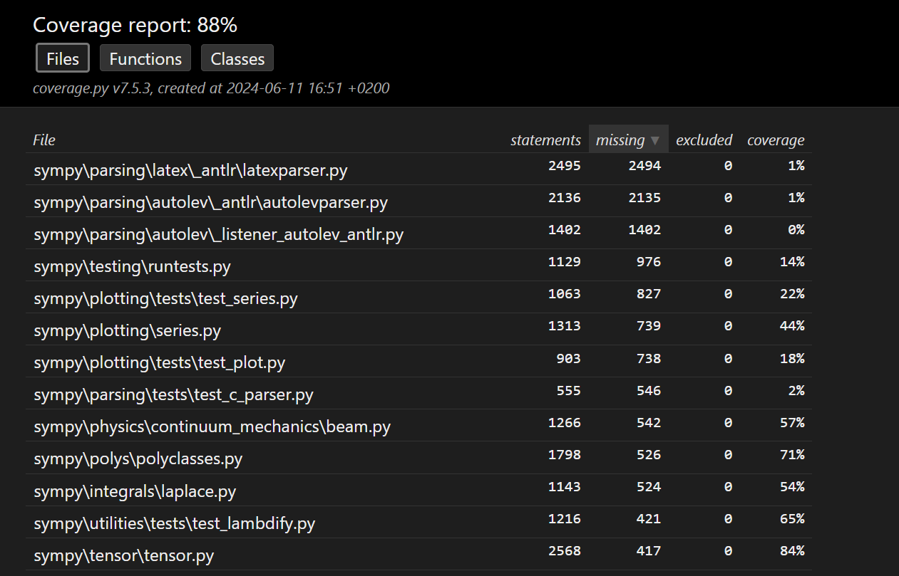

Report for Assignment 1 - Group 82

    Project
        Name: Sympy - Python library for symbolic mathematics
        URL: https://github.com/dimalarcon/SEP2024-Group82-sympy.git

        Number of lines of code: 50.9447 (50,9 KLOC)
        Tool used to measure the number of lines of code: lizard
        [TO DO: ADD HERE A SCREENSHOT OF THE RESULT OF LIZARD]

        Programming Language: Python

        Coverage Measurement
        Tool used to measure the coverage of the tests: coverage.py
        Coverage results: 88%
        
