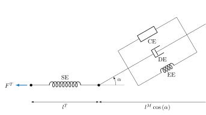

.. _biomechanics-tutorial:

======================================
Introduction to Biomechanical Modeling
======================================

:obj:`sympy.physics.biomechanics` provides features to enhance models created
using :obj:`sympy.physics.mechanics` with force producing elements that model
muscles and tendons. In this tutorial, we will introduce the features of this
module.

The initial primary purpose of the biomechanics package is to introduce tools
for modeling the forces produced by `Hill-type muscle models`_. These models
generate forces applied to the skeletal structure of an organism based on the
contraction state of the muscle coupled with the passive stretch of tendons. In
this tutorial, we introduce the elements that make up a musculotendon model and
then demonstrate it in operation with a specific implementation, the
:obj:`~sympy.physics.biomechanics.musculotendon.MusculotendonDeGroote2016` model.

.. _Hill-type muscle models: https://en.wikipedia.org/wiki/Hill%27s_muscle_model

Loads
=====

:obj:`sympy.physics.mechanics` includes two types of loads:
:obj:`~sympy.physics.mechanics.loads.Force` and
:obj:`~sympy.physics.mechanics.loads.Torque`. Forces represent bound vector
quantities that act directed along a line of action and torques are unbound
vectors which represent the resulting torque of a couple from a set of forces.

An example of very common force model is a linear spring and linear damper in
parallel. The force acting on a particle of mass :math:`m` with 1D motion
described by generalized coordinate :math:`x(t)`  with linear spring and damper
coefficients :math:`k` and :math:`c` has the familiar equation of motion:

.. math::

   m \ddot{x} = \sum F = -kx - c\dot{x}

In SymPy, we can formulate the force acting on the particle :math:`P` that has
motion in reference frame :math:`N` and position relative to point :math:`O`
fixed in :math:`N` like so:

.. plot::
   :format: doctest
   :include-source: True
   :context: reset
   :nofigs:

   >>> import sympy as sm
   >>> import sympy.physics.mechanics as me

   >>> k, c = sm.symbols('k, c', real=True, nonnegative=True)
   >>> x = me.dynamicsymbols('x', real=True)

   >>> N = me.ReferenceFrame('N')
   >>> O, P = me.Point('O'), me.Point('P')

   >>> P.set_pos(O, x*N.x)
   >>> P.set_vel(N, x.diff()*N.x)

   >>> force_on_P = me.Force(P, -k*P.pos_from(O) - c*P.vel(N))
   >>> force_on_P
   (P, (-c*Derivative(x(t), t) - k*x(t))*N.x)

and there would be an equal and opposite force acting on :math:`O`:

.. plot::
   :format: doctest
   :include-source: True
   :context:
   :nofigs:

   >>> force_on_O = me.Force(O, k*P.pos_from(O) + c*P.vel(N))
   >>> force_on_O
   (O, (c*Derivative(x(t), t) + k*x(t))*N.x)

Forces that a single muscle and tendon applies to a set of rigid bodies will
be the primary output of the musculotendon models developed further in this
tutorial.

Pathways
========

Muscles and their associated tendons wrap around the moving skeletal system, as
well as other muscles and organs. This imposes the challenge of determining the
lines of action of the forces that the muscle and tendon produce on the
skeleton and organs it touches. We have introduced the
:obj:`~sympy.physics.mechanics.pathway` module to help manage the specification
of the geometric relationships to the forces' lines of action.

The spring-damper example above has the simplest line of action definition so
we can use a :obj:`~sympy.physics.mechanics.pathway.LinearPathway` to establish
that line of action. First provide the two endpoints where the force will have
equal and opposite application to and the distance between the points and the
relative speed between the two points are calculated by the pathway with
:obj:`~sympy.physics.mechanics.pathway.LinearPathway.length` and
:obj:`~sympy.physics.mechanics.pathway.LinearPathway.extension_velocity`. Note
that a positive speed implies the points are moving away from each other. Also
note that the formulation handles the case where :math:`x` is positive or
negative.

.. plot::
   :format: doctest
   :include-source: True
   :context:
   :nofigs:

   >>> lpathway = me.LinearPathway(O, P)
   >>> lpathway
   LinearPathway(O, P)
   >>> lpathway.length
   Abs(x(t))
   >>> lpathway.extension_velocity
   sign(x(t))*Derivative(x(t), t)

The :obj:`~sympy.physics.mechanics.pathway.LinearPathway.to_loads` method then
takes the magnitude of a force with a sign convention that positive magnitudes
push the two points away from each other and returns a list of all forces
acting on the two points.

.. plot::
   :format: doctest
   :include-source: True
   :context:
   :nofigs:

   >>> import pprint
   >>> pprint.pprint(lpathway.to_loads(-k*x - k*x.diff()))
   [Force(point=O, force=(k*x(t) + k*Derivative(x(t), t))*x(t)/Abs(x(t))*N.x),
    Force(point=P, force=(-k*x(t) - k*Derivative(x(t), t))*x(t)/Abs(x(t))*N.x)]

Pathways can be constructed with any arbitrary geometry and any number of
interconnected particles and rigid bodies. An example, a more complicated
pathway is an :obj:`~sympy.physics.mechanics.pathway.ObstacleSetPathway`. You
can specify any number of intermediate points between the two pathway endpoints
which the actuation path of the forces will follow along. For example, if we
introduce two points fixed in :math:`N` then the force will act along a set of
linear segments connecting :math:`O` to :math:`Q` to :math:`R` then to
:math:`P`. Each of the four points will experience resultant forces. For
simplicity we show the effect of only the spring force.

.. plot::
   :format: doctest
   :include-source: True
   :context:
   :nofigs:

   >>> Q, R = me.Point('Q'), me.Point('R')
   >>> Q.set_pos(O, 1*N.y)
   >>> R.set_pos(O, 1*N.x + 1*N.y)
   >>> opathway = me.ObstacleSetPathway(O, Q, R, P)
   >>> opathway.length
   sqrt((x(t) - 1)**2 + 1) + 2
   >>> opathway.extension_velocity
   (x(t) - 1)*Derivative(x(t), t)/sqrt((x(t) - 1)**2 + 1)
   >>> pprint.pprint(opathway.to_loads(-k*opathway.length))
   [Force(point=O, force=k*(sqrt((x(t) - 1)**2 + 1) + 2)*N.y),
    Force(point=Q, force=- k*(sqrt((x(t) - 1)**2 + 1) + 2)*N.y),
    Force(point=Q, force=k*(sqrt((x(t) - 1)**2 + 1) + 2)*N.x),
    Force(point=R, force=- k*(sqrt((x(t) - 1)**2 + 1) + 2)*N.x),
    Force(point=R, force=k*(sqrt((x(t) - 1)**2 + 1) + 2)*(x(t) - 1)/sqrt((x(t) - 1)**2 + 1)*N.x - k*(sqrt((x(t) - 1)**2 + 1) + 2)/sqrt((x(t) - 1)**2 + 1)*N.y),
    Force(point=P, force=- k*(sqrt((x(t) - 1)**2 + 1) + 2)*(x(t) - 1)/sqrt((x(t) - 1)**2 + 1)*N.x + k*(sqrt((x(t) - 1)**2 + 1) + 2)/sqrt((x(t) - 1)**2 + 1)*N.y)]

If you set :math:`x=1`, it is a bit easier to see that the collection of forces
are correct:

.. plot::
   :format: doctest
   :include-source: True
   :context:
   :nofigs:

   >>> for load in opathway.to_loads(-k*opathway.length):
   ...     pprint.pprint(me.Force(load[0], load[1].subs({x: 1})))
   Force(point=O, force=3*k*N.y)
   Force(point=Q, force=- 3*k*N.y)
   Force(point=Q, force=3*k*N.x)
   Force(point=R, force=- 3*k*N.x)
   Force(point=R, force=- 3*k*N.y)
   Force(point=P, force=3*k*N.y)

You can create your own pathways by sub-classing
:obj:`~sympy.physics.mechanics.pathway.PathwayBase`.

Wrapping Geometries
===================

It is common for muscles to wrap over bones, tissue, or organs. We have
introduced wrapping geometries and associated wrapping pathways to help manage
their complexities. For example, if two pathway endpoints lie on the surface of
a cylinder the forces act along lines that are tangent to the geodesic
connecting the two points at the endpoints. The
:obj:`~sympy.physics.mechanics.wrapping_geometry.WrappingCylinder` object
calculates the complex geometry for the pathway. A
:obj:`~sympy.physics.mechanics.pathway.WrappingPathway` then uses the geometry
to construct the forces. A spring force along this pathway is constructed
below:

.. plot::
   :format: doctest
   :include-source: True
   :context:
   :nofigs:

   >>> r = sm.symbols('r', real=True, nonegative=True)
   >>> theta = me.dynamicsymbols('theta', real=True)
   >>> O, P, Q = sm.symbols('O, P, Q', cls=me.Point)
   >>> A = me.ReferenceFrame('A')

   >>> A.orient_axis(N, theta, N.z)

   >>> P.set_pos(O, r*N.x)
   >>> Q.set_pos(O, N.z + r*A.x)

   >>> cyl = me.WrappingCylinder(r, O, N.z)
   >>> wpathway = me.WrappingPathway(P, Q, cyl)
   >>> pprint.pprint(wpathway.to_loads(-k*wpathway.length))
   [Force(point=P, force=- k*r*Abs(theta(t))*N.y - k*N.z),
    Force(point=Q, force=k*N.z + k*r*Abs(theta(t))*A.y),
    Force(point=O, force=k*r*Abs(theta(t))*N.y - k*r*Abs(theta(t))*A.y)]

Actuators
=========

Models of multibody systems commonly have time varying inputs in the form of
the magnitudes of forces or torques. In many cases, these specified inputs may
be derived from the state of the system or even from the output of another
dynamic system. The :obj:`~sympy.physics.mechanics.actuator` module includes
classes to help manage the creation of such models of force and torque inputs.
An actuator is intended to represent a real physical component. For example,
the spring-damper force from above can be created by sub-classing
:obj:`~sympy.physics.mechanics.actuator.ActuatorBase` and implementing a method
that generates the loads associated with that spring-damper actuator.

.. plot::
   :format: doctest
   :include-source: True
   :context:
   :nofigs:

   >>> N = me.ReferenceFrame('N')
   >>> O, P = me.Point('O'), me.Point('P')
   >>> P.set_pos(O, x*N.x)

   >>> class SpringDamper(me.ActuatorBase):
   ...
   ...     # positive x spring is in tension
   ...     # negative x spring is in compression
   ...     def __init__(self, P1, P2, spring_constant, damper_constant):
   ...         self.P1 = P1
   ...         self.P2 = P2
   ...         self.k = spring_constant
   ...         self.c = damper_constant
   ...
   ...     def to_loads(self):
   ...         x = self.P2.pos_from(self.P1).magnitude()
   ...         v = x.diff(me.dynamicsymbols._t)
   ...         dir_vec = self.P2.pos_from(self.P1).normalize()
   ...         force_P1 = me.Force(self.P1,
   ...                             self.k*x*dir_vec + self.c*v*dir_vec)
   ...         force_P2 = me.Force(self.P2,
   ...                             -self.k*x*dir_vec - self.c*v*dir_vec)
   ...         return [force_P1, force_P2]
   ...

   >>> spring_damper = SpringDamper(O, P, k, c)
   >>> pprint.pprint(spring_damper.to_loads())
   [Force(point=O, force=(c*x(t)*sign(x(t))*Derivative(x(t), t)/Abs(x(t)) + k*x(t))*N.x),
    Force(point=P, force=(-c*x(t)*sign(x(t))*Derivative(x(t), t)/Abs(x(t)) - k*x(t))*N.x)]

There is also a :obj:`~sympy.physics.mechanics.actuator.ForceActuator` that
allows seamless integration with pathway objects. You only need to set the
``.force`` attribute in initialization in the sub-class.

.. plot::
   :format: doctest
   :include-source: True
   :context:
   :nofigs:

   >>> class SpringDamper(me.ForceActuator):
   ...
   ...     # positive x spring is in tension
   ...     # negative x spring is in compression
   ...     def __init__(self, pathway, spring_constant, damper_constant):
   ...         self.pathway = pathway
   ...         self.force = (-spring_constant*pathway.length -
   ...                       damper_constant*pathway.extension_velocity)
   ...
   >>> spring_damper2 = SpringDamper(lpathway, k, c)
   >>> pprint.pprint(spring_damper2.to_loads())
   [Force(point=O, force=(c*sign(x(t))*Derivative(x(t), t) + k*Abs(x(t)))*x(t)/Abs(x(t))*N.x),
    Force(point=P, force=(-c*sign(x(t))*Derivative(x(t), t) - k*Abs(x(t)))*x(t)/Abs(x(t))*N.x)]

This then makes it easy to apply a spring-damper force to other pathways, e.g.:

.. plot::
   :format: doctest
   :include-source: True
   :context:
   :nofigs:

   >>> spring_damper3 = SpringDamper(wpathway, k, c)
   >>> pprint.pprint(spring_damper3.to_loads())
   [Force(point=P, force=r*(-c*r**2*theta(t)*Derivative(theta(t), t)/sqrt(r**2*theta(t)**2 + 1) - k*sqrt(r**2*theta(t)**2 + 1))*Abs(theta(t))/sqrt(r**2*theta(t)**2 + 1)*N.y + (-c*r**2*theta(t)*Derivative(theta(t), t)/sqrt(r**2*theta(t)**2 + 1) - k*sqrt(r**2*theta(t)**2 + 1))/sqrt(r**2*theta(t)**2 + 1)*N.z),
    Force(point=Q, force=- (-c*r**2*theta(t)*Derivative(theta(t), t)/sqrt(r**2*theta(t)**2 + 1) - k*sqrt(r**2*theta(t)**2 + 1))/sqrt(r**2*theta(t)**2 + 1)*N.z - r*(-c*r**2*theta(t)*Derivative(theta(t), t)/sqrt(r**2*theta(t)**2 + 1) - k*sqrt(r**2*theta(t)**2 + 1))*Abs(theta(t))/sqrt(r**2*theta(t)**2 + 1)*A.y),
    Force(point=O, force=- r*(-c*r**2*theta(t)*Derivative(theta(t), t)/sqrt(r**2*theta(t)**2 + 1) - k*sqrt(r**2*theta(t)**2 + 1))*Abs(theta(t))/sqrt(r**2*theta(t)**2 + 1)*N.y + r*(-c*r**2*theta(t)*Derivative(theta(t), t)/sqrt(r**2*theta(t)**2 + 1) - k*sqrt(r**2*theta(t)**2 + 1))*Abs(theta(t))/sqrt(r**2*theta(t)**2 + 1)*A.y)]

Activation Dynamics
===================

Musculotendon models are able to produce an active contractile force when they
are activated. Biologically, this occurs when :math:`\textrm{Ca}^{2+}` ions are
present among the muscle fibers at a sufficient concentration that they start
to voluntarily contract. This state of voluntary contraction is "activation". In
biomechanical models it is typically given the symbol :math:`a(t)`, which is
treated as a normalized quantity in the range :math:`[0, 1]`.

An organism does not directly control the concentration of these
:math:`\textrm{Ca}^{2+}` ions in its muscles, instead its nervous system,
controlled by its brain, sends an electrical signal to a muscle which causes
:math:`\textrm{Ca}^{2+}` ions to be released. These diffuse and increase in
concentration throughout the muscle leading to activation. An electrical signal
transmitted to a muscle stimulating contraction is an "excitation". In
biomechanical models it is usually given the symbol :math:`e(t)`, which is also
treated as a normalized quantity in the range :math:`[0, 1]`.

The relationship between the excitation input and the activation state is known
as activation dynamics. Because activation dynamics are so common in
biomechanical models, SymPy provides the
:obj:`~sympy.physics.biomechanics.activation` module, which contains
implementations for some common models of activation dynamics. These are
zeroth-order activation dynamics and first-order activation dynamics based on
the equations from the paper by [DeGroote2016]_. Below we will work through
manually implementing these models and then show how these relate to the classes
provided by SymPy.

Zeroth-Order
------------

The simplest possible model of activation dynamics is to assume that diffusion
of :math:`\textrm{Ca}^{2+}` ions is instantaneous. Mathematically this gives us
:math:`a(t) = e(t)`, a zeroth-order ordinary differential equation.

>>> e = me.dynamicsymbols('e')
>>> e
e(t)
>>> a = e
>>> a
e(t)

Alternatively, you could give :math:`a(t)` its own
:obj:`~sympy.physics.vector.dynamicsymbols` and use a substitution to replace
this with :math:`e(t)` in any equation.

>>> a = me.dynamicsymbols('a')
>>> zeroth_order_activation = {a: e}
>>> a.subs(zeroth_order_activation)
e(t)

SymPy provides the class
:obj:`~sympy.physics.biomechanics.activation.ZerothOrderActivation` in the
:obj:`~sympy.physics.biomechanics.activation` module. This class must be
instantiated with a single argument, ``name``, which associates a name with the
instance. This name should be unique per instance.

>>> from sympy.physics.biomechanics import ZerothOrderActivation
>>> actz = ZerothOrderActivation('zeroth')
>>> actz
ZerothOrderActivation('zeroth')

The argument passed to `name` tries to help ensures that the
automatically-created :obj:`~sympy.physics.vector.dynamicsymbols` for
:math:`e(t)` and :math:`a(t)` are unique betweem instances.

>>> actz.excitation
e_zeroth(t)
>>> actz.activation
e_zeroth(t)

:obj:`~sympy.physics.biomechanics.activation.ZerothOrderActivation` subclasses
:obj:`~sympy.physics.biomechanics.activation.ActivationBase`, which provides a
consistent interface for all concrete classes of activation dynamics. This
includes a method to inspect the ordinary differential equation(s) associated
with the model. As zeroth-order activation dynamics correspond to a zeroth-order
ordinary differential equation, this returns an empty column matrix.

>>> actz.rhs()
Matrix(0, 1, [])

First-Order
-----------

In practice the diffusion and concentration increase of
:math:`\textrm{Ca}^{2+}` ions is not instantaneous. In a real biological
muscle, a step increase in excitation will lead to a smooth and gradual
increase in activation. [DeGroote2016]_ model this using a first-order
ordinary differential equation:

.. math::

   \frac{da}{dt} &= \left( \frac{1}{\tau_a \left(1 + 3a(t)\right)} (1 + 2f) + \frac{1 + 3a(t)}{4\tau_d} (1 - 2f) \right) \left(e(t) - a(t) \right) \\
   f &= \frac{1}{2} \tanh{\left(b \left(e(t) -a(t)\right)\right)}

where :math:`\tau_a` is the time constant for activation, :math:`\tau_d` is the
time constant for deactivation, and :math:`b` is a smoothing coefficient.

>>> tau_a, tau_d, b = sm.symbols('tau_a, tau_d, b')
>>> f = sm.tanh(b*(e - a))/2
>>> dadt = ((1/(tau_a*(1 + 3*a)))*(1 + 2*f) + ((1 + 3*a)/(4*tau_d))*(1 - 2*f))*(e - a)

This first-order ordinary differential equation can then be used to propagate
the state :math:`a(t)` under the input :math:`e(t)` in a simulation.

Like before, SymPy provides the class
:obj:`~sympy.physics.biomechanics.activation.FirstOrderActivationDeGroote2016`
in the :obj:`~sympy.physics.biomechanics.activation` module. This class is
another subclass of :obj:`~sympy.physics.biomechanics.activation.ActivationBase`
and uses the model for first-order activation dynamics from [DeGroote2016]_
defined above. This class must be instantiated with four arguments: a name, and
three sympifiable objects to represent the three constants :math:`\tau_a`,
:math:`\tau_d`, and :math:`b`.

>>> from sympy.physics.biomechanics import FirstOrderActivationDeGroote2016
>>> actf = FirstOrderActivationDeGroote2016('first', tau_a, tau_d, b)
>>> actf.excitation
e_first(t)
>>> actf.activation
a_first(t)

The first-order ordinary differential equation can be accessed as before, but
this time a length-1 column vector is returned.

>>> actf.rhs()
Matrix([[((1/2 - tanh(b*(-a_first(t) + e_first(t)))/2)*(3*a_first(t)/2 + 1/2)/tau_d + (tanh(b*(-a_first(t) + e_first(t)))/2 + 1/2)/(tau_a*(3*a_first(t)/2 + 1/2)))*(-a_first(t) + e_first(t))]])

You can also instantiate the class with the suggested values for each of the
constants. These are: :math:`\tau_a = 0.015`, :math:`\tau_d = 0.060`, and
:math:`b = 10.0`.

>>> actf2 = FirstOrderActivationDeGroote2016.with_defaults('first')
>>> actf2.rhs()
Matrix([[((1/2 - tanh(10.0*a_first(t) - 10.0*e_first(t))/2)/(0.0225*a_first(t) + 0.0075) + 16.6666666666667*(3*a_first(t)/2 + 1/2)*(tanh(10.0*a_first(t) - 10.0*e_first(t))/2 + 1/2))*(-a_first(t) + e_first(t))]])
>>> constants = {tau_a: sm.Float('0.015'), tau_d: sm.Float('0.060'), b: sm.Float('10.0')}
>>> actf.rhs().subs(constants)
Matrix([[(66.6666666666667*(1/2 - tanh(10.0*a_first(t) - 10.0*e_first(t))/2)/(3*a_first(t)/2 + 1/2) + 16.6666666666667*(3*a_first(t)/2 + 1/2)*(tanh(10.0*a_first(t) - 10.0*e_first(t))/2 + 1/2))*(-a_first(t) + e_first(t))]])

Custom
------

To create your own custom models of activation dynamics, you can subclass
:obj:`~sympy.physics.biomechanics.activation.ActivationBase` and override the
abstract methods. The concrete class will then conform to the expected API and
integrate automatically with the rest of :obj:`sympy.physics.mechanics` and
:obj:`sympy.physics.biomechanics`.

Musculotendon Curves
====================

Over the years many different configurations of Hill-type muscle models have
been published containing different combinations of elements in series and in
parallel. We'll consider a very common version of the model that has the tendon
modeled as an element in series with muscle fibers, which are in turn modeled as
three elements in parallel: an elastic element, a contractile element, and a
damper.

.. _fig-hill_type_muscle_model:

   Schematic showing the four-element Hill-type muscle model. :math:`SE` is the
   series element representing the tendon, :math:`CE` is the contractile
   element, :math:`EE` is the parallel element representing the elasticity of
   the muscle fibers, and :math:`DE` is the damper.

Each of these components typically has a characteristic curve describing it. The
following sub-sections will describe and implement the characteristic curves
described in the paper by [DeGroote2016]_.

Tendon Force-Length
-------------------

It is common to model tendons as both rigid (inextensible) and elastic elements.
If the tendon is being treated as rigid, the tendon length does not change and
the length of the muscle fibers change directly with changes in musculotendon
length. A rigid tendon will not have an associated characteristic curve; it does
not have any force-producing capabilities itself and just directly transmits the
force produced by the muscle fibers.

If the tendon is elastic, it is commonly modeled as a nonlinear spring. We
therefore have our first characteristic curve, the tendon force-length curve,
which is a function of normalized tendon length:

.. math::

   \tilde{l}^T = \frac{l^T}{l^T_{slack}}

where :math:`l^T` is tendon length, and :math:`l^T_{slack}` is the "tendon slack
length", a constant representing the tendon length under no force.
Characteristic musculotendon curves are parameterized in terms of "normalized"
(or "dimensionless") quantities such as :math:`\tilde{l}^T` because these curves
apply generically to all muscle fibers and tendons. Their properties can be
adjusted to model a specific musculotendon by selecting different values for the
constants. In the case of the tendon force-length characteristic, this is done
by tuning :math:`l^T_{slack}`. Shorter values for this constant result in a
stiffer tendon.

The equation for the tendon force-length curve
:math:`fl^T\left(\tilde{l}^T\right)` from [DeGroote2016]_ is:

.. math::

   fl^T\left(\tilde{l}^T\right) = c_0 \exp{c_3 \left( \tilde{l}^T - c_1 \right)} - c_2

To implement this in SymPy we need a time-varying dynamic symbol representing
:math:`\tilde{l}^T` and four symbols representing the four constants.

>>> l_T_tilde = me.dynamicsymbols('l_T_tilde')
>>> c0, c1, c2, c3 = sm.symbols('c0, c1, c2, c3')

>>> fl_T = c0*sm.exp(c3*(l_T_tilde - c1)) - c2
>>> fl_T
c0*exp(c3*(-c1 + l_T_tilde(t))) - c2

Alternatively, we could define this in terms of :math:`l^T` and
:math:`l^T_{slack}`.

>>> l_T = me.dynamicsymbols('l_T')
>>> l_T_slack = sm.symbols('l_T_slack')

>>> fl_T = c0*sm.exp(c3*(l_T/l_T_slack - c1)) - c2
>>> fl_T
c0*exp(c3*(-c1 + l_T(t)/l_T_slack)) - c2

The :obj:`~sympy.physics.biomechanics` module in SymPy provides a class for
this exact curve,
:obj:`~sympy.physics.biomechanics.curve.TendonForceLengthDeGroote2016`. It can
be instantiated with five arguments. The first argument is :math:`\tilde{l}^T`,
which need not necessarily be a symbol; it could be an expression. The further
four arguments are all constants. It is intended that these will be constants,
or sympifiable numerical values.

>>> from sympy.physics.biomechanics import TendonForceLengthDeGroote2016

>>> fl_T2 = TendonForceLengthDeGroote2016(l_T/l_T_slack, c0, c1, c2, c3)
>>> fl_T2
TendonForceLengthDeGroote2016(l_T(t)/l_T_slack, c0, c1, c2, c3)

This class is a subclass of :obj:`~sympy.core.function.Function` and so
implements usual SymPy methods for substitution, evaluation, differentiation
etc. The
:obj:`~sympy.physics.biomechanics.curve.TendonForceLengthDeGroote2016.doit`
method allows the equation of the curve to be accessed.

>>> fl_T2.doit()
c0*exp(c3*(-c1 + l_T(t)/l_T_slack)) - c2

The class provides an alternate constructor that allows it to be constucted
prepopulated with the values for the constants recommended in [DeGroote2016]_.
This takes a single argument, again corresponding to :math:`\tilde{l}^T`, which
can against either be a symbol or expression.

>>> fl_T3 = TendonForceLengthDeGroote2016.with_defaults(l_T/l_T_slack)
>>> fl_T3
TendonForceLengthDeGroote2016(l_T(t)/l_T_slack, 0.2, 0.995, 0.25, 33.93669377311689)

In the above the constants have been replaced with instances of SymPy numeric
types like :obj:`~sympy.core.numbers.Float`.

The :obj:`~sympy.physics.biomechanics.curve.TendonForceLengthDeGroote2016` class
also supports code generation, so seamlessly integrates with SymPy's code
printers. To visualize this curve, we can use
:obj:`~sympy.utilities.lambdify.lambdify` on an instance of the function, which
will create a callable to evaluate it for a given value of :math:`\tilde{l}^T`.
Sensible values for :math:`\tilde{l}^T` fall within the range
:math:`[0.95, 1.05]`, which we will plot below.

.. plot::
   :format: doctest
   :include-source: True
   :context: close-figs

   >>> import matplotlib.pyplot as plt
   >>> import numpy as np
   >>> from sympy.physics.biomechanics import TendonForceLengthDeGroote2016

   >>> l_T_tilde = me.dynamicsymbols('l_T_tilde')
   >>> fl_T = TendonForceLengthDeGroote2016.with_defaults(l_T_tilde)
   >>> fl_T_callable = sm.lambdify(l_T_tilde, fl_T)
   >>> l_T_tilde_num = np.linspace(0.95, 1.05)

   >>> fig, ax = plt.subplots()
   >>> _ = ax.plot(l_T_tilde_num, fl_T_callable(l_T_tilde_num))
   >>> _ = ax.set_xlabel('Normalized tendon length')
   >>> _ = ax.set_ylabel('Normalized tendon force-length')

When deriving the equations describing the musculotendon dynamics of models with
elastic tendons, it can be useful to know the inverse of the tendon force-length
characteristic curve. The curve defined in [DeGroote2016]_ is analytically
invertible, which means that we can directly determine
:math:`\tilde{l}^T = \left[fl^T\left(\tilde{l}^T\right)\right]^{-1}` for a given
value of :math:`fl^T\left(\tilde{l}^T\right)`.

.. math::

   \tilde{l}^T = \left[fl^T\left(\tilde{l}^T\right)\right]^{-1} = \frac{\log{\frac{fl^T + c_2}{c_0}}}{c_3} + c_1

There is also a class for this in :obj:`~sympy.physics.biomechanics`,
:obj:`~sympy.physics.biomechanics.curve.TendonForceLengthInverseDeGroote2016`,
which behaves identically to
:obj:`~sympy.physics.biomechanics.curve.TendonForceLengthDeGroote2016`. It can
be instantiated with five parameters, the first for :math:`fl^T` followed by
four constants, or by using the alternate constructor with a single argument for
:math:`fl^T`.

>>> from sympy.physics.biomechanics import TendonForceLengthInverseDeGroote2016

>>> fl_T_sym =me.dynamicsymbols('fl_T')
>>> fl_T_inv = TendonForceLengthInverseDeGroote2016(fl_T_sym, c0, c1, c2, c3)
>>> fl_T_inv
TendonForceLengthInverseDeGroote2016(fl_T(t), c0, c1, c2, c3)

>>> fl_T_inv2 = TendonForceLengthInverseDeGroote2016.with_defaults(fl_T_sym)
>>> fl_T_inv2
TendonForceLengthInverseDeGroote2016(fl_T(t), 0.2, 0.995, 0.25, 33.93669377311689)

Fiber Passive Force-Length
--------------------------

The first element used to model the muscle fibers is the fiber passive
force- length. This is essentially another nonlinear spring representing the
elastic properties of the muscle fibers. The characteristic curve describing
this element is a function of normalized muscle fiber length:

.. math::

   \tilde{l}^M = \frac{l^M}{l^M_{opt}}

where :math:`l^M` is muscle fiber length, and :math:`l^M_{opt}` is the "optimal
fiber length, a constant representing the muscle fiber length at which it
produces no passive-elastic force (it is also the muscle fiber length at which
it can produce maximum active force). Like with tuning :math:`l^T_{slack}` to
change the stiffness properties of a modeled tendon via the tendon force-length
characteristic, we can adjust :math:`l^M_{opt}` to change the passive properties
of the muscle fibers; decreasing :math:`l^M_{opt}` will make modeled muscle
fibers stiffer.

The equation for the fiber passive force-length curve
:math:`fl^M_{pas}\left(\tilde{l}^M\right)` from [DeGroote2016]_ is:

.. math::

   fl^M_{pas} = \frac{\frac{\exp{c_1 \left(\tilde{l^M} - 1\right)}}{c_0} - 1}{\exp{c_1} - 1}

Similarly to before, to implement this in SymPy we need a time-varying dynamic
symbol representing :math:`\tilde{l}^M` and two symbols representing the two
constants.

>>> l_M_tilde = me.dynamicsymbols('l_M_tilde')
>>> c0, c1 = sm.symbols('c0, c1')

>>> fl_M_pas = (sm.exp(c1*(l_M_tilde - 1)/c0) - 1)/(sm.exp(c1) - 1)
>>> fl_M_pas
(exp(c1*(l_M_tilde(t) - 1)/c0) - 1)/(exp(c1) - 1)

Alternatively, we could define this in terms of :math:`l^M` and
:math:`l^M_{opt}`.

>>> l_M = me.dynamicsymbols('l_M')
>>> l_M_opt = sm.symbols('l_M_opt')

>>> fl_M_pas2 = (sm.exp(c1*(l_M/l_M_opt - 1)/c0) - 1)/(sm.exp(c1) - 1)
>>> fl_M_pas2
(exp(c1*(-1 + l_M(t)/l_M_opt)/c0) - 1)/(exp(c1) - 1)

Again, the :obj:`~sympy.physics.biomechanics` module in SymPy provides a class
for this exact curve,
:obj:`~sympy.physics.biomechanics.curve.FiberForceLengthPassiveDeGroote2016`. It
can be instantiated with three arguments. The first argument is
:math:`\tilde{l}^M`, which need not necessarily be a symbol and can be an
expression. The further two arguments are both constants. It is intended that
these will be constants, or sympifiable numerical values.

>>> from sympy.physics.biomechanics import FiberForceLengthPassiveDeGroote2016

>>> fl_M_pas2 = FiberForceLengthPassiveDeGroote2016(l_M/l_M_opt, c0, c1)
>>> fl_M_pas2
FiberForceLengthPassiveDeGroote2016(l_M(t)/l_M_opt, c0, c1)
>>> fl_M_pas2.doit()
(exp(c1*(-1 + l_M(t)/l_M_opt)/c0) - 1)/(exp(c1) - 1)

Using the alternate constructor, which takes a single parameter for
:math:`\tilde{l}^M`, we can create an instance prepopulated with the values for
the constants recommended in [DeGroote2016]_.

>>> fl_M_pas3 = FiberForceLengthPassiveDeGroote2016.with_defaults(l_M/l_M_opt)
>>> fl_M_pas3
FiberForceLengthPassiveDeGroote2016(l_M(t)/l_M_opt, 0.6, 4.0)
>>> fl_M_pas3.doit()
2.37439874427164e-5*exp(6.66666666666667*l_M(t)/l_M_opt) - 0.0186573603637741

Sensible values for :math:`\tilde{l}^M` fall
within the range :math:`[0.0, 2.0]`, which we will plot below.

.. plot::
   :format: doctest
   :include-source: True
   :context: close-figs

   >>> import matplotlib.pyplot as plt
   >>> import numpy as np
   >>> from sympy.physics.biomechanics import FiberForceLengthPassiveDeGroote2016

   >>> l_M_tilde = me.dynamicsymbols('l_M_tilde')
   >>> fl_M_pas = FiberForceLengthPassiveDeGroote2016.with_defaults(l_M_tilde)
   >>> fl_M_pas_callable = sm.lambdify(l_M_tilde, fl_M_pas)
   >>> l_M_tilde_num = np.linspace(0.0, 2.0)

   >>> fig, ax = plt.subplots()
   >>> _ = ax.plot(l_M_tilde_num, fl_M_pas_callable(l_M_tilde_num))
   >>> _ = ax.set_xlabel('Normalized fiber length')
   >>> _ = ax.set_ylabel('Normalized fiber passive force-length')

The inverse of the fiber passive force-length characteristic curve is sometimes
required when formulating musculotendon dynamics. The equation for this curve
from [DeGroote2016]_ is again analytically invertible.

.. math::

  \tilde{l}^M = \left[fl^M_{pas}\right]^{-1} = \frac{c_0 \log{\left(\exp{c_1} - 1\right)fl^M_{pas} + 1}}{c_1} + 1

There is also a class for this in :obj:`~sympy.physics.biomechanics`,
:obj:`~sympy.physics.biomechanics.curve.FiberForceLengthPassiveInverseDeGroote2016`.
It can be instantiated with three parameters, the first for :math:`fl^M`
followed by a pair of constants, or by using the alternate constructor with a
single argument for :math:`\tilde{l}^M`.

>>> from sympy.physics.biomechanics import FiberForceLengthPassiveInverseDeGroote2016

>>> fl_M_pas_sym =me.dynamicsymbols('fl_M_pas')
>>> fl_M_pas_inv = FiberForceLengthPassiveInverseDeGroote2016(fl_M_pas_sym, c0, c1)
>>> fl_M_pas_inv
FiberForceLengthPassiveInverseDeGroote2016(fl_M_pas(t), c0, c1)

>>> fl_M_pas_inv2 = FiberForceLengthPassiveInverseDeGroote2016.with_defaults(fl_M_pas_sym)
>>> fl_M_pas_inv2
FiberForceLengthPassiveInverseDeGroote2016(fl_M_pas(t), 0.6, 4.0)

Fiber Active Force-Length
-------------------------

When a muscle is activated, it contracts to produce a force. This phenomenom is
modeled by the contractile element in the parallel fiber component of the
musculotendon model. The amount of force that the fibers can produce is a
function of the instantaneous length of the fibers. The characteristic curve
describing the fiber active force-length curve is again parameterized by
:math:`\tilde{l}^M`. This curve is "bell-shaped". For very small and very large
values of :math:`\tilde{l}^M`, the active fiber force-length tends to zero. The
peak active fiber force-length occurs when :math:`\tilde{l}^M = l^M_{opt}` and
gives a value of :math:`0.0`.

The equation for the fiber active force-length curve
:math:`fl^M_{act}\left(\tilde{l}^M\right)` from [DeGroote2016]_ is:

.. math::

   fl^M_{act}\left(\tilde{l}^M\right) = c_0 \exp{-\frac{1}{2}\left(\frac{\tilde{l}^M - c_1}{\left(c_2 + c_3 \tilde{l}^M\right)}\right)^2}
        + c_4 \exp{-\frac{1}{2}\left(\frac{\tilde{l}^M - c_5}{\left(c_6 + c_7 \tilde{l}^M\right)}\right)^2}
        + c_8 \exp{-\frac{1}{2}\left(\frac{\tilde{l}^M - c_9}{\left(c_{10} + c_{11} \tilde{l}^M\right)}\right)^2}

To implement this in SymPy we need a time-varying dynamic symbol representing
:math:`\tilde{l}^M` and twelve symbols representing the twelve constants.

>>> constants = sm.symbols('c0:12')
>>> c0, c1, c2, c3, c4, c5, c6, c7, c8, c9, c10, c11 = constants

>>> fl_M_act = (c0*sm.exp(-(((l_M_tilde - c1)/(c2 + c3*l_M_tilde))**2)/2) + c4*sm.exp(-(((l_M_tilde - c5)/(c6 + c7*l_M_tilde))**2)/2) + c8*sm.exp(-(((l_M_tilde - c9)/(c10 + c11*l_M_tilde))**2)/2))
>>> fl_M_act
c0*exp(-(-c1 + l_M_tilde(t))**2/(2*(c2 + c3*l_M_tilde(t))**2)) + c4*exp(-(-c5 + l_M_tilde(t))**2/(2*(c6 + c7*l_M_tilde(t))**2)) + c8*exp(-(-c9 + l_M_tilde(t))**2/(2*(c10 + c11*l_M_tilde(t))**2))

The SymPy-provided class for this exact curve is
:obj:`~sympy.physics.biomechanics.curve.FiberForceLengthActiveDeGroote2016`. It
can be instantiated with thirteen arguments. The first argument is
:math:`\tilde{l}^M`, which need not necessarily be a symbol and can be an
expression. The further twelve arguments are all constants. It is intended that
these will be constants, or sympifiable numerical values.

>>> from sympy.physics.biomechanics import FiberForceLengthActiveDeGroote2016

>>> fl_M_act2 = FiberForceLengthActiveDeGroote2016(l_M/l_M_opt, *constants)
>>> fl_M_act2
FiberForceLengthActiveDeGroote2016(l_M(t)/l_M_opt, c0, c1, c2, c3, c4, c5, c6, c7, c8, c9, c10, c11)
>>> fl_M_act2.doit()
c0*exp(-(-c1 + l_M(t)/l_M_opt)**2/(2*(c2 + c3*l_M(t)/l_M_opt)**2)) + c4*exp(-(-c5 + l_M(t)/l_M_opt)**2/(2*(c6 + c7*l_M(t)/l_M_opt)**2)) + c8*exp(-(-c9 + l_M(t)/l_M_opt)**2/(2*(c10 + c11*l_M(t)/l_M_opt)**2))

Using the alternate constructor, which takes a single parameter for
:math:`\tilde{l}^M`, we can create an instance prepopulated with the values for
the constants recommended in [DeGroote2016]_.

>>> fl_M_act3 = FiberForceLengthActiveDeGroote2016.with_defaults(l_M/l_M_opt)
>>> fl_M_act3
FiberForceLengthActiveDeGroote2016(l_M(t)/l_M_opt, 0.814, 1.06, 0.162, 0.0633, 0.433, 0.717, -0.0299, 0.2, 0.1, 1.0, 0.354, 0.0)
>>> fl_M_act3.doit()
0.1*exp(-3.98991349867535*(-1 + l_M(t)/l_M_opt)**2) + 0.433*exp(-12.5*(-0.717 + l_M(t)/l_M_opt)**2/(-0.1495 + l_M(t)/l_M_opt)**2) + 0.814*exp(-21.4067977442463*(-1 + 0.943396226415094*l_M(t)/l_M_opt)**2/(1 + 0.390740740740741*l_M(t)/l_M_opt)**2)

Sensible values for :math:`\tilde{l}^M` fall
within the range :math:`[0.0, 2.0]`, which we will plot below.

.. plot::
   :format: doctest
   :include-source: True
   :context: close-figs

   >>> import matplotlib.pyplot as plt
   >>> import numpy as np
   >>> from sympy.physics.biomechanics import FiberForceLengthActiveDeGroote2016

   >>> l_M_tilde = me.dynamicsymbols('l_M_tilde')
   >>> fl_M_act = FiberForceLengthActiveDeGroote2016.with_defaults(l_M_tilde)
   >>> fl_M_act_callable = sm.lambdify(l_M_tilde, fl_M_act)
   >>> l_M_tilde_num = np.linspace(0.0, 2.0)

   >>> fig, ax = plt.subplots()
   >>> _ = ax.plot(l_M_tilde_num, fl_M_act_callable(l_M_tilde_num))
   >>> _ = ax.set_xlabel('Normalized fiber length')
   >>> _ = ax.set_ylabel('Normalized fiber active force-length')

No inverse curve exists for the fiber active force-length characteristic curve
as it has multiple values of :math:`\tilde{l}^M` for each value of
:math:`fl^M_{act}`.

Fiber Force-Velocity
--------------------

The force produced by the contractile element is also a function of its
lengthening velocity. The characteristic curve describing the velocity-dependent
portion of the contractile element's dynamics is a function of normalized muscle
fiber lengthening velocity:

.. math::

   \tilde{v}^M = \frac{v^M}{v^M_{max}}

where :math:`v^M` is muscle fiber lengthening velocity, and :math:`v^M_{max}` is
the "maximum fiber velocity", a constant representing the muscle fiber velocity
at which it is not able to produce any contractile force when concentrically
contracting. :math:`v^M_{max}` is commonly given a value of
:math:`10 l^M_{opt}`.

The equation for the fiber force-velocity curve
:math:`fv^M\left(\tilde{v}^M\right)` from [DeGroote2016]_ is:

.. math::

   fv^M\left(\tilde{v}^M\right) = c_0 \log{\left(c_1 \tilde{v}^M + c_2\right) + \sqrt{\left(c_1 \tilde{v}^M + c_2\right)^2 + 1}} + c_3

Similarly to before, to implement this in SymPy we need a time-varying dynamic
symbol representing :math:`\tilde{v}^M` and four symbols representing the four
constants.

>>> v_M_tilde = me.dynamicsymbols('v_M_tilde')
>>> c0, c1, c2, c3 = sm.symbols('c0, c1, c2, c3')

>>> fv_M = c0*sm.log(c1*v_M_tilde + c2 + sm.sqrt((c1*v_M_tilde + c2)**2 + 1)) + c3
>>> fv_M
c0*log(c1*v_M_tilde(t) + c2 + sqrt((c1*v_M_tilde(t) + c2)**2 + 1)) + c3

Alternatively, we could define this in terms of :math:`v^M` and
:math:`v^M_{max}`.

>>> v_M = me.dynamicsymbols('v_M')
>>> v_M_max = sm.symbols('v_M_max')

>>> fv_M_pas2 = c0*sm.log(c1*v_M/v_M_max + c2 + sm.sqrt((c1*v_M/v_M_max + c2)**2 + 1)) + c3
>>> fv_M_pas2
c0*log(c1*v_M(t)/v_M_max + c2 + sqrt((c1*v_M(t)/v_M_max + c2)**2 + 1)) + c3

The SymPy-provided class for this exact curve is
:obj:`~sympy.physics.biomechanics.curve.FiberForceVelocityDeGroote2016`. It can
be instantiated with five arguments. The first argument is :math:`\tilde{v}^M`,
which need not necessarily be a symbol and can be an expression. The further
four arguments are all constants. It is intended that these will be constants,
or sympifiable numerical values.

>>> from sympy.physics.biomechanics import FiberForceVelocityDeGroote2016

>>> fv_M2 = FiberForceVelocityDeGroote2016(v_M/v_M_max, c0, c1, c2, c3)
>>> fv_M2
FiberForceVelocityDeGroote2016(v_M(t)/v_M_max, c0, c1, c2, c3)
>>> fv_M2.doit()
c0*log(c1*v_M(t)/v_M_max + c2 + sqrt((c1*v_M(t)/v_M_max + c2)**2 + 1)) + c3

Using the alternate constructor, which takes a single parameter for
:math:`\tilde{v}^M`, we can create an instance prepopulated with the values for
the constants recommended in [DeGroote2016]_.

>>> fv_M3 = FiberForceVelocityDeGroote2016.with_defaults(v_M/v_M_max)
>>> fv_M3
FiberForceVelocityDeGroote2016(v_M(t)/v_M_max, -0.318, -8.149, -0.374, 0.886)
>>> fv_M3.doit()
0.886 - 0.318*log(8.149*sqrt((-0.0458952018652595 - v_M(t)/v_M_max)**2 + 0.0150588346410601) - 0.374 - 8.149*v_M(t)/v_M_max)

Sensible values for :math:`\tilde{v}^M` fall within the range
:math:`[-1.0, 1.0]`, which we will plot below.

.. plot::
   :format: doctest
   :include-source: True
   :context: close-figs

   >>> import matplotlib.pyplot as plt
   >>> import numpy as np
   >>> from sympy.physics.biomechanics import FiberForceVelocityDeGroote2016

   >>> v_M_tilde = me.dynamicsymbols('v_M_tilde')
   >>> fv_M = FiberForceVelocityDeGroote2016.with_defaults(v_M_tilde)
   >>> fv_M_callable = sm.lambdify(v_M_tilde, fv_M)
   >>> v_M_tilde_num = np.linspace(-1.0, 1.0)

   >>> fig, ax = plt.subplots()
   >>> _ = ax.plot(l_M_tilde_num, fv_M_callable(v_M_tilde_num))
   >>> _ = ax.set_xlabel('Normalized fiber velocity')
   >>> _ = ax.set_ylabel('Normalized fiber force-velocity')

The inverse of the fiber force-velocity characteristic curve is sometimes
required when formulating musculotendon dynamics. The equation for this curve
from [DeGroote2016]_ is again analytically invertible.

.. math::

  \tilde{v}^M = \left[fv^M\right]^{-1} = \frac{\sinh{\frac{fv^M - c_3}{c_0}} - c_2}{c_1}

There is also a class for this in :obj:`~sympy.physics.biomechanics`,
:obj:`~sympy.physics.biomechanics.curve.FiberForceVelocityInverseDeGroote2016`.
It can be instantiated with five parameters, the first for :math:`fv^M`
followed by four constants, or by using the alternate constructor with a
single argument for :math:`\tilde{v}^M`.

>>> from sympy.physics.biomechanics import FiberForceVelocityInverseDeGroote2016

>>> fv_M_sym = me.dynamicsymbols('fv_M')
>>> fv_M_inv = FiberForceVelocityInverseDeGroote2016(fv_M_sym, c0, c1, c2, c3)
>>> fv_M_inv
FiberForceVelocityInverseDeGroote2016(fv_M(t), c0, c1, c2, c3)

>>> fv_M_inv2 = FiberForceVelocityInverseDeGroote2016.with_defaults(fv_M_sym)
>>> fv_M_inv2
FiberForceVelocityInverseDeGroote2016(fv_M(t), -0.318, -8.149, -0.374, 0.886)

Fiber Damping
-------------

Perhaps the simplest element in the musculotendon model is the fiber damping.
This does not have an associated characteristic curve as it is typically just
modeled as a simple linear damper. We will use :math:`\beta` as the coefficient
of damping such that the damping force can be described as:

.. math::

   f_{damp} = \beta \tilde{v}^M

[DeGroote2016]_ suggest the value :math:`\beta = 0.1`. However, SymPy uses
:math:`\beta = 10` by default. When conducting forward simulations or solving
optimal control problems as this increase in damping typically does not
significantly effect the musculotendon dynamics but does have been empirically
found to significantly improve the numerical conditioning of the equations.

Musculotendon Dynamics
======================

Rigid Tendon Dynamics
---------------------

Rigid tendon musculotendon dynamics are reasonably straightforward to implement
because the inextensible tendon allows for the normalized muscle fiber length
to be expressed directly in terms of musculotendon length. With the inextensible
tendon :math:`l^T = l^T_{slack}` and as such, normalized tendon length
is just unity, :math:`\tilde{l}^T = 1`. Using trigonometry, muscle fiber length
can be expressed as

.. math::

   l^M = \sqrt{\left(l^{MT} - l^T\right)^2 + \left(l^M_{opt} \sin{\alpha_{opt}} \right)^2}

where :math:`\alpha_{opt}` is the "optimal pennation angle", another constant
property of a musculotendon that describes the pennation angle (the angle of
the muscle fibers relative to the direction parallel to the tendon) at which
:math:`l^M = l^M_{opt}`. A common simplifying assumption is to assume
:math:`\alpha_{opt} = 0`, which simplifies the above to

.. math::

   l^M = \sqrt{\left(l^{MT} - l^T\right)^2 + \left(l^M_{opt}\right)^2}

With :math:`\tilde{l}^M = \frac{l^M}{l^M_{opt}}`, the muscle fiber velocity can
be expressed as

.. math::

   v^M = v^{MT} \frac{l^{MT} - l^T_{slack}}{l^M}

Muscle fiber can be normalized as before,
:math:`\tilde{v}^M = \frac{v^M}{v^M_{max}}`. Using the curves described above,
we can express the normalized muscle fiber force (:math:`\tilde{F}^M`) can be
expressed as a function of normalized tendon length (:math:`\tilde{l}^T`),
normalized fiber length (:math:`\tilde{l}^M`), normalized fiber velocity
(:math:`\tilde{v}^M`), and activation (:math:`a`):

.. math::

   \tilde{F}^M = a \cdot fl^M_{act}\left(\tilde{l}^M\right) \cdot fv^M\left(\tilde{v}^M\right) + fl^M_{pas}\left(\tilde{l}^M\right) + \beta \cdot \tilde{v}^M

We introduce a new constant, :math:`F^M_{max}`, the "maximum isometric force",
which describes the maximum force that a musculotendon can produce under full
activation and an isometric (:math:`v^M = 0`) contraction. Accounting for the
pennation angle, the tendon force (:math:`F^T`), which is the force applied to
the skeleton at the musculotendon's origin and insertion, can be expressed as:

.. math::

   F^T = F^M_{max} \cdot F^M \cdot \sqrt{1 - \sin{\alpha_{opt}}^2}

We can describe all of this using SymPy and the musculotendon curve classes that
we introduced above. We will need time-varying dynamics symbols for
:math:`l^{MT}`, :math:`v_{MT}`, and :math:`a`. We will also need constant
symbols for :math:`l^T_{slack}`, :math:`l^M_{opt}`, :math:`F^M_{max}`,
:math:`v^M_{max}`, :math:`\alpha_{opt}`, and :math:`\beta`.

>>> l_MT, v_MT, a = me.dynamicsymbols('l_MT, v_MT, a')
>>> l_T_slack, l_M_opt, F_M_max = sm.symbols('l_T_slack, l_M_opt, F_M_max')
>>> v_M_max, alpha_opt, beta = sm.symbols('v_M_max, alpha_opt, beta')

>>> l_M = sm.sqrt((l_MT - l_T_slack)**2 + (l_M_opt*sm.sin(alpha_opt))**2)
>>> l_M
sqrt(l_M_opt**2*sin(alpha_opt)**2 + (-l_T_slack + l_MT(t))**2)

>>> v_M = v_MT*(l_MT - l_T_slack)/l_M
>>> v_M
(-l_T_slack + l_MT(t))*v_MT(t)/sqrt(l_M_opt**2*sin(alpha_opt)**2 + (-l_T_slack + l_MT(t))**2)

>>> fl_M_pas = FiberForceLengthPassiveDeGroote2016.with_defaults(l_M/l_M_opt)
>>> fl_M_pas
FiberForceLengthPassiveDeGroote2016(sqrt(l_M_opt**2*sin(alpha_opt)**2 + (-l_T_slack + l_MT(t))**2)/l_M_opt, 0.6, 4.0)

>>> fl_M_act = FiberForceLengthActiveDeGroote2016.with_defaults(l_M/l_M_opt)
>>> fl_M_act
FiberForceLengthActiveDeGroote2016(sqrt(l_M_opt**2*sin(alpha_opt)**2 + (-l_T_slack + l_MT(t))**2)/l_M_opt, 0.814, 1.06, 0.162, 0.0633, 0.433, 0.717, -0.0299, 0.2, 0.1, 1.0, 0.354, 0.0)

>>> fv_M = FiberForceVelocityDeGroote2016.with_defaults(v_M/v_M_max)
>>> fv_M
FiberForceVelocityDeGroote2016((-l_T_slack + l_MT(t))*v_MT(t)/(v_M_max*sqrt(l_M_opt**2*sin(alpha_opt)**2 + (-l_T_slack + l_MT(t))**2)), -0.318, -8.149, -0.374, 0.886)

>>> F_M = a*fl_M_act*fv_M + fl_M_pas + beta*v_M/v_M_max
>>> F_M
beta*(-l_T_slack + l_MT(t))*v_MT(t)/(v_M_max*sqrt(l_M_opt**2*sin(alpha_opt)**2 + (-l_T_slack + l_MT(t))**2)) + a(t)*FiberForceLengthActiveDeGroote2016(sqrt(l_M_opt**2*sin(alpha_opt)**2 + (-l_T_slack + l_MT(t))**2)/l_M_opt, 0.814, 1.06, 0.162, 0.0633, 0.433, 0.717, -0.0299, 0.2, 0.1, 1.0, 0.354, 0.0)*FiberForceVelocityDeGroote2016((-l_T_slack + l_MT(t))*v_MT(t)/(v_M_max*sqrt(l_M_opt**2*sin(alpha_opt)**2 + (-l_T_slack + l_MT(t))**2)), -0.318, -8.149, -0.374, 0.886) + FiberForceLengthPassiveDeGroote2016(sqrt(l_M_opt**2*sin(alpha_opt)**2 + (-l_T_slack + l_MT(t))**2)/l_M_opt, 0.6, 4.0)

>>> F_T = F_M_max*F_M*sm.sqrt(1 - sm.sin(alpha_opt)**2)
>>> F_T
F_M_max*sqrt(1 - sin(alpha_opt)**2)*(beta*(-l_T_slack + l_MT(t))*v_MT(t)/(v_M_max*sqrt(l_M_opt**2*sin(alpha_opt)**2 + (-l_T_slack + l_MT(t))**2)) + a(t)*FiberForceLengthActiveDeGroote2016(sqrt(l_M_opt**2*sin(alpha_opt)**2 + (-l_T_slack + l_MT(t))**2)/l_M_opt, 0.814, 1.06, 0.162, 0.0633, 0.433, 0.717, -0.0299, 0.2, 0.1, 1.0, 0.354, 0.0)*FiberForceVelocityDeGroote2016((-l_T_slack + l_MT(t))*v_MT(t)/(v_M_max*sqrt(l_M_opt**2*sin(alpha_opt)**2 + (-l_T_slack + l_MT(t))**2)), -0.318, -8.149, -0.374, 0.886) + FiberForceLengthPassiveDeGroote2016(sqrt(l_M_opt**2*sin(alpha_opt)**2 + (-l_T_slack + l_MT(t))**2)/l_M_opt, 0.6, 4.0))

SymPy offers this implementation of rigid tendon dynamics in the
:obj:`~sympy.physics.biomechanics.musculotendon.MusculotendonDeGroote2016` class,
a full demonstration of which is shown below when we will construct a complete
simple musculotendon model.

Elastic Tendon Dynamics
-----------------------

Elastic tendon dynamics are more complicated as we cannot directly express fiber
length in terms of musculotendon length due to tendon length varying. Instead,
we have to related the forces experienced in the tendon to the forces produced
by the muscle fibers, ensuring that the two are in equilibrium. We cannot do
this without introducing an additional state variable into the musculotendon
dynamics, and thus an additional first-order ordinary differential equation.
There are many choices that we can make for this state, but perhaps one of the
most intuitive is to use :math:`\tilde{l}^M`. With this we will need to both
create an expression for the tendon force (:math:`F^T`) as well as the
first-order ordinary differential equation for :math:`\frac{d \tilde{l}^M}{dt}`.
:math:`l^M`, :math:`l^T`, and `\tilde{l}^T` can be calculated similar to with
rigid tendon dynamics, remembering that we already have :math:`\tilde{l}^M`
available as a know value due to it being a state variable.

.. math::

   l^M &= \tilde{l}^M \cdot l^M_{opt} \\
   l^T &= l^{MT} - \sqrt{\left(l^M\right)^2 - \left(l^M_{opt} \sin{\alpha_{opt}}\right)^2} \\
   \tilde{l}^T &= \frac{l^T}{l^T_{slack}}

Using :math:`\tilde{l}^T` and the tendon force-length curve
(:math:`fl^T\left(\tilde{l}^T\right)`), we can write an equation for the
normalized and absolte tendon force:

.. math::

   \tilde{F}^T &= fl^T\left(\tilde{l}^T\right) \\
   F^T &= F^M_{max} \cdot \tilde{F}^T

To express :math:`F^M` we need to know the cosine of the pennation angle
(:math:`\cos{\alpha}`). We can use trigonometry to write an equation for this:

.. math::

   \cos{\alpha} &= \frac{l^{MT} - l^T}{l^M} \\
   F^M &= \frac{F^T}{\cos{\alpha}}

If we assume that the damping coefficient :math:`\beta = 0`, we can rearrange
the muscle fiber force equation:

.. math::

   \tilde{F}^M = a \cdot fl^M_{act}\left(\tilde{l}^M\right) \cdot fv^M\left(\tilde{v}^M\right) + fl^M_{pas}\left(\tilde{l}^M\right) + \beta \cdot \tilde{v}^M

to give :math:`fv^M\left(\tilde{v}^M\right)`:

.. math::

   fv^M\left(\tilde{v}^M\right) = \frac{\tilde{F}^M - fl^M_{pas}\left(\tilde{l}^M\right)}{a \cdot fl^M_{act}\left(\tilde{l}^M\right)}

Using the inverse fiber force-velocity curve,
:math:`\left[fv^M\left(\tilde{v}^M\right)\right]^{-1}`, and differentiating
:math:`\tilde{l}^M` with respect to time, we can finally write an equation for
:math:`\frac{d \tilde{l}^M}{dt}`:

.. math::

   \frac{d \tilde{l}^M}{dt} = \frac{v^M_{max}}{l^M_{opt}} \tilde{v}^M

To formulate these elastic tendon musculotendon dynamics, we had to assume that
:math:`\beta = 0`, which is suboptimal in forward simulations and optimal
control problems. It is possible to formulate elastic tendon musculotendon
dynamics with damping, but this requires a more complicated formulation with an
additional input variable in addition to an additional state variable, and as
such the musculotendon dynamics must be enforced as a differential algebraic
equation rather than an ordinary differential equation. The specifics of these
types of formulation will not be discussed here, but the interested reader can
refer to the docstrings of the
:obj:`~sympy.physics.biomechanics.musculotendon.MusculotendonDeGroote2016` where
they are implemented.

A Simple Musculotendon Model
============================

To demonstrate a muscle's effect on a simple system, we can model a particle of
mass :math:`m` under the influence of gravity with a muscle pulling the mass
against gravity. The mass :math:`m` has a single generalized coordinate
:math:`q` and generalized speed :math:`u` to describe its position and motion.
The following code establishes the kinematics and gravitational force and an
associated particle:

.. plot::
   :format: doctest
   :include-source: True
   :context: reset
   :nofigs:

   >>> import pprint
   >>> import sympy as sm
   >>> import sympy.physics.mechanics as me

   >>> q, u = me.dynamicsymbols('q, u', real=True)
   >>> m, g = sm.symbols('m, g', real=True, positive=True)

   >>> N = me.ReferenceFrame('N')
   >>> O, P = sm.symbols('O, P', cls=me.Point)

   >>> P.set_pos(O, q*N.x)
   >>> O.set_vel(N, 0)
   >>> P.set_vel(N, u*N.x)

   >>> gravity = me.Force(P, m*g*N.x)

   >>> block = me.Particle('block', P, m)

SymPy Biomechanics includes musculotendon actuator models. Here we will use a
specific musculotendon model implementation. A musculotendon actuator is
instantiated with two input components, the pathway and the activation dynamics
model. The actuator must act along a pathway that connects the origin and
insertion points of the muscle. Our origin will attach to the fixed point
:math:`O` and insert on the moving particle :math:`P`.

.. plot::
   :format: doctest
   :include-source: True
   :context: close-figs
   :nofigs:

   >>> from sympy.physics.mechanics.pathway import LinearPathway

   >>> muscle_pathway = LinearPathway(O, P)

A pathway has attachment points:

.. plot::
   :format: doctest
   :include-source: True
   :context: close-figs
   :nofigs:

   >>> muscle_pathway.attachments
   (O, P)

and knows the length between the end attachment points as well as the relative
speed between the two attachment points:

.. plot::
   :format: doctest
   :include-source: True
   :context: close-figs
   :nofigs:

   >>> muscle_pathway.length
   Abs(q(t))
   >>> muscle_pathway.extension_velocity
   sign(q(t))*Derivative(q(t), t)

Finally, the pathway can determine the forces acting on the two attachment
points give a force magnitude:

.. plot::
   :format: doctest
   :include-source: True
   :context: close-figs
   :nofigs:

   >>> muscle_pathway.to_loads(m*g)
   [(O, - g*m*q(t)/Abs(q(t))*N.x), (P, g*m*q(t)/Abs(q(t))*N.x)]

The activation dynamics model represents a set of algebraic or ordinary
differential equations that relate the muscle excitation to the muscle
activation. In our case, we will use a first order ordinary differential
equation that gives a smooth, but delayed activation :math:`a(t)` from the
excitation :math:`e(t)`.

.. plot::
   :format: doctest
   :include-source: True
   :context: close-figs
   :nofigs:

   >>> from sympy.physics.biomechanics import FirstOrderActivationDeGroote2016
   >>> muscle_activation = FirstOrderActivationDeGroote2016.with_defaults('muscle')

The activation model has a state variable :math:`\mathbf{x}`, input variable
:math:`\mathbf{r}`, and some constant parameters :math:`\mathbf{p}`:

.. plot::
   :format: doctest
   :include-source: True
   :context: close-figs
   :nofigs:

   >>> muscle_activation.x
   Matrix([[a_muscle(t)]])
   >>> muscle_activation.r
   Matrix([[e_muscle(t)]])
   >>> muscle_activation.p
   Matrix(0, 1, [])

Note that the return value for the constants parameters is empty. If we had
instantiated
:obj:`~sympy.physics.biomechanics.activation.FirstOrderActivationDeGroote2016`
normally then we would have had to supply three values for :math:`\tau_{a}`,
:math:`\tau_{d}`, and `b`. If these had been :obj:`~sympy.core.symbol.Symbol`
objects then these would have shown up in the returned
:obj:`~sympy.matrices.dense.MutableDenseMatrix`.

These are associated with its first order differential equation :math:`\dot{a}
= f(a, e, t)`:

.. plot::
   :format: doctest
   :include-source: True
   :context: close-figs
   :nofigs:

   >>> muscle_activation.rhs()
   Matrix([[((1/2 - tanh(10.0*a_muscle(t) - 10.0*e_muscle(t))/2)/(0.0225*a_muscle(t) + 0.0075) + 16.6666666666667*(3*a_muscle(t)/2 + 1/2)*(tanh(10.0*a_muscle(t) - 10.0*e_muscle(t))/2 + 1/2))*(-a_muscle(t) + e_muscle(t))]])

With the pathway and activation dynamics, the musculotendon model created using
them both and needs some parameters to define the muscle and tendon specific
properties. You need to specify the tendon slack length, peak isometric force,
optimal fiber length, maximal fiber velocity, optimal pennation angle, and
fiber damping coefficients.

.. TODO : How do we know this is a rigid tendon model?

.. plot::
   :format: doctest
   :include-source: True
   :context: close-figs
   :nofigs:

   >>> from sympy.physics.biomechanics import MusculotendonDeGroote2016

   >>> F_M_max, l_M_opt, l_T_slack = sm.symbols('F_M_max, l_M_opt, l_T_slack', real=True)
   >>> v_M_max, alpha_opt, beta = sm.symbols('v_M_max, alpha_opt, beta', real=True)

   >>> muscle = MusculotendonDeGroote2016.with_defaults(
   ...     'muscle',
   ...     muscle_pathway,
   ...     muscle_activation,
   ...     tendon_slack_length=l_T_slack,
   ...     peak_isometric_force=F_M_max,
   ...     optimal_fiber_length=l_M_opt,
   ...     maximal_fiber_velocity=v_M_max,
   ...     optimal_pennation_angle=alpha_opt,
   ...     fiber_damping_coefficient=beta,
   ... )
   ...

.. TODO : Explain why the rhs() is different for the muscle than the activation.
.. TODO : Needs explanation about rigid tendon

Because this musculotendon actuator has a rigid tendon model, it has the same
state and ordinary differential equation as the activation model:

.. plot::
   :format: doctest
   :include-source: True
   :context: close-figs
   :nofigs:

   >>> muscle.musculotendon_dynamics
   0
   >>> muscle.x
   Matrix([[a_muscle(t)]])
   >>> muscle.r
   Matrix([[e_muscle(t)]])
   >>> muscle.p
   Matrix([
   [l_T_slack],
   [  F_M_max],
   [  l_M_opt],
   [  v_M_max],
   [alpha_opt],
   [     beta]])
   >>> muscle.rhs()
   Matrix([[((1/2 - tanh(10.0*a_muscle(t) - 10.0*e_muscle(t))/2)/(0.0225*a_muscle(t) + 0.0075) + 16.6666666666667*(3*a_muscle(t)/2 + 1/2)*(tanh(10.0*a_muscle(t) - 10.0*e_muscle(t))/2 + 1/2))*(-a_muscle(t) + e_muscle(t))]])

The musculotendon provides the extra ordinary differential equations as well as
the muscle specific forces applied to the pathway:

.. plot::
   :format: doctest
   :include-source: True
   :context: close-figs
   :nofigs:

   >>> muscle_loads = muscle.to_loads()
   >>> pprint.pprint(muscle_loads)
   [Force(point=O, force=F_M_max*(beta*(-l_T_slack + Abs(q(t)))*sign(q(t))*Derivative(q(t), t)/(v_M_max*sqrt(l_M_opt**2*sin(alpha_opt)**2 + (-l_T_slack + Abs(q(t)))**2)) + a_muscle(t)*FiberForceLengthActiveDeGroote2016(sqrt(l_M_opt**2*sin(alpha_opt)**2 + (-l_T_slack + Abs(q(t)))**2)/l_M_opt, 0.814, 1.06, 0.162, 0.0633, 0.433, 0.717, -0.0299, 0.2, 0.1, 1.0, 0.354, 0.0)*FiberForceVelocityDeGroote2016((-l_T_slack + Abs(q(t)))*sign(q(t))*Derivative(q(t), t)/(v_M_max*sqrt(l_M_opt**2*sin(alpha_opt)**2 + (-l_T_slack + Abs(q(t)))**2)), -0.318, -8.149, -0.374, 0.886) + FiberForceLengthPassiveDeGroote2016(sqrt(l_M_opt**2*sin(alpha_opt)**2 + (-l_T_slack + Abs(q(t)))**2)/l_M_opt, 0.6, 4.0))*q(t)*cos(alpha_opt)/Abs(q(t))*N.x),
    Force(point=P, force=- F_M_max*(beta*(-l_T_slack + Abs(q(t)))*sign(q(t))*Derivative(q(t), t)/(v_M_max*sqrt(l_M_opt**2*sin(alpha_opt)**2 + (-l_T_slack + Abs(q(t)))**2)) + a_muscle(t)*FiberForceLengthActiveDeGroote2016(sqrt(l_M_opt**2*sin(alpha_opt)**2 + (-l_T_slack + Abs(q(t)))**2)/l_M_opt, 0.814, 1.06, 0.162, 0.0633, 0.433, 0.717, -0.0299, 0.2, 0.1, 1.0, 0.354, 0.0)*FiberForceVelocityDeGroote2016((-l_T_slack + Abs(q(t)))*sign(q(t))*Derivative(q(t), t)/(v_M_max*sqrt(l_M_opt**2*sin(alpha_opt)**2 + (-l_T_slack + Abs(q(t)))**2)), -0.318, -8.149, -0.374, 0.886) + FiberForceLengthPassiveDeGroote2016(sqrt(l_M_opt**2*sin(alpha_opt)**2 + (-l_T_slack + Abs(q(t)))**2)/l_M_opt, 0.6, 4.0))*q(t)*cos(alpha_opt)/Abs(q(t))*N.x)]

These loads are made up of various functions that describe the length and
velocity relationships to the muscle fiber force.

Now that we have the forces that the muscles and tendons produce the equations
of motion of the system can be formed with, for example, Kane's Method:

.. plot::
   :format: doctest
   :include-source: True
   :context: close-figs
   :nofigs:

   >>> kane = me.KanesMethod(N, (q,), (u,), kd_eqs=(u - q.diff(),))
   >>> Fr, Frs = kane.kanes_equations((block,), (muscle_loads + [gravity]))

The equations of motion are made up of the kinematical differential equation,
the dynamical differential equation (Newton's Second Law), and the muscle
activation differential equation. The explicit form of each can be formed like
so:

.. plot::
   :format: doctest
   :include-source: True
   :context: close-figs
   :nofigs:

   >>> dqdt = u
   >>> dudt = kane.forcing[0]/m
   >>> dadt = muscle.rhs()[0]

We can now create a numerical function that evaluates the equations of motion
given the state, inputs, and constant parameters. Start by listing each
symbolically:

.. plot::
   :format: doctest
   :include-source: True
   :context: close-figs
   :nofigs:

   >>> a = muscle.a
   >>> e = muscle.e
   >>> state = [q, u, a]
   >>> inputs = [e]
   >>> constants = [m, g, F_M_max, l_M_opt, l_T_slack, v_M_max, alpha_opt, beta]

Then the numerical function to evaluate the right hand side of the explicit
ordinary differential equations is:

.. plot::
   :format: doctest
   :include-source: True
   :context: close-figs
   :nofigs:

   >>> eval_eom = sm.lambdify((state, inputs, constants), (dqdt, dudt, dadt))

It will additionally be interesting to numerically evaluate the muscle force,
so create a function for it too:

.. plot::
   :format: doctest
   :include-source: True
   :context: close-figs
   :nofigs:

   >>> force = muscle.force.xreplace({q.diff(): u})
   >>> eval_force = sm.lambdify((state, constants), force)

To test these functions we need some suitable numerical values. This muscle
will be able to produce a maximum force of 10 N to lift a mass of 0.5 kg:

.. plot::
   :format: doctest
   :include-source: True
   :context: close-figs
   :nofigs:

   >>> import numpy as np
   >>> p_vals = np.array([
   ...     0.5,  # m [kg]
   ...     9.81,  # g [m/s/s]
   ...     10.0,  # F_M_max [N]
   ...     0.18,  # l_M_opt [m]
   ...     0.17,  # l_T_slack [m]
   ...     10.0,  # v_M_max [m/s]
   ...     0.0,  # alpha_opt
   ...     0.1,  # beta
   ... ])
   ...

Our tendon is rigid, so the length of the muscle will be
:math:`q-l_{T_\textrm{slack}}` and we want to give an initial muscle length
near its force producing peak, so we choose :math:`q_0=l_{M_\textrm{opt}} +
l_{T_\textrm{slack}}`. Let's also give the muscle a small initial activation so
that it produces a non-zero force:

.. plot::
   :format: doctest
   :include-source: True
   :context: close-figs
   :nofigs:

   >>> x_vals = np.array([
   ...     p_vals[3] + p_vals[4],  # q [m]
   ...     0.0,  # u [m/s]
   ...     0.1,  # a [unitless]
   ... ])
   ...

Set the excitation to 1.0 and test the numerical functions:

.. plot::
   :format: doctest
   :include-source: True
   :context: close-figs
   :nofigs:

   >>> r_vals = np.array([
   ...     1.0,  # e
   ... ])
   ...
   >>> eval_eom(x_vals, r_vals, p_vals)
   (0.0, 7.817106179880225, 92.30769105034035)
   >>> eval_force(x_vals, p_vals)
   -0.9964469100598874

The two functions work so we can now simulate this system to see if and how the
muscle lifts the mass:

.. plot::
   :format: doctest
   :include-source: True
   :context: close-figs

   >>> def eval_rhs(t, x):
   ...
   ...     r = np.array([1.0])
   ...
   ...     return eval_eom(x, r, p_vals)
   ...
   >>> from scipy.integrate import solve_ivp
   >>> t0, tf = 0.0, 6.0
   >>> times = np.linspace(t0, tf, num=601)
   >>> sol = solve_ivp(eval_rhs,
   ...                 (t0, tf),
   ...                 x_vals, t_eval=times)
   ...
   >>> import matplotlib.pyplot as plt
   >>> fig, axes = plt.subplots(4, 1, sharex=True)
   >>> _ = axes[0].plot(sol.t, sol.y[0] - p_vals[4], label='length of muscle')
   >>> _ = axes[0].set_ylabel('Distance [m]')
   >>> _ = axes[1].plot(sol.t, sol.y[1], label=state[1])
   >>> _ = axes[1].set_ylabel('Speed [m/s]')
   >>> _ = axes[2].plot(sol.t, sol.y[2], label=state[2])
   >>> _ = axes[2].set_ylabel('Activation')
   >>> _ = axes[3].plot(sol.t, eval_force(sol.y, p_vals).T, label='force')
   >>> _ = axes[3].set_ylabel('Force [N]')
   >>> _ = axes[3].set_xlabel('Time [s]')
   >>> _ = axes[0].legend(), axes[1].legend(), axes[2].legend(), axes[3].legend()

The muscle pulls the mass in opposition to gravity and damps out to an
equilibrium of 5 N.

References
==========

.. [DeGroote2016] De Groote, F., Kinney, A. L., Rao, A. V., & Fregly, B. J.,
   Evaluation of direct collocation optimal control problem formulations for
   solving the muscle redundancy problem, Annals of biomedical engineering,
   44(10), (2016) pp. 2922-2936
