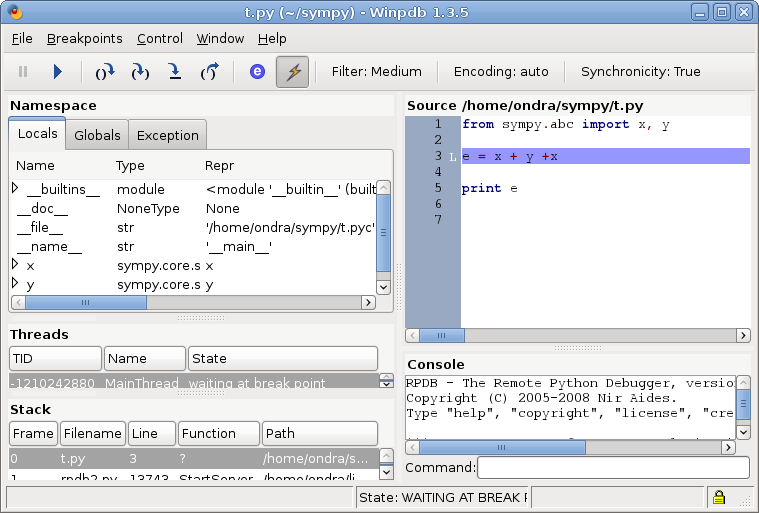
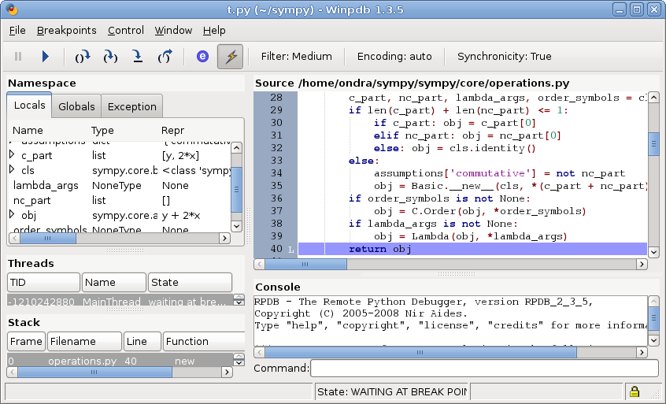

.. _guide:

==================
SymPy User's Guide
==================

.. role:: input(strong)

Introduction
============

If you are new to SymPy, start with the :ref:`Tutorial <tutorial>`. If you went
through it, now
it's time to learn how SymPy works internally, which is what this guide is
about. Once you grasp the ideas behind SymPy, you will be able to use it
effectively and also know how to extend it and fix it.
You may also be just interested in :ref:`SymPy Modules Reference <module-docs>`.

Learning SymPy
==============

Everyone has different ways of understanding the code written by others.

Ondřej's approach
-----------------

Let's say I'd like to understand how ``x + y + x`` works and how it is possible
that it gets simplified to ``2*x + y``.

I write a simple script, I usually call it ``t.py`` (I don't remember anymore
why I call it that way)::

    from sympy.abc import x, y

    e = x + y + x

    print e

And I try if it works

.. parsed-literal::

    $ :input:`python t.py`
    y + 2*x

Now I start `winpdb <http://winpdb.org/>`_ on it (if you've never used winpdb
-- it's an excellent multiplatform debugger, works on Linux, Windows and Mac OS
X):

.. parsed-literal::

    $ :input:`winpdb t.py`
    y + 2*x

and a winpdb window will popup, I move to the next line using F6:

Then I step into (F7) and after a little debugging I get for example:

.. tip:: Make the winpdb window larger on your screen, it was just made smaller
         to fit in this guide.

I see values of all local variables in the left panel, so it's very easy to see
what's happening. You can see, that the ``y + 2*x`` is emerging in the ``obj``
variable. Observing that ``obj`` is constructed from ``c_part`` and ``nc_part``
and seeing what ``c_part`` contains (``y`` and ``2*x``). So looking at the line
28 (the whole line is not visible on the screenshot, so here it is)::

    c_part, nc_part, lambda_args, order_symbols = cls.flatten(map(_sympify, args))

you can see that the simplification happens in ``cls.flatten``. Now you can set
the breakpoint on the line 28, quit winpdb (it will remember the breakpoint),
start it again, hit F5, this will stop at this breakpoint, hit F7, this will go
into the function ``Add.flatten()``::

    @classmethod
    def flatten(cls, seq):
        """
        Takes the sequence "seq" of nested Adds and returns a flatten list.

        Returns: (commutative_part, noncommutative_part, lambda_args,
            order_symbols)

        Applies associativity, all terms are commutable with respect to
        addition.
        """
        terms = {}      # term -> coeff
                        # e.g. x**2 -> 5   for ... + 5*x**2 + ...

        coeff = S.Zero  # standalone term
                        # e.g. 3 + ...
        lambda_args = None
        order_factors = []
        while seq:
            o = seq.pop(0)

and then you can study how it works. I am going to stop here, this should be
enough to get you going -- with the above technique, I am able to understand
almost any Python code.

SymPy's Architecture
====================

We try to make the sources easily understandable, so you can look into the
sources and read the doctests, it should be well documented and if you don't
understand something, ask on the mailinglist_.

You can find all the decisions archived in the issues_, to see rationale for
doing this and that.

Basics
------

All symbolic things are implemented using subclasses of the ``Basic`` class.
First, you need to create symbols using ``Symbol("x")`` or numbers using
``Integer(5)`` or ``Float(34.3)``. Then you construct the expression using any
class from SymPy.  For example ``Add(Symbol("a"), Symbol("b"))`` gives an
instance of the ``Add`` class.  You can call all methods, which the particular
class supports.

For easier use, there is a syntactic sugar for expressions like:

``cos(x) + 1`` is equal to ``cos(x).__add__(1)`` is equal to
``Add(cos(x), Integer(1))``

or

``2/cos(x)`` is equal to ``cos(x).__rdiv__(2)`` is equal to
``Mul(Rational(2), Pow(cos(x), Rational(-1)))``.

So, you can write normal expressions using python arithmetics like this::

    a = Symbol("a")
    b = Symbol("b")
    e = (a + b)**2
    print e

but from the SymPy point of view, we just need the classes ``Add``, ``Mul``,
``Pow``, ``Rational``, ``Integer``.

Automatic evaluation to canonical form
--------------------------------------

For computation, all expressions need to be in a
canonical form, this is done during the creation of the particular instance
and only inexpensive operations are performed, necessary to put the expression
in the
canonical form.  So the canonical form doesn't mean the simplest possible
expression. The exact list of operations performed depend on the
implementation.  Obviously, the definition of the canonical form is arbitrary,
the only requirement is that all equivalent expressions must have the same
canonical form.  We tried the conversion to a canonical (standard) form to be
as fast as possible and also in a way so that the result is what you would
write by hand - so for example ``b*a + -4 + b + a*b + 4 + (a + b)**2`` becomes
``2*a*b + b + (a + b)**2``.

Whenever you construct an expression, for example ``Add(x, x)``, the
``Add.__new__()`` is called and it determines what to return. In this case::

    >>> from sympy import Add
    >>> from sympy.abc import x
    >>> e = Add(x, x)
    >>> e
    2*x

    >>> type(e)
    <class 'sympy.core.mul.Mul'>

``e`` is actually an instance of ``Mul(2, x)``, because ``Add.__new__()``
returned ``Mul``.

Comparisons
-----------

Expressions can be compared using a regular python syntax::

    >>> from sympy.abc import x, y
    >>> x + y == y + x
    True

    >>> x + y == y - x
    False

We made the following decision in SymPy: ``a = Symbol("x")`` and another
``b = Symbol("x")`` (with the same string "x") is the same thing, i.e ``a == b`` is
``True``. We chose ``a == b``, because it is more natural - ``exp(x) == exp(x)`` is
also ``True`` for the same instance of ``x`` but different instances of ``exp``,
so we chose to have ``exp(x) == exp(x)`` even for different instances of ``x``.

Sometimes, you need to have a unique symbol, for example as a temporary one in
some calculation, which is going to be substituted for something else at the
end anyway. This is achieved using ``Dummy("x")``. So, to sum it
up::

    >>> from sympy import Symbol, Dummy
    >>> Symbol("x") == Symbol("x")
    True

    >>> Dummy("x") == Dummy("x")
    False

Debugging
---------

Starting with 0.6.4, you can turn on/off debug messages with the environment
variable ``SYMPY_DEBUG``, which is expected to have the values True or False. For
example, to turn on debugging, you would issue::

    [user@localhost]: SYMPY_DEBUG=True ./bin/isympy

Functionality
-------------

There are no given requirements on classes in the library. For example, if they
don't implement the ``fdiff()`` method and you construct an expression using
such a class, then trying to use the ``Basic.series()`` method will raise an
exception of not finding the ``fdiff()`` method in your class.  This "duck
typing" has an advantage that you just implement the functionality which you
need.

You can define the ``cos`` class like this::

    class cos(Function):
        pass

and use it like ``1 + cos(x)``, but if you don't implement the ``fdiff()`` method,
you will not be able to call ``(1 + cos(x)).series()``.

The symbolic object is characterized (defined) by the things which it can do,
so implementing more methods like ``fdiff()``, ``subs()`` etc., you are creating
a "shape" of the symbolic object. Useful things to implement in new classes are:
``hash()`` (to use the class in comparisons), ``fdiff()`` (to use it in series
expansion), ``subs()`` (to use it in expressions, where some parts are being
substituted) and ``series()`` (if the series cannot be computed using the
general ``Basic.series()`` method). When you create a new class, don't worry
about this too much - just try to use it in your code and you will realize
immediately which methods need to be implemented in each situation.

All objects in sympy are immutable - in the sense that any operation just
returns a new instance (it can return the same instance only if it didn't
change). This is a common mistake to change the current instance, like
``self.arg = self.arg + 1`` (wrong!). Use ``arg = self.arg + 1; return arg`` instead.
The object is immutable in the
sense of the symbolic expression it represents. It can modify itself to keep
track of, for example, its hash. Or it can recalculate anything regarding the
expression it contains. But the expression cannot be changed. So you can pass
any instance to other objects, because you don't have to worry that it will
change, or that this would break anything.

Conclusion
----------

Above are the main ideas behind SymPy that we try to obey. The rest
depends on the current implementation and may possibly change in the future.
The point of all of this is that the interdependencies inside SymPy should be
kept to a minimum. If one wants to add new functionality to SymPy, all that is
necessary is to create a subclass of ``Basic`` and implement what you want.

Functions
---------

How to create a new function with one variable::

    class sign(Function):

        nargs = 1

        @classmethod
        def eval(cls, arg):
            if isinstance(arg, Basic.NaN):
                return S.NaN
            if isinstance(arg, Basic.Zero):
                return S.Zero
            if arg.is_positive:
                return S.One
            if arg.is_negative:
                return S.NegativeOne
            if isinstance(arg, Basic.Mul):
                coeff, terms = arg.as_coeff_mul()
                if not isinstance(coeff, Basic.One):
                    return cls(coeff) * cls(Basic.Mul(*terms))

        is_finite = True

        def _eval_conjugate(self):
            return self

        def _eval_is_zero(self):
            return isinstance(self[0], Basic.Zero)

and that's it. The ``_eval_*`` functions are called when something is needed.
The ``eval`` is called when the class is about to be instantiated and it
should return either some simplified instance of some other class or if the
class should be unmodified, return ``None`` (see ``core/function.py`` in
``Function.__new__`` for implementation details). See also tests in
`sympy/functions/elementary/tests/test_interface.py
<https://github.com/sympy/sympy/blob/master/sympy/functions/elementary/tests/test_interface.py>`_ that test this interface. You can use them to create your own new functions.

The applied function ``sign(x)`` is constructed using
::

    sign(x)

both inside and outside of SymPy. Unapplied functions ``sign`` is just the class
itself::

    sign

both inside and outside of SymPy. This is the current structure of classes in
SymPy::

    class BasicType(type):
        pass
    class MetaBasicMeths(BasicType):
        ...
    class BasicMeths(AssumeMeths):
        __metaclass__ = MetaBasicMeths
        ...
    class Basic(BasicMeths):
        ...
    class FunctionClass(MetaBasicMeths):
        ...
    class Function(Basic, RelMeths, ArithMeths):
        __metaclass__ = FunctionClass
        ...

The exact names of the classes and the names of the methods and how they work
can be changed in the future.

This is how to create a function with two variables::

    class chebyshevt_root(Function):
        nargs = 2

        @classmethod
        def eval(cls, n, k):
            if not 0 <= k < n:
                raise ValueError("must have 0 <= k < n")
            return cos(S.Pi*(2*k + 1)/(2*n))

.. note:: the first argument of a @classmethod should be ``cls`` (i.e. not
          ``self``).

Here it's how to define a derivative of the function::

    >>> from sympy import Function, sympify, cos
    >>> class my_function(Function):
    ...     nargs = 1
    ...
    ...     def fdiff(self, argindex = 1):
    ...         return cos(self.args[0])
    ...
    ...     @classmethod
    ...     def eval(cls, arg):
    ...         arg = sympify(arg)
    ...         if arg == 0:
    ...             return sympify(0)

So guess what this ``my_function`` is going to be? Well, it's derivative is
``cos`` and the function value at 0 is 0, but let's pretend we don't know::

    >>> from sympy import pprint
    >>> pprint(my_function(x).series(x, 0, 10))
         3     5     7       9
        x     x     x       x       / 10\
    x - -- + --- - ---- + ------ + O\x  /
        6    120   5040   362880

Looks familiar indeed::

    >>> from sympy import sin
    >>> pprint(sin(x).series(x, 0, 10))
         3     5     7       9
        x     x     x       x       / 10\
    x - -- + --- - ---- + ------ + O\x  /
        6    120   5040   362880

Let's try a more complicated example. Let's define the derivative in terms of
the function itself::

    >>> class what_am_i(Function):
    ...     nargs = 1
    ...
    ...     def fdiff(self, argindex = 1):
    ...         return 1 - what_am_i(self.args[0])**2
    ...
    ...     @classmethod
    ...     def eval(cls, arg):
    ...         arg = sympify(arg)
    ...         if arg == 0:
    ...             return sympify(0)

So what is ``what_am_i``?  Let's try it::

    >>> pprint(what_am_i(x).series(x, 0, 10))
         3      5       7       9
        x    2*x    17*x    62*x     / 10\
    x - -- + ---- - ----- + ----- + O\x  /
        3     15     315     2835

Well, it's ``tanh``::

    >>> from sympy import tanh
    >>> pprint(tanh(x).series(x, 0, 10))
         3      5       7       9
        x    2*x    17*x    62*x     / 10\
    x - -- + ---- - ----- + ----- + O\x  /
        3     15     315     2835

The new functions we just defined are regular SymPy objects, you
can use them all over SymPy, e.g.::

    >>> from sympy import limit
    >>> limit(what_am_i(x)/x, x, 0)
    1

Common tasks
------------

Please use the same way as is shown below all across SymPy.

**accessing parameters**::

    >>> from sympy import sign, sin
    >>> from sympy.abc import x, y, z

    >>> e = sign(x**2)
    >>> e.args
    (x**2,)

    >>> e.args[0]
    x**2

    Number arguments (in Adds and Muls) will always be the first argument;
    other arguments might be in arbitrary order:
    >>> (1 + x + y*z).args[0]
    1
    >>> (1 + x + y*z).args[1] in (x, y*z)
    True

    >>> (y*z).args
    (y, z)

    >>> sin(y*z).args
    (y*z,)

Never use internal methods or variables, prefixed with "``_``" (example: don't
use ``_args``, use ``.args`` instead).

**testing the structure of a SymPy expression**

Applied functions::

    >>> from sympy import sign, exp, Function
    >>> e = sign(x**2)

    >>> isinstance(e, sign)
    True

    >>> isinstance(e, exp)
    False

    >>> isinstance(e, Function)
    True

So ``e`` is a ``sign(z)`` function, but not ``exp(z)`` function.

Unapplied functions::

    >>> from sympy import sign, exp, FunctionClass
    >>> e = sign

    >>> f = exp

    >>> g = Add

    >>> isinstance(e, FunctionClass)
    True

    >>> isinstance(f, FunctionClass)
    True

    >>> isinstance(g, FunctionClass)
    False

    >>> g is Add
    True

So ``e`` and ``f`` are functions, ``g`` is not a function.

Contributing
============

We welcome every SymPy user to participate in it's development. Don't worry if
you've never contributed to any open source project, we'll help you learn
anything necessary, just ask on our mailinglist_.

Don't be afraid to ask anything and don't worry that you are wasting our time
if you are new to SymPy and ask questions that maybe most of the people know
the answer to -- you are not, because that's exactly what the mailinglist_ is
for and people answer your emails because they want to. Also we try hard to
answer every email, so you'll always get some feedback and pointers what to do
next.

Improving the code
------------------

Go to issues_ that are sorted by priority and simply find something that you
would like to get fixed and fix it. If you find something odd, please report it
into issues_ first before fixing it. Feel free to consult with us on the
mailinglist_.  Then send your patch either to the issues_ or the mailinglist_.

Please read our excellent `SymPy Patches Tutorial
<https://github.com/sympy/sympy/wiki/Development-workflow>`_ at our
wiki for a guide on how to write patches to SymPy, how to work with Git,
and how to make your life easier as you get started with SymPy.

.. _issues:             https://github.com/sympy/sympy/issues
.. _mailinglist:        https://groups.google.com/forum/#!forum/sympy

Improving the docs
------------------

Please see :ref:`the documentation <module-docs>` how to fix and improve
SymPy's documentation. All contribution is very welcome.
