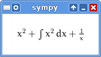

.. include:: ../definitions.def

Setting up and using printers
=============================

Computations are at the heart of symbolic mathematics systems, but very
often presentation and visualization of results or intermediate steps
is also very important, for example for sharing results. SymPy implements
a very generic and flexible framework for implementing printers of
mathematical expressions, Python's data types and date structures, and
foreign types.

Built-in printers
-----------------

There are many ways how expressions can be printed in Sympy.

Standard
~~~~~~~~

This is what ``str(expression)`` returns and it looks like this::

    >>> from sympy import *
    >>> var('x')
    x

    >>> print x**2
    x**2
    >>> print 1/x
    1/x
    >>> print Integral(x**2, x)
    Integral(x**2, x)

Note that :func:`str` is by design not aware of global configuration,
so if you for example run ``bin/isympy -o grlex``, :func:`str` will
ignore this. There is another function :func:`sstr` that takes global
configuration into account.

Low-level
~~~~~~~~~

Due to internal implementation of Python, SymPy can't use :func:`repr`
for generating low-level textual representation of expressions. To get
this kind of representation you have to use:func:`srepr` ::

    >>> srepr(x**2)
    "Pow(Symbol('x'), Integer(2))"

    >>> srepr(1/x)
    "Pow(Symbol('x'), Integer(-1))"

    >>> srepr(Integral(x**2, x))
    "Integral(Pow(Symbol('x'), Integer(2)), Tuple(Symbol('x')))"

:func:`repr` gives the same result as :func:`str`::

    >>> repr(x**2)
    'x**2'

Note that :func:`repr` is also not aware of global configuration.

Pretty printing
~~~~~~~~~~~~~~~

This is a nice 2D ASCII-art printing produced by :func:`pprint`::

    >>> pprint(x**2, use_unicode=False)
     2
    x
    >>> pprint(1/x, use_unicode=False)
    1
    -
    x
    >>> pprint(Integral(x**2, x), use_unicode=False)
      /
     |
     |  2
     | x  dx
     |
    /

It also has support for Unicode character set, which makes shapes look
much more natural than in ASCII-art case::

    >>> pprint(Integral(x**2, x), use_unicode=True)
    ⌠
    ⎮  2
    ⎮ x  dx
    ⌡

By default :func:`pprint` tries to figure out the best of Unicode and
ASCII-art for generating output. If Unicode is supported, then this will
be the default. Otherwise it falls back to ASCII art. User can select the
desired character set by setting ``use_unicode`` option in :func:`pprint`.

Python printing
~~~~~~~~~~~~~~~

::

    >>> print python(x**2)
    x = Symbol('x')
    e = x**2
    >>> print python(1/x)
    x = Symbol('x')
    e = 1/x
    >>> print python(Integral(x**2, x))
    x = Symbol('x')
    e = Integral(x**2, x)

LaTeX printing
~~~~~~~~~~~~~~

::

    >>> latex(x**2)
    'x^{2}'
    >>> latex(x**2, mode='inline')
    '$x^{2}$'
    >>> latex(x**2, mode='equation')
    '\\begin{equation}x^{2}\\end{equation}'
    >>> latex(x**2, mode='equation*')
    '\\begin{equation*}x^{2}\\end{equation*}'
    >>> latex(1/x)
    '\\frac{1}{x}'
    >>> latex(Integral(x**2, x))
    '\\int x^{2}\\, dx'

MathML printing
~~~~~~~~~~~~~~~

::

    >>> from sympy.printing.mathml import mathml
    >>> from sympy import Integral, latex
    >>> from sympy.abc import x
    >>> print mathml(x**2)
    <apply><power/><ci>x</ci><cn>2</cn></apply>
    >>> print mathml(1/x)
    <apply><power/><ci>x</ci><cn>-1</cn></apply>

Printing with Pyglet
~~~~~~~~~~~~~~~~~~~~

This allows for printing expressions in a separate GUI window. Issue::

    >>> preview(x**2 + Integral(x**2, x) + 1/x) # doctest: +SKIP

and a Pyglet window with the LaTeX rendered expression will popup:

Setting up printers
-------------------

By default SymPy uses :func:`str`/:func:`sstr` printer. Other printers can
be used explicitly as in examples in subsections above. This is efficient
only when printing at most a few times with a non-standard printer. To make
Python use a different printer than the default one, the typical approach
is to modify ``sys.displayhook``::

    >>> 1/x
    1/x

    >>> import sys
    >>> oldhook = sys.displayhook
    >>> sys.displayhook = pprint

    >>> 1/x
    1
    -
    x

    >>> sys.displayhook = oldhook

Alternatively one can use SymPy's function :func:`init_printing`. This works
only for pretty printer, but is the fastest way to setup this type of printer.

Customizing built-in printers
-----------------------------

Suppose we dislike how certain classes of expressions are printed. One such
issue may be pretty printing of polynomials (instances of :class:`Poly` class),
in which case :class:`PrettyPrinter` simply doesn't have support for printing
polynomials and falls back to :class:`StrPrinter`::

    >>> Poly(x**2 + 1)
    Poly(x**2 + 1, x, domain='ZZ')

One way to add support for pretty printing polynomials is to extend pretty
printer's class and implement ``_print_Poly`` method. We would choose this
approach if we wanted this to be a permanent change in SymPy. We will choose
a different way and subclass :class:`PrettyPrinter` and implement ``_print_Poly``
in the new class.

Let's call the new pretty printer :class:`PolyPrettyPrinter`. It's implementation
looks like this::

    >>> from sympy.printing.pretty.pretty import PrettyPrinter
    >>> from sympy.printing.pretty.stringpict import prettyForm

    >>> class PolyPrettyPrinter(PrettyPrinter):
    ...    """This printer prints polynomials nicely. """
    ...
    ...    def _print_Poly(self, poly):
    ...        expr = poly.as_expr()
    ...        gens = list(poly.gens)
    ...        domain = poly.get_domain()
    ...
    ...        pform_head = prettyForm('Poly')
    ...        pform_tail = self._print_seq([expr] + gens + [domain], '(', ')')
    ...
    ...        pform = prettyForm(*pform_head.right(pform_tail))
    ...        return pform

    >>> def pretty_poly(expr, **settings):
    ...    """Pretty-print polynomials nicely. """
    ...    p = PolyPrettyPrinter(settings)
    ...    s = p.doprint(expr)
    ...
    ...    return s

Using :func:`pretty_poly` allows us to print polynomials in 2D and Unicode::

    >>> print pretty_poly(Poly(x**2 + 1), use_unicode=True)
          2
    Poly(x  + 1, x, ℤ)

We can use techniques from previous section to make this new pretty printer
the default for all inputs.

Tasks
~~~~~

1. Following implementation of :class:`PolyPrettyPrinter`, add a printer
   for :class:`Lambda` which would use *mapping* notation (arrow) instead
   of lambda calculus-like notation.

   (:ref:`solution <solution_custom_printers_1>`)

2. Following the way how :class:`Poly` is printed by :func:`str` printer,
   make :class:`PolyPrettyPrinter` print domain including ``domain=`` string.

   (:ref:`solution <solution_custom_printers_2>`)

Implementing printers from scratch
----------------------------------

SymPy implements a variety of printers and often extending those existent
may be sufficient, to optimize them for certain problem domain or specific
mathematical notation. However, we can also add completely new ones, for
example to allow printing SymPy's expression with other symbolic mathematics
systems' syntax.

Suppose we would like to translate SymPy's expressions to Mathematica syntax.
As of version 0.7.1, SymPy doesn't implement such a printer, so we get do it
right now. Adding a new printer basically boils down to adding a new class,
let's say :class:`MathematicaPrinter`, which derives from :class:`Printer`
and implements ``_print_*`` methods for all kinds of expressions we want to
support. In this particular example we would like to be able to translate:

* numbers
* symbols
* functions
* exponentiation

and compositions of all of those. A prototype implementation is as follows:

.. literalinclude:: python/mathematica.py

Before we explain this code, let's see what it can do::

    >>> mathematica(S(1)/2) # doctest: +SKIP
    1/2
    >>> mathematica(x) # doctest: +SKIP
    x

    >>> mathematica(x**2) # doctest: +SKIP
    x^2

    >>> mathematica(f(x)) # doctest: +SKIP
    f[x]
    >>> mathematica(sin(x)) # doctest: +SKIP
    Sin[x]
    >>> mathematica(asin(x)) # doctest: +SKIP
    ArcSin[x]

    >>> mathematica(sin(x**2)) # doctest: +SKIP
    Sin[x^2]
    >>> mathematica(sin(x**(S(1)/2))) # doctest: +SKIP
    Sin[x^(1/2)]

However, as we didn't include support for :class:`Add`, this doesn't work::

    >>> mathematica(x**2 + 1) # doctest: +SKIP
    x**2 + 1

and very many other classes of expressions are printed improperly. If we
need support for a particular class, we have to add another ``_print_*``
method to :class:`MathematicaPrinter`. For example, to make the above
example work, we have to implement ``_print_Add``.

Tasks
~~~~~

1. Make Mathematica printer correctly print `\pi`.

   (:ref:`solution <solution_new_printers_1>`)

2. Add support for :class:`Add` and :class:`Mul` to Mathematica printer. In
   the case of products, allow both explicit and implied multiplication, and
   allow users to choose desired behavior by parametrization of Mathematica
   printer.

   (:ref:`solution <solution_new_printers_2>`)

Code generation
---------------

Besides printing of mathematical expressions, SymPy also implements Fortran
and C code generation. The simplest way to proceed is to use :func:`codegen`
which takes a tuple consisting of function name and an expression, or a list
of tuples of this kind, language in which it will generate code (``C`` for
C programming language and ``F95`` for Fortran, and file name::

    >>> from sympy.utilities.codegen import codegen

    >>> print codegen(("chebyshevt_20", chebyshevt(20, x)), "F95", "file")[0][1]
    !******************************************************************************
    !*                    Code generated with sympy 0.7.2-git                     *
    !*                                                                            *
    !*              See http://www.sympy.org/ for more information.               *
    !*                                                                            *
    !*                       This file is part of 'project'                       *
    !******************************************************************************
    <BLANKLINE>
    REAL*8 function chebyshevt_20(x)
    implicit none
    REAL*8, intent(in) :: x
    <BLANKLINE>
    chebyshevt_20 = 524288*x**20 - 2621440*x**18 + 5570560*x**16 - 6553600*x &
          **14 + 4659200*x**12 - 2050048*x**10 + 549120*x**8 - 84480*x**6 + &
          6600*x**4 - 200*x**2 + 1
    <BLANKLINE>
    end function

In this example we generated Fortran code for function ``chebyshevt_20`` which
allows use to evaluate Chebyshev polynomial of the first kind of degree 20.
Almost the same way one can generate C code for this expression.

Tasks
~~~~~

1. Generate C code for ``chebyshevt(20, x)``.
2. Make SymPy generate one file of Fortran or/and C code that would contain
   definitions of functions that would allow us to evaluate each of the first
   ten Chebyshev polynomials of the first kind.
