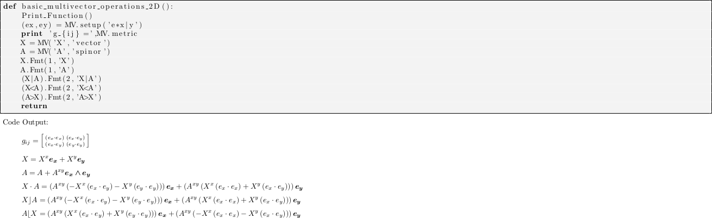

.. raw:: html

    

.. role:: red
   :class: color:red

*****************
Geometric Algebra
*****************

:Author: Alan Bromborsky

.. |release| replace:: 0.10

.. % Complete documentation on the extended LaTeX markup used for Python
.. % documentation is available in ``Documenting Python'', which is part
.. % of the standard documentation for Python.  It may be found online
.. % at:
.. %
.. % http://www.python.org/doc/current/doc/doc.html
.. % \lstset{language=Python}
.. % \input{macros}
.. % This is a template for short or medium-size Python-related documents,
.. % mostly notably the series of HOWTOs, but it can be used for any
.. % document you like.
.. % The title should be descriptive enough for people to be able to find
.. % the relevant document.

.. % Increment the release number whenever significant changes are made.
.. % The author and/or editor can define 'significant' however they like.

.. % At minimum, give your name and an email address.  You can include a
.. % snail-mail address if you like.

.. % This makes the Abstract go on a separate page in the HTML version;
.. % if a copyright notice is used, it should go immediately after this.
.. %
.. % \ifhtml
.. % \chapter*{Front Matter\label{front}}
.. % \fi
.. % Copyright statement should go here, if needed.
.. % ...
.. % The abstract should be a paragraph or two long, and describe the

.. % scope of the document.

.. topic:: Abstract

   This document describes the implementation, installation and use of a
   geometric algebra module written in
   python that utilizes the :mod:`sympy` symbolic algebra library.  The python
   module *galgebra* has been developed for coordinate free calculations using
   the operations (geometric, outer, and inner products etc.) of geometric algebra.
   The operations can be defined using a completely arbitrary metric defined
   by the inner products of a set of arbitrary vectors or the metric can be
   restricted to enforce orthogonality and signature constraints on the set of
   vectors.  In addition the module includes the geometric, outer (curl) and inner
   (div) derivatives and the ability to define a curvilinear coordinate system.
   The module requires the sympy module and the numpy module for numerical linear
   algebra calculations.  For latex output a latex distribution must be installed.

.. module:: sympy.galgebra.ga

What is Geometric Algebra?
==========================

Geometric algebra is the Clifford algebra of a real finite dimensional vector
space or the algebra that results when a real finite dimensional vector space
is extended with a product of vectors (geometric product) that is associative,
left and right distributive, and yields a real number for the square (geometric
product) of any vector [Hestenes]_, [Doran]_.  The elements of the geometric
algebra are called multivectors and consist of the linear combination of
scalars, vectors, and the geometric product of two or more vectors. The
additional axioms for the geometric algebra are that for any vectors :math:`a`,
:math:`b`, and :math:`c` in the base vector space ([Doran]_,p85):

.. math::
  :nowrap:

  \begin{equation*}
  \begin{array}{c}
  a\left ( bc \right ) = \left ( ab \right ) c \\
  a\left ( b+c \right ) = ab+ac \\
  \left ( a + b \right ) c = ac+bc \\
  aa = a^{2} \in \Re
  \end{array}
  \end{equation*}

By induction the first three axioms also apply to any multivectors.  The dot product of
two vectors is defined by ([Doran]_,p86)

.. math::
  :nowrap:

  \begin{equation*}
     a\cdot b \equiv (ab+ba)/2
  \end{equation*}

Then consider

.. math::
  :nowrap:

  \begin{align*}
     c &= a+b \\
     c^{2} &= (a+b)^{2} \\
     c^{2} &= a^{2}+ab+ba+b^{2} \\
     a\cdot b &= (c^{2}-a^{2}-b^{2})/2 \in \Re
  \end{align*}

Thus :math:`a\cdot b`  is real.  The objects generated from linear combinations
of the geometric products of vectors are called multivectors.  If a basis for
the underlying vector space is the set of vectors formed from :math:`e_{1},\dots,e_{n}`
a complete basis for the geometric algebra is given by the scalar :math:`1`, the vectors :math:`e_{1},\dots,e_{n}`
and all geometric products of vectors

.. math::
   :nowrap:

   \begin{equation*}
      e_{i_{1}} e_{i_{2}} \dots e_{i_{r}} \mbox{ where } 0 \le r \le n \mbox{, } 0 \le i_{j} \le n \mbox{ and } 0 < i_{1} < i_{2} < \dots < i_{r} \le n
   \end{equation*}

Each base of the complete basis is represented by a noncommutative symbol (except for the scalar 1)
with name :math:`e_{i_{1}}\dots e_{i_{r}}` so that the general multivector :math:`\boldsymbol{A}` is represented by
(:math:`A` is the scalar part of the multivector and the :math:`A^{i_{1},\dots,i_{r}}` are scalars)

.. math::
   :nowrap:

   \begin{equation*}
      \boldsymbol{A} = A + \sum_{r=1}^{n}\sum_{i_{1},\dots,i_{r},\;\forall\; 0\le i_{j} \le n} A^{i_{1},\dots,i_{r}}e_{i_{1}}e_{i_{2}}\dots e_{r}
   \end{equation*}

The critical operation in setting up the geometric algebra is reducing
the geometric product of any two bases to a linear combination of bases so that
we can calculate a multiplication table for the bases.  Since the geometric
product is associative we can use the operation (by definition for two vectors
:math:`a\cdot b \equiv (ab+ba)/2`  which is a scalar)

.. _eq1:

.. math::
   :nowrap:
   :label: 5.1

   \begin{equation}
      e_{i_{j+1}}e_{i_{j}} = 2e_{i_{j+1}}\cdot e_{i_{j}} - e_{i_{j}}e_{i_{j+1}}
   \end{equation}

These processes are repeated untill every basis list in :math:`\boldsymbol{A}` is in normal
(ascending) order with no repeated elements. As an example consider the
following

.. math::
   :nowrap:

   \begin{align*}
      e_{3}e_{2}e_{1} &= (2(e_{2}\cdot e_{3}) - e_{2}e_{3})e_{1} \\
                      &= 2(e_{2}\cdot e_{3})e_{1} - e_{2}e_{3}e_{1} \\
                      &= 2(e_{2}\cdot e_{3})e_{1} - e_{2}(2(e_{1}\cdot e_{3})-e_{1}e_{3}) \\
                      &= 2((e_{2}\cdot e_{3})e_{1}-(e_{1}\cdot e_{3})e_{2})+e_{2}e_{1}e_{3} \\
                      &= 2((e_{2}\cdot e_{3})e_{1}-(e_{1}\cdot e_{3})e_{2}+(e_{1}\cdot e_{2})e_{3})-e_{1}e_{2}e_{3}
   \end{align*}

which results from repeated application of equation :ref:`5.1 <eq1>`.  If the product of basis vectors contains repeated factors
equation :ref:`5.1 <eq1>` can be used to bring the repeated factors next to one another so that if :math:`e_{i_{j}} = e_{i_{j+1}}`
then :math:`e_{i_{j}}e_{i_{j+1}} = e_{i_{j}}\cdot e_{i_{j+1}}` which is a scalar that commutes with all the terms in the product
and can be brought to the front of the product.  Since every repeated pair of vectors in a geometric product of :math:`r` factors
reduces the number of noncommutative factors in the product by :math:`r-2`. The number of bases in the multivector algebra is :math:`2^{n}`
and the number containing :math:`r` factors is :math:`{n\choose r}` which is the number of combinations or :math:`n` things
taken :math:`r` at a time (binominal coefficient).

The other construction required for formulating the geometric algebra is the outer or wedge product (symbol :math:`\wedge`) of :math:`r`
vectors denoted by :math:`a_{1}\wedge\dots\wedge a_{r}`.  The wedge product of :math:`r` vectors is called an :math:`r`-blade and is defined
by ([Doran]_,p86)

.. math::
   :nowrap:

   \begin{equation*}
      a_{1}\wedge\dots\wedge a_{r} \equiv \sum_{i_{j_{1}}\dots i_{j_{r}}} \epsilon^{i_{j_{1}}\dots i_{j_{r}}}a_{i_{j_{1}}}\dots a_{i_{j_{1}}}
   \end{equation*}

where :math:`\epsilon^{i_{j_{1}}\dots i_{j_{r}}}` is the contravariant permutation symbol which is :math:`+1` for an even permutation of the
superscripts, :math:`0` if any superscripts are repeated, and :math:`-1` for an odd permutation of the superscripts. From the definition
:math:`a_{1}\wedge\dots\wedge a_{r}` is antisymmetric in all its arguments and the following relation for the wedge product of a vector :math:`a` and an
:math:`r`-blade :math:`B_{r}` can be derived

.. _eq2:

.. math::
   :label: 5.2
   :nowrap:

   \begin{equation}
      a\wedge B_{r} = (aB_{r}+(-1)^{r}B_{r}a)/2
   \end{equation}

Using equation :ref:`5.2 <eq2>` one can represent the wedge product of all the basis vectors
in terms of the geometric product of all the basis vectors so that one can solve (the system
of equations is lower diagonal) for the geometric product of all the basis vectors in terms of
the wedge product of all the basis vectors.  Thus a general multivector :math:`\boldsymbol{B}` can be
represented as a linear combination of a scalar and the basis blades.

.. math::
   :nowrap:

   \begin{equation*}
      \boldsymbol{B} = B + \sum_{r=1}^{n}\sum_{i_{1},\dots,i_{r},\;\forall\; 0\le i_{j} \le n} B^{i_{1},\dots,i_{r}}e_{i_{1}}\wedge e_{i_{2}}\wedge\dots\wedge e_{r}
   \end{equation*}

Using the blades :math:`e_{i_{1}}\wedge e_{i_{2}}\wedge\dots\wedge e_{r}` creates a graded
algebra where :math:`r` is the grade of the basis blades.  The grade-:math:`r`
part of :math:`\boldsymbol{B}` is the linear combination of all terms with
grade :math:`r` basis blades. The scalar part of :math:`\boldsymbol{B}` is defined to
be grade-:math:`0`.  Now that the blade expansion of :math:`\boldsymbol{B}` is defined
we can also define the grade projection operator :math:`\left < {\boldsymbol{B}} \right >_{r}` by

.. math::
   :nowrap:

   \begin{equation*}
      \left < {\boldsymbol{B}} \right >_{r} = \sum_{i_{1},\dots,i_{r},\;\forall\; 0\le i_{j} \le n} B^{i_{1},\dots,i_{r}}e_{i_{1}}\wedge e_{i_{2}}\wedge\dots\wedge e_{r}
   \end{equation*}

and

.. math::
   :nowrap:

   \begin{equation*}
      \left < {\boldsymbol{B}} \right >_{} \equiv \left < {\boldsymbol{B}} \right >_{0} = B
   \end{equation*}

Then if :math:`\boldsymbol{A}_{r}` is an :math:`r`-grade multivector and :math:`\boldsymbol{B}_{s}` is an :math:`s`-grade multivector we have

.. math::
   :nowrap:

   \begin{equation*}
      \boldsymbol{A}_{r}\boldsymbol{B}_{s} = \left < {\boldsymbol{A}_{r}\boldsymbol{B}_{s}} \right >_{\left |{{r-s}}\right |}+\left < {\boldsymbol{A}_{r}\boldsymbol{B}_{s}} \right >_{\left |{{r-s}}\right |+2}+\cdots
                             \left < {\boldsymbol{A}_{r}\boldsymbol{B}_{s}} \right >_{r+s}
   \end{equation*}

and define ([Hestenes]_,p6)

.. math::
   :nowrap:

   \begin{align*}
      \boldsymbol{A}_{r}\wedge\boldsymbol{B}_{s} &\equiv \left < {\boldsymbol{A}_{r}\boldsymbol{B}_{s}} \right >_{r+s} \\
      \boldsymbol{A}_{r}\cdot\boldsymbol{B}_{s} &\equiv \left \{ \begin{array}{cc}
      r\mbox{ or }s \ne 0: & \left < {\boldsymbol{A}_{r}\boldsymbol{B}_{s}} \right >_{\left |{{r-s}}\right |}  \\
      r\mbox{ or }s = 0: & 0 \end{array} \right \}
   \end{align*}

where :math:`\boldsymbol{A}_{r}\cdot\boldsymbol{B}_{s}` is called the dot or inner product of
two pure grade multivectors.  For the case of two non-pure grade multivectors

 .. math::
   :nowrap:

   \begin{align*}
      \boldsymbol{A}\wedge\boldsymbol{B} &= \sum_{r,s}\left < {\boldsymbol{A}} \right >_{r}\wedge\left < {\boldsymbol{B}} \right >_{s} \\
      \boldsymbol{A}\cdot\boldsymbol{B} &= \sum_{r,s\ne 0}\left < {\boldsymbol{A}} \right >_{r}\cdot\left < {\boldsymbol{B}} \right >_{s}
   \end{align*}

Two other products, the right (:math:`\rfloor`) and left (:math:`\lfloor`) contractions, are defined by

 .. math::
   :nowrap:

   \begin{align*}
      \boldsymbol{A}\lfloor\boldsymbol{B} &\equiv \sum_{r,s}\left \{ \begin{array}{cc} \left < {\boldsymbol{A}_r\boldsymbol{B}_{s}} \right >_{r-s} & r \ge s \\
                                                  0                                               & r < s \end{array}\right \}  \\
      \boldsymbol{A}\rfloor\boldsymbol{B} &\equiv \sum_{r,s}\left \{ \begin{array}{cc} \left < {\boldsymbol{A}_{r}\boldsymbol{B}_{s}} \right >_{s-r} & s \ge r \\
                                                  0                                               & s < r\end{array}\right \}
   \end{align*}

A final operation for multivectors is the reverse.  If a multivector :math:`\boldsymbol{A}` is the geometric product of :math:`r` vectors (versor)
so that :math:`\boldsymbol{A} = a_{1}\dots a_{r}` the reverse is defined by

 .. math::
   :nowrap:

   \begin{align*}
      \boldsymbol{A}^{\dagger} \equiv a_{r}\dots a_{1}
   \end{align*}

where for a general multivector we have (the the sum of the reverse of versors)

.. math::
   :nowrap:

   \begin{equation*}
      \boldsymbol{A}^{\dagger} = A + \sum_{r=1}^{n}(-1)^{r(r-1)/2}\sum_{i_{1},\dots,i_{r},\;\forall\; 0\le i_{j} \le n} A^{i_{1},\dots,i_{r}}e_{i_{1}}\wedge e_{i_{2}}\wedge\dots\wedge e_{r}
   \end{equation*}

note that if :math:`\boldsymbol{A}` is a versor then :math:`\boldsymbol{A}\boldsymbol{A}^{\dagger}\in\Re` and (:math:`AA^{\dagger} \ne 0`)

.. math::
   :nowrap:

   \begin{equation*}
      \boldsymbol{A}^{-1} = {\displaystyle\frac{\boldsymbol{A}^{\dagger}}{\boldsymbol{AA}^{\dagger}}}
   \end{equation*}

Representation of Multivectors in Sympy
=======================================

The sympy python module offers a simple way of representing multivectors using linear
combinations of commutative expressions (expressions consisting only of commuting sympy objects)
and noncommutative symbols. We start by defining :math:`n` noncommutative sympy symbols

.. code-block:: python

   (e_1,...,e_n) = symbols('e_1,...,e_n',commutative=False)

Several software packages for numerical geometric algebra calculations are
available from Doran-Lasenby group and the Dorst group. Symbolic packages for
Clifford algebra using orthongonal bases such as
:math:`e_{i}e_{j}+e_{j}e_{i} = 2\eta_{ij}`, where :math:`\eta_{ij}` is a numeric
array are available in Maple and Mathematica. The symbolic algebra module,
*galgebra*, developed for python does not depend on an orthogonal basis
representation, but rather is generated from a set of :math:`n` arbitrary
symbolic vectors,  :math:`e_{1},e_{2},\dots,e_{n}` and a symbolic metric
tensor :math:`g_{ij} = e_{i}\cdot e_{j}`.

In order not to reinvent the wheel all scalar symbolic algebra is handled by the
python module  :mod:`sympy` and the abstract basis vectors are encoded as
noncommuting sympy symbols.

The basic geometic algebra operations will be implemented in python by defining
a multivector class, MV, and overloading the python operators in Table
:ref:`5.1 <table1>` where *A* and *B*  are any two multivectors (In the case of
*+*, *-*, *\**, *^*, and *|* the operation is also defined if *A* or
*B* is a sympy symbol or a sympy real number).

    .. _table1:

    .. csv-table::
        :header: Operation,Result
        :widths: 10, 40

        ''A+B'', sum of multivectors
        ''A-B'', difference of multivectors
        ''A*B'', geometric product
        ''A^B'', outer product of multivectors
        ''A|B'', inner product of multivectors
        ''A<B'', left contraction of multivectors
        ''A>B'', right contraction of multivectors

    Table :ref:`5.1 <table1>`. Multivector operations for *galgebra*

Since *<* and *>* have no r-forms (in python for the *<* and *>* operators there are no *__rlt__()* and *__rlt__()* member functions to overload)
we can only have mixed modes (scalars and multivectors) if the first operand is a multivector.

.. note::

    Except for *<* and *>* all the multivector operators have r-forms so that as long as one of the
    operands, left or right, is a multivector the other can be a multivector or a scalar (sympy symbol or integer).

.. warning::

    Note that the operator order precedence is determined by python and is not
    necessarily that used by geometric algebra. It is **absolutely essential** to
    use parenthesis in multivector
    expressions containing *^*, *|*, *<*, and/or *>*.  As an example let
    *A* and *B* be any two multivectors. Then *A + A*B = A +(A*B)*, but
    *A+A^B = (2*A)^B* since in python the *^* operator has a lower precedence
    than the '+' operator.  In geometric algebra the outer and inner products and
    the left and right contractions have a higher precedence than the geometric
    product and the geometric product has a higher precedence than addition and
    subtraction.  In python the *^*, *|*, *<*, and *>* all have a lower
    precedence than *+* and *-* while *\** has a higher precedence than
    *+* and *-*.

For those users who wish to define a default operator precedence the functions
*define_precedence()* and *GAeval()* are available in the module *galgebra/precedence*.

.. function:: sympy.galgebra.precedence.define_precedence(gd, op_ord='<>|,^,\*')

   Define the precedence of the multivector operations.  The function
   *define_precedence()* must be called from the main program and the
   first argument *gd* must be set to *globals()*.  The second argument
   *op_ord* determines the operator precedence for expressions input to
   the function *GAeval()*. The default value of *op_ord* is *'<>|,^,\*'*.
   For the default value the *<*, *>*, and *|* operations have equal
   precedence followed by *^*, and *^* is followed by *\**.

.. function:: sympy.galgebra.precedence.GAeval(s, pstr=False)

   The function *GAeval()* returns a multivector expression defined by the
   string *s* where the operations in the string are parsed according to
   the precedences defined by *define_precedence()*.  *pstr* is a flag
   to print the input and output of *GAeval()* for debugging purposes.
   *GAeval()* works by adding parenthesis to the input string *s* with the
   precedence defined by *op_ord='<>|,^,\*'*.  Then the parsed string is
   converted to a sympy expression using the python *eval()* function.
   For example consider where *X*, *Y*, *Z*, and *W* are multivectors

   .. code-block:: python

      define_precedence(globals())
      V = GAeval('X|Y^Z*W')

   The sympy variable *V* would evaluate to *((X|Y)^Z)\*W*.

.. _vbm:

Vector Basis and Metric
=======================

The two structures that define the :class:`MV` (multivector) class are the
symbolic basis vectors and the symbolic metric.  The symbolic basis
vectors are input as a string with the symbol name separated by spaces.  For
example if we are calculating the geometric algebra of a system with three
vectors that we wish to denote as *a0*, *a1*, and *a2* we would define the
string variable:

.. code-block:: python

  basis = 'a0 a1 a2'

that would be input into the multivector setup function.  The next step would be
to define the symbolic metric for the geometric algebra of the basis we
have defined. The default metric is the most general and is the matrix of
the following symbols

.. _eq3:

.. math::
  :nowrap:
  :label: 3

  \begin{equation}
  g = \left [
  \begin{array}{ccc}
    (a0.a0)   & (a0.a1)  & (a0.a2) \\
    (a0.a1) & (a1.a1)  & (a1.a2) \\
    (a0.a2) & (a1.a2) & (a2.a2) \\
  \end{array}
  \right ]
  \end{equation}

where each of the :math:`g_{ij}` is a symbol representing all of the dot
products of the basis vectors. Note that the symbols are named so that
:math:`g_{ij} = g_{ji}` since for the symbol function
:math:`(a0.a1) \ne (a1.a0)`.

Note that the strings shown in equation :ref:`5.3 <eq3>` are only used when the values
of :math:`g_{ij}` are output (printed).   In the *galgebra* module (library)
the :math:`g_{ij}` symbols are stored in a static member of the multivector
class :class:`MV` as the sympy matrix *MV.metric* (:math:`g_{ij}` = *MV.metric[i,j]*).

The default definition of :math:`g` can be overwritten by specifying a string
that will define :math:`g`. As an example consider a symbolic representation
for conformal geometry. Define for a basis

.. code-block:: python

  basis = 'a0 a1 a2 n nbar'

and for a metric

.. code-block:: python

  metric = '# # # 0 0, # # # 0 0, # # # 0 0, 0 0 0 0 2, 0 0 0 2 0'

then calling *MV.setup(basis,metric)* would initialize the metric tensor

.. math::
  :nowrap:

  \begin{equation*}
  g = \left [
  \begin{array}{ccccc}
    (a0.a0) & (a0.a1)  & (a0.a2) & 0 & 0\\
    (a0.a1) & (a1.a1)  & (a1.a2) & 0 & 0\\
    (a0.a2) & (a1.a2)  & (a2.a2) & 0 & 0 \\
    0 & 0 & 0 & 0 & 2 \\
    0 & 0 & 0 & 2 & 0
  \end{array}
  \right ]
  \end{equation*}

Here we have specified that *n* and *nbar* are orthonal to all the
*a*'s, *(n.n) = (nbar.nbar) = 0*, and *(n.nbar) = 2*. Using
*#* in the metric definition string just tells the program to use the
default symbol for that value.

When *MV.setup* is called multivector representations of the basis local to
the program are instantiated.  For our first example that means that the
symbolic vectors named *a0*, *a1*, and *a2* are created and returned from
*MV.setup* via a tuple as in -

.. code-block:: python

  (a_1,a_2,a3) = MV.setup('a_1 a_2 a_3',metric=metric)

Note that the python variable name for a basis vector does not have to
correspond to the name give in *MV.setup()*, one may wish to use a
shorted python variable name to reduce programming (typing) errors, for
example one could use -

.. code-block:: python

  (a1,a2,a3) = MV.setup('a_1 a_2 a_3',metric=metric)

or

.. code-block:: python

  (g1,g2,g3) = MV.setup('gamma_1 gamma_2 gamma_3',metric=metric)

so that if the latex printer is used *e1* would print as :math:`\boldsymbol{e_{1}}`
and *g1* as :math:`\boldsymbol{\gamma_{1}}`.

.. note::

  Additionally *MV.setup* has simpified options for naming a set of basis vectors and for
  inputing an othogonal basis.

  If one wishes to name the basis vectors :math:`\boldsymbol{e}_{x}`, :math:`\boldsymbol{e}_{y}`, and
  :math:`\boldsymbol{e}_{z}` then set *basis='e*x|y|z'* or to name :math:`\boldsymbol{\gamma}_{t}`,
  :math:`\boldsymbol{\gamma}_{x}`, :math:`\boldsymbol{\gamma}_{y}`, and :math:`\boldsymbol{\gamma}_{z}` then set
  *basis='gamma*t|x|y|z'*.

  For the case of an othogonal basis if the signature of the
  vector space is :math:`(1,1,1)` (Euclidian 3-space) set *metric='[1,1,1]'* or if it
  is :math:`(1,-1,-1,-1)` (Minkowsi 4-space) set *metric='[1,-1,-1,-1]'*.

Representation and Reduction of Multivector Bases
=================================================

In our symbolic geometric algebra all multivectors
can be obtained from the symbolic basis vectors we have input, via the
different operations available to geometric algebra. The first problem we have
is representing the general multivector in terms terms of the basis vectors.  To
do this we form the ordered geometric products of the basis vectors and develop
an internal representation of these products in terms of python classes.  The
ordered geometric products are all multivectors of the form
:math:`a_{i_{1}}a_{i_{2}}\dots a_{i_{r}}` where :math:`i_{1}<i_{2}<\dots <i_{r}`
and :math:`r \le n`. We call these multivectors bases and represent them
internally with noncommutative symbols so for example :math:`a_{1}a_{2}a_{3}`
is represented by

.. code-block:: python

  Symbol('a_1*a_2*a_3',commutative=False)

In the simplist case of two basis vectors *a_1* and *a_2* we have a list of
bases

.. code-block:: python

  MV.bases = [[Symbol('ONE',commutative=False)],[Symbol('a_1',commutative=False),\
               Symbol('a_2',commutative=False)],[Symbol('a_1*a_2',commutative=False)]]

.. note::

  The reason that the base for the scalar component of the multivector is defined as
  *Symbol('ONE',commutative=False)*, a noncommutative symbol is because of the
  properties of the left and right contraction operators which are non commutative
  if one is contracting a multivector with a scalar.

For the case of the basis blades we have

.. code-block:: python

  MV.blades = [[Symbol('ONE',commutative=False)],[Symbol('a_1',commutative=False),\
               Symbol('a_2',commutative=False)],[Symbol('a_1^a_2',commutative=False)]]

.. note::

  For all grades/pseudo-grades greater than one (vectors) the '*' in the name of the base symbol is
  replaced with a '^' in the name of the blade symbol so that for all basis bases and
  blades of grade/pseudo-grade greater than one there are different symbols for the corresponding
  bases and blades.

The function that builds all the required arrays and dictionaries upto the base multiplication
table is shown below.  *MV.dim* is the number of basis vectors and the *combinations*
functions from *itertools* constructs the index tupels for the bases of each pseudo grade.
Then the noncommutative symbol representing each base is constructed from each index tuple.
*MV.ONE* is the noncommutative symbol for the scalar base.  For example if *MV.dim = 3*
then

.. code-block:: python

  MV.index = ((),((0,),(1,),(2,)),((0,1),(0,2),(1,2)),((0,1,2)))

.. note::

  In the case that the metric tensor is diagonal (orthogonal basis vectors) both base and blade
  bases are identical and fewer arrays and dictionaries need to be constructed.

.. code-block:: python

    @staticmethod
    def build_base_blade_arrays(debug):
        indexes = tuple(range(MV.dim))
        MV.index = [()]
        for i in indexes:
            MV.index.append(tuple(combinations(indexes,i+1)))
        MV.index = tuple(MV.index)

        #Set up base and blade and index arrays

        if not MV.is_orthogonal:
            MV.bases_flat = []
            MV.bases  = [MV.ONE]
            MV.base_to_index  = {MV.ONE:()}
            MV.index_to_base  = {():MV.ONE}
            MV.base_grades    = {MV.ONE:0}
            MV.base_grades[ONE] = 0

        MV.blades = [MV.ONE]
        MV.blades_flat = []
        MV.blade_grades    = {MV.ONE:0}
        MV.blade_grades[ONE] = 0
        MV.blade_to_index = {MV.ONE:()}
        MV.index_to_blade = {():MV.ONE}

        ig = 1 #pseudo grade and grade index
        for igrade in MV.index[1:]:
            if not MV.is_orthogonal:
                bases     = [] #base symbol array within pseudo grade
            blades    = [] #blade symbol array within grade
            ib = 0 #base index within grade
            for ibase in igrade:
                #build base name string
                (base_sym,base_str,blade_sym,blade_str) = MV.make_base_blade_symbol(ibase)

                if not MV.is_orthogonal:
                    bases.append(base_sym)
                    MV.bases_flat.append(base_sym)

                blades.append(blade_sym)
                MV.blades_flat.append(blade_sym)
                base_index = MV.index[ig][ib]

                #Add to dictionarys relating symbols and indexes
                if not MV.is_orthogonal:
                    MV.base_to_index[base_sym]   = base_index
                    MV.index_to_base[base_index] = base_sym
                    MV.base_grades[base_sym]     = ig

                MV.blade_to_index[blade_sym] = base_index
                MV.index_to_blade[base_index] = blade_sym
                MV.blade_grades[blade_sym] = ig

                ib += 1
            ig += 1

            if not MV.is_orthogonal:
                MV.bases.append(tuple(bases))

            MV.blades.append(tuple(blades))

        if not MV.is_orthogonal:
            MV.bases       = tuple(MV.bases)
            MV.bases_flat  = tuple(MV.bases_flat)
            MV.bases_flat1 = (MV.ONE,)+MV.bases_flat
            MV.bases_set   = set(MV.bases_flat[MV.dim:])

        MV.blades       = tuple(MV.blades)
        MV.blades_flat  = tuple(MV.blades_flat)
        MV.blades_flat1 = (MV.ONE,)+MV.blades_flat
        MV.blades_set   = set(MV.blades_flat[MV.dim:])

        return

Base Representation of Multivectors
===================================

In terms of the bases defined as noncommutative sympy symbols the general multivector
is a linear combination (scalar sympy coefficients) of bases so that for the case
of two bases the most general multivector is given by -

.. code-block:: python

  A = A_0*MV.bases[0][0]+A__1*MV.bases[1][0]+A__2*MV.bases[1][1]+A__12*MV.bases[2][0]

If we have another multivector *B* to multiply with *A* we can calculate the product in
terms of a linear combination of bases if we have a multiplication table for the bases.

Blade Representation of Multivectors
====================================

Since we can now calculate the symbolic geometric product of any two
multivectors we can also calculate the blades corresponding to the product of
the symbolic basis vectors using the formula

.. math::
  :nowrap:

  \begin{equation*}
    A_{r}\wedge b = \frac{1}{2}\left ( A_{r}b-\left ( -1 \right )^{r}bA_{r} \right ),
  \end{equation*}

where :math:`A_{r}` is a multivector of grade :math:`r` and :math:`b` is a
vector.  For our example basis the result is shown in Table :ref:`5.3 <table3>`.

.. _table3:

::

   1 = 1
   a0 = a0
   a1 = a1
   a2 = a2
   a0^a1 = {-(a0.a1)}1+a0a1
   a0^a2 = {-(a0.a2)}1+a0a2
   a1^a2 = {-(a1.a2)}1+a1a2
   a0^a1^a2 = {-(a1.a2)}a0+{(a0.a2)}a1+{-(a0.a1)}a2+a0a1a2

Table :ref:`5.3 <table3>`. Bases blades in terms of bases.

The important thing to notice about Table :ref:`5.3 <table3>` is that it is a
triagonal (lower triangular) system of equations so that using a simple back
substitution algorithm we can solve for the pseudo bases in terms of the blades
giving Table :ref:`5.4 <table4>`.

.. _table4:

::

   1 = 1
   a0 = a0
   a1 = a1
   a2 = a2
   a0a1 = {(a0.a1)}1+a0^a1
   a0a2 = {(a0.a2)}1+a0^a2
   a1a2 = {(a1.a2)}1+a1^a2
   a0a1a2 = {(a1.a2)}a0+{-(a0.a2)}a1+{(a0.a1)}a2+a0^a1^a2

Table :ref:`5.4 <table4>`. Bases in terms of basis blades.

Using Table :ref:`5.4 <table4>` and simple substitution we can convert from a base
multivector representation to a blade representation.  Likewise, using Table
:ref:`5.3 <table3>` we can convert from blades to bases.

Using the blade representation it becomes simple to program functions that will
calculate the grade projection, reverse, even, and odd multivector functions.

Note that in the multivector class *MV* there is a class variable for each
instantiation, *self.bladeflg*, that is set to *False* for a base representation
and *True* for a blade representation.  One needs to keep track of which
representation is in use since various multivector operations require conversion
from one representation to the other.

.. warning::

    When the geometric product of two multivectors is calculated the module looks to
    see if either multivector is in blade representation.  If either is the result of
    the geometric product is converted to a blade representation.  One result of this
    is that if either of the multivectors is a simple vector (which is automatically a
    blade) the result will be in a blade representation.  If *a* and *b* are vectors
    then the result *a*b* will be *(a.b)+a^b* or simply *a^b* if *(a.b) = 0*.

Outer and Inner Products, Left and Right Contractions
=====================================================

In geometric algebra any general multivector :math:`A` can be decomposed into
pure grade multivectors (a linear combination of blades of all the same order)
so that in a :math:`n`-dimensional vector space

.. math::
  :nowrap:

  \begin{equation*}
  A = \sum_{r = 0}^{n}A_{r}
  \end{equation*}

The geometric product of two pure grade multivectors :math:`A_{r}` and
:math:`B_{s}` has the form

.. math::
  :nowrap:

  \begin{equation*}
  A_{r}B_{s} = \left < {A_{r}B_{s}} \right >_{\left |{{r-s}}\right |}+\left < {A_{r}B_{s}} \right >_{\left |{{r-s}}\right |+2}+\cdots+\left < {A_{r}B_{s}} \right >_{r+s}
  \end{equation*}

where :math:`\left < { } \right >_{t}` projects the :math:`t` grade components of the
multivector argument.  The inner and outer products of :math:`A_{r}` and
:math:`B_{s}` are then defined to be

.. math::
  :nowrap:

  \begin{equation*}
  A_{r}\cdot B_{s} = \left < {A_{r}B_{s}} \right >_{\left |{{r-s}}\right |}
  \end{equation*}

.. math::
  :nowrap:

  \begin{equation*}
  A_{r}\wedge B_{s} = \left < {A_{r}B_{s}} \right >_{r+s}
  \end{equation*}

and

.. math::
  :nowrap:

  \begin{equation*}
  A\cdot B = \sum_{r,s}A_{r}\cdot B_{s}
  \end{equation*}

.. math::
  :nowrap:

  \begin{equation*}
  A\wedge B = \sum_{r,s}A_{r}\wedge B_{s}
  \end{equation*}

Likewise the right (:math:`\lfloor`) and left (:math:`\rfloor`) contractions are defined as

.. math::
  :nowrap:

  \begin{equation*}
  A_{r}\lfloor B_{s} = \left \{ \begin{array}{cc}
     \left < {A_{r}B_{s}} \right >_{r-s} &  r \ge s \\
               0            &  r < s \end{array} \right \}
  \end{equation*}

.. math::
  :nowrap:

  \begin{equation*}
  A_{r}\rfloor B_{s} = \left \{ \begin{array}{cc}
     \left < {A_{r}B_{s}} \right >_{s-r} &  s \ge r \\
               0            &  s < r \end{array} \right \}
  \end{equation*}

and

.. math::
  :nowrap:

  \begin{equation*}
  A\lfloor B = \sum_{r,s}A_{r}\lfloor B_{s}
  \end{equation*}

.. math::
  :nowrap:

  \begin{equation*}
  A\rfloor B = \sum_{r,s}A_{r}\rfloor B_{s}
  \end{equation*}

.. warning::

    In the  *MV* class we have overloaded the *^* operator to represent the outer
    product so that instead of calling the outer product function we can write *mv1^ mv2*.
    Due to the precedence rules for python it is **absolutely essential** to enclose outer products
    in parenthesis.

.. warning::

    In the *MV* class we have overloaded the *|* operator for the inner product,
    *>* operator for the right contraction, and *<* operator for the left contraction.
    Instead of calling the inner product function we can write *mv1|mv2*, *mv1>mv2*, or
    *mv1<mv2* respectively for the inner product, right contraction, or left contraction.
    Again, due to the precedence rules for python it is **absolutely essential** to enclose inner
    products and/or contractions in parenthesis.

.. _reverse:

Reverse of Multivector
======================

If :math:`A` is the geometric product of :math:`r` vectors

.. math::
  :nowrap:

  \begin{equation*}
    A = a_{1}\dots a_{r}
  \end{equation*}

then the reverse of :math:`A` designated :math:`A^{\dagger}` is defined by

.. math::
  :nowrap:

  \begin{equation*}
    A^{\dagger} \equiv a_{r}\dots a_{1}.
  \end{equation*}

The reverse is simply the product with the order of terms reversed.  The reverse
of a sum of products is defined as the sum of the reverses so that for a general
multivector A we have

.. math::
  :nowrap:

  \begin{equation*}
    A^{\dagger} = \sum_{i=0}^{N} {\left < {A} \right >_{i}}^{\dagger}
  \end{equation*}

but

.. _eq4:

.. math::
  :label: 5.4
  :nowrap:

  \begin{equation}
    {\left < {A} \right >_{i}}^{\dagger} = \left ( -1\right )^{\frac{i\left ( i-1\right )}{2}}\left < {A} \right >_{i}
  \end{equation}

which is proved by expanding the blade bases in terms of orthogonal vectors and
showing that equation :ref:`5.4 <eq4>` holds for the geometric product of orthogonal
vectors.

The reverse is important in the theory of rotations in :math:`n`-dimensions.  If
:math:`R` is the product of an even number of vectors and :math:`RR^{\dagger} = 1`
then :math:`RaR^{\dagger}` is a composition of rotations of the vector :math:`a`.
If :math:`R` is the product of two vectors then the plane that :math:`R` defines
is the plane of the rotation.  That is to say that :math:`RaR^{\dagger}` rotates the
component of :math:`a` that is projected into the plane defined by :math:`a` and
:math:`b` where :math:`R=ab`.  :math:`R` may be written
:math:`R = e^{\frac{\theta}{2}U}`, where :math:`\theta` is the angle of rotation
and :math:`u` is a unit blade :math:`\left ( u^{2} = \pm 1\right )` that defines the
plane of rotation.

.. _recframe:

Reciprocal Frames
=================

If we have :math:`M` linearly independent vectors (a frame),
:math:`a_{1},\dots,a_{M}`, then the reciprocal frame is
:math:`a^{1},\dots,a^{M}` where :math:`a_{i}\cdot a^{j} = \delta_{i}^{j}`,
:math:`\delta_{i}^{j}` is the Kronecker delta (zero if :math:`i \ne j` and one
if :math:`i = j`). The reciprocal frame is constructed as follows:

.. math::
  :nowrap:

  \begin{equation*}
    E_{M} = a_{1}\wedge\dots\wedge a_{M}
  \end{equation*}

.. math::
  :nowrap:

  \begin{equation*}
    E_{M}^{-1} = {\displaystyle\frac{E_{M}}{E_{M}^{2}}}
  \end{equation*}

Then

.. math::
  :nowrap:

  \begin{equation*}
    a^{i} = \left ( -1\right )^{i-1}\left ( a_{1}\wedge\dots\wedge \breve{a}_{i} \wedge\dots\wedge a_{M}\right ) E_{M}^{-1}
  \end{equation*}

where :math:`\breve{a}_{i}` indicates that :math:`a_{i}` is to be deleted from
the product.  In the standard notation if a vector is denoted with a subscript
the reciprocal vector is denoted with a superscript. The multivector setup
function *MV.setup(basis,metric,rframe)* has the argument *rframe* with a
default value of *False*.  If it is set to *True* the reciprocal frame of
the basis vectors is calculated. Additionally there is the function
*reciprocal_frame(vlst,names='')* external to the *MV* class that will
calculate the reciprocal frame of a list, *vlst*, of vectors.  If the argument
*names* is set to a space delimited string of names for the vectors the
reciprocal vectors will be given these names.

.. _deriv:

Geometric Derivative
====================

If :math:`F` is a multivector field that is a function of a vector
:math:`x = x^{i}\boldsymbol{e}_{i}` (we are using the summation convention that
pairs of subscripts and superscripts are summed over the dimension of the vector
space) then the geometric derivative :math:`\nabla F` is given by (in this
section the summation convention is used):

.. math::
  :nowrap:

  \begin{equation*}
    \nabla F = \boldsymbol{e}^{i}{\displaystyle\frac{\partial F}{\partial x^{i}}}
  \end{equation*}

If :math:`F_{R}` is a grade-:math:`R` multivector and
:math:`F_{R} = F_{R}^{i_{1}\dots i_{R}}\boldsymbol{e}_{i_{1}}\wedge\dots\wedge \boldsymbol{e}_{i_{R}}`
then

.. math::
  :nowrap:

  \begin{equation*}
    \nabla F_{R} = {\displaystyle\frac{\partial F_{R}^{i_{1}\dots i_{R}}}{\partial x^{j}}}\boldsymbol{e}^{j}\left (\boldsymbol{e}_{i_{1}}\wedge
                 \dots\wedge \boldsymbol{e}_{i_{R}} \right )
  \end{equation*}

Note that
:math:`\boldsymbol{e}^{j}\left (\boldsymbol{e}_{i_{1}}\wedge\dots\wedge \boldsymbol{e}_{i_{R}} \right )`
can only contain grades :math:`R-1` and :math:`R+1` so that :math:`\nabla F_{R}`
also can only contain those grades. For a grade-:math:`R` multivector
:math:`F_{R}` the inner (div) and outer (curl) derivatives are defined as

.. math::
  :nowrap:

  \begin{equation*}
  \nabla\cdot F_{R} = \left < \nabla F_{R}\right >_{R-1}
  \end{equation*}

and

.. math::
  :nowrap:

  \begin{equation*}
  \nabla\wedge F_{R} = \left < \nabla F_{R}\right >_{R+1}
  \end{equation*}

For a general multivector function :math:`F` the inner and outer derivatives are
just the sum of the inner and outer dervatives of each grade of the multivector
function.

Curvilinear coordinates are derived from a vector function
:math:`x(\boldsymbol{\theta})` where
:math:`\boldsymbol{\theta} = \left (\theta_{1},\dots,\theta_{N}\right )` where the number of
coordinates is equal to the dimension of the vector space.  In the case of
3-dimensional spherical coordinates :math:`\boldsymbol{\theta} = \left ( r,\theta,\phi \right )`
and the coordinate generating function :math:`x(\boldsymbol{\theta})` is

.. math::
  :nowrap:

  \begin{equation*}
  x =  r \cos\left({\phi}\right) \sin\left({\theta}\right){\boldsymbol{{e}_{x}}}+ r \sin\left({\phi}\right) \sin\left({\theta}\right){\boldsymbol{{e}_{y}}}+ r \cos\left({\theta}\right){\boldsymbol{{e}_{z}}}
  \end{equation*}

A coordinate frame is derived from :math:`x` by
:math:`\boldsymbol{e}_{i} = {\displaystyle\frac{\partial {x}}{\partial {\theta^{i}}}}`.  The following show the frame for
spherical coordinates.

.. math::
  :nowrap:

  \begin{equation*}
  \boldsymbol{e}_{r} = \cos\left({\phi}\right) \sin\left({\theta}\right){\boldsymbol{{e}_{x}}}+\sin\left({\phi}\right) \sin\left({\theta}\right){\boldsymbol{{e}_{y}}}+\cos\left({\theta}\right){\boldsymbol{{e}_{z}}}
  \end{equation*}

.. math::
  :nowrap:

  \begin{equation*}
  \boldsymbol{e}_{{\theta}} = \cos\left({\phi}\right) \cos\left({\theta}\right){\boldsymbol{{e}_{x}}}+r \cos\left({\theta}\right) \sin\left({\phi}\right){\boldsymbol{{e}_{y}}} - r \sin\left({\theta}\right){\boldsymbol{{e}_{z}}}
  \end{equation*}

.. math::
  :nowrap:

  \begin{equation*}
  \boldsymbol{e}_{{\phi}} =  - r \sin\left({\phi}\right) \sin\left({\theta}\right){\boldsymbol{{e}_{x}}}+r \cos\left({\phi}\right) \sin\left({\theta}\right){\boldsymbol{{e}_{y}}}
  \end{equation*}

The coordinate frame generated in this manner is not necessarily normalized so
define a normalized frame by

.. math::
  :nowrap:

  \begin{equation*}
  \boldsymbol{\hat{e}}_{i} = {\displaystyle\frac{\boldsymbol{e}_{i}}{\sqrt{\left |{{\boldsymbol{e}_{i}^{2}}}\right |}}} = {\displaystyle\frac{\boldsymbol{e}_{i}}{\left |{{\boldsymbol{e}_{i}}}\right |}}
  \end{equation*}

This works for all :math:`\boldsymbol{e}_{i}^{2} \neq 0` since we have defined
:math:`\left |\boldsymbol{e}_{i}\right | = \sqrt{\left |\boldsymbol{e}_{i}^{2}\right |}`.   For spherical
coordinates the normalized frame vectors are

.. math::
  :nowrap:

  \begin{equation*}
  \boldsymbol{\hat{e}}_{r} =  \cos\left({\phi}\right) \sin\left({\theta}\right){\boldsymbol{{e}_{x}}}+\sin\left({\phi}\right) \sin\left({\theta}\right){\boldsymbol{{e}_{y}}}+\cos\left({\theta}\right){\boldsymbol{{e}_{z}}}
  \end{equation*}

.. math::
  :nowrap:

  \begin{equation*}
  \boldsymbol{\hat{e}}_{{\theta}} = \cos\left({\phi}\right) \cos\left({\theta}\right){\boldsymbol{{e}_{x}}}+\cos\left({\theta}\right) \sin\left({\phi}\right){\boldsymbol{{e}_{y}}}- \sin\left({\theta}\right){\boldsymbol{{e}_{z}}}
  \end{equation*}

.. math::
  :nowrap:

  \begin{equation*}
  \boldsymbol{\hat{e}}_{{\phi}} = - \sin\left({\phi}\right){\boldsymbol{{e}_{x}}}+\cos\left({\phi}\right){\boldsymbol{{e}_{y}}}
  \end{equation*}

The geometric derivative in curvilinear coordinates is given by

.. math::
  :nowrap:

  \begin{align*}
    \nabla F_{R} & =  \boldsymbol{e}^{i}{\displaystyle\frac{\partial {}}{\partial {x^{i}}}}\left ( F_{R}^{i_{1}\dots i_{R}}
                     \boldsymbol{\hat{e}}_{i_{1}}\wedge\dots\wedge\boldsymbol{\hat{e}}_{i_{R}}\right )  \\
                   & =  \boldsymbol{e^{j}}{\displaystyle\frac{\partial {}}{\partial {\theta^{j}}}}\left ( F_{R}^{i_{1}\dots i_{R}}
                     \boldsymbol{\hat{e}}_{i_{1}}\wedge\dots\wedge\boldsymbol{\hat{e}}_{i_{R}}\right )  \\
                   & =   \left ({\displaystyle\frac{\partial {}}{\partial {\theta^{j}}}} F_{R}^{i_{1}\dots i_{R}}\right )
                     \boldsymbol{e^{j}}\left (\boldsymbol{\hat{e}}_{i_{1}}\wedge\dots\wedge\boldsymbol{\hat{e}}_{i_{R}}\right )+
                     F_{R}^{i_{1}\dots i_{R}}\boldsymbol{e^{j}}
                     {\displaystyle\frac{\partial {}}{\partial {\theta^{j}}}}\left (\boldsymbol{\hat{e}}_{i_{1}}\wedge\dots\wedge\boldsymbol{\hat{e}}_{i_{R}}\right ) \\
                   & =   \left ({\displaystyle\frac{\partial {}}{\partial {\theta^{j}}}} F_{R}^{i_{1}\dots i_{R}}\right )
                     \boldsymbol{e^{j}}\left (\boldsymbol{\hat{e}}_{i_{1}}\wedge\dots\wedge\boldsymbol{\hat{e}}_{i_{R}}\right )+
                     F_{R}^{i_{1}\dots i_{R}}C\left \{ \boldsymbol{\hat{e}}_{i_{1}}\wedge\dots\wedge\boldsymbol{\hat{e}}_{i_{R}}\right \}
  \end{align*}

where

.. math::
  :nowrap:

  \begin{equation*}
  C\left \{ \boldsymbol{\hat{e}}_{i_{1}}\wedge\dots\wedge\boldsymbol{\hat{e}}_{i_{R}}\right \}  = \boldsymbol{e^{j}}{\displaystyle\frac{\partial {}}{\partial {\theta^{j}}}}
                                                              \left (\boldsymbol{\hat{e}}_{i_{1}}\wedge\dots\wedge\boldsymbol{\hat{e}}_{i_{R}}\right )
  \end{equation*}

are the connection multivectors for the curvilinear coordinate system. For a
spherical coordinate system they are

.. math::
  :nowrap:

  \begin{equation*}
  C\left \{\boldsymbol{\hat{e}}_{r}\right \} =  \frac{2}{r}
  \end{equation*}

.. math::
  :nowrap:

  \begin{equation*}
  C\left \{\boldsymbol{\hat{e}}_{\theta}\right \} =  \frac{\cos\left({\theta}\right)}{r \sin\left({\theta}\right)}
                                +\frac{1}{r}\boldsymbol{\hat{e}}_{r}\wedge\boldsymbol{\hat{e}}_{\theta}
  \end{equation*}

.. math::
  :nowrap:

  \begin{equation*}
  C\left \{\boldsymbol{\hat{e}}_{\phi}\right \} = \frac{1}{r}\boldsymbol{{\hat{e}}_{r}}\wedge\boldsymbol{\hat{e}}_{{\phi}}+ \frac{\cos\left({\theta}\right)}{r \sin\left({\theta}\right)}\boldsymbol{\hat{e}}_{{\theta}}\wedge\boldsymbol{\hat{e}}_{{\phi}}
  \end{equation*}

.. math::
  :nowrap:

  \begin{equation*}
  C\left \{\hat{e}_{r}\wedge\hat{e}_{\theta}\right \} =  - \frac{\cos\left({\theta}\right)}{r \sin\left({\theta}\right)}
                                        \boldsymbol{\hat{e}}_{r}+\frac{1}{r}\boldsymbol{\hat{e}}_{{\theta}}
  \end{equation*}

.. math::
  :nowrap:

  \begin{equation*}
  C\left \{\boldsymbol{\hat{e}}_{r}\wedge\boldsymbol{\hat{e}}_{\phi}\right \} = \frac{1}{r}\boldsymbol{\hat{e}}_{{\phi}}
                      - \frac{\cos\left({\theta}\right)}{r \sin\left({\theta}\right)}\boldsymbol{\hat{e}}_{r}\wedge\boldsymbol{\hat{e}}_{{\theta}}\wedge\boldsymbol{\hat{e}}_{{\phi}}
  \end{equation*}

.. math::
  :nowrap:

  \begin{equation*}
  C\left \{\boldsymbol{\hat{e}}_{\theta}\wedge\boldsymbol{\hat{e}}_{\phi}\right \} =  \frac{2}{r}\boldsymbol{\hat{e}}_{r}\wedge
                                                \boldsymbol{\hat{e}}_{\theta}\wedge\boldsymbol{\hat{e}}_{\phi}
  \end{equation*}

.. math::
  :nowrap:

  \begin{equation*}
  C\left \{\boldsymbol{\hat{e}}_r\wedge\boldsymbol{\hat{e}}_{\theta}\wedge\boldsymbol{\hat{e}}_{\phi}\right \} = 0
  \end{equation*}

Numpy, LaTeX, and Ansicon Installation
======================================

To install the geometric algebra module on windows,linux, or OSX perform the following operations

    #. Install sympy.  *galgebra* is included in sympy.

    #. To install texlive in linux or windows

        #. Go to <http://www.tug.org/texlive/acquire-netinstall.html> and click on "install-tl.zip" o download
        #. Unzip "install-tl.zip" anywhere on your machine
        #. Open the file "readme.en.html" in the "readme-html.dir" directory.  This file contains the information needed to install texlive.
        #. Open a terminal (console) in the "install-tl-XXXXXX" directory
        #. Follow the instructions in "readme.en.html" file to run the install-tl.bat file in windows or the install-tl script file in linux.

    #. For OSX install mactex from <http://tug.org/mactex/>.

    #. Install python-nympy if you want to calculate numerical matrix functons (determinant, inverse, eigenvalues, etc.).
       For windows go to <http://sourceforge.net/projects/numpy/files/NumPy/1.6.2/> and install the distribution of numpy
       appropriate for your system.  For OSX go to <http://sourceforge.net/projects/numpy/files/NumPy/1.6.1/>.
    #. It is strongly suggested that you go to <http://www.geany.org/Download/Releases> and install the version of the "geany" editor appropriate for your system.
    #. If you wish to use "enhance_print" on windows -

        #. Go to <https://github.com/adoxa/ansicon/downloads> and download "ansicon"
        #. In the Edit -> Preferences -> Tools menu of "geany" enter into the Terminal input the full path of "ansicon.exe"

After installation if you are doing you code development in the *galgebra* directory you need only include

.. code-block:: python

    from sympy.galgebra.printing import xdvi,enhance_print
    from sympy.galgebra.ga import *

to use the *galgebra* module.

In addition to the code shown in the examples section of this document there are more examples in the Examples directory under the
*galgebra* directory.

Module Components
=================

Initializing Multivector Class
------------------------------

The multivector class is initialized with:

.. function:: sympy.galgebra.ga.MV.setup(basis, metric=None, coords=None, rframe=False, debug=False, curv=(None, None))

   The *basis* and *metric* parameters were described in section :ref:`vbm`. If
   *rframe=True* the reciprocal frame of the symbolic bases vectors is calculated.
   If *debug=True* the data structure required to initialize the :class:`MV` class
   are printer out. *coords* is a tuple of :class:`sympy` symbols equal in length to
   the number of basis vectors.  These symbols are used as the arguments of a
   multivector field as a function of position and for calculating the derivatives
   of a multivector field (if *coords* is defined then *rframe* is automatically
   set equal to *True*). Additionally, :func:`MV.setup` calculates the pseudo scalar,
   :math:`I` and makes them available to the programmer as *MV.I* and *MV.Iinv*.

   :func:`MV.setup` always returns a tuple containing the basis vectors (as multivectors)
   so that if we have the code

   .. code-block:: python

     (e1,e2,e3) = MV.setup('e_1 e_2 e_3')

   then we can define a multivector by the expression

   .. code-block:: python

     (a1,a2,a3) = symbols('a__1 a__2 a__3')
     A = a1*e1+a2*e2+a3*e3

   Another option is

   .. code-block:: python

     (e1,e2,e3) = MV.setup('e*1|2|3')

   which produce the same results as the previous method.  Note that if
   we had used

   .. code-block:: python

     (e1,e2,e3) = MV.setup('e*x|y|z')

   then the basis vectors would have been labeled *e_x*, *e_y*, and *e_z*.  If
   *coords* is defined then :func:`MV.setup` returns the tuple

   .. code-block:: python

     X = (x,y.z) = symbols('x y z')
     (ex,ey,ez,grad) = MV.setup('e',coords=X)

   the basis vectros are again labeled *e_x*, *e_y*, and *e_z* and the
   additional vector *grad* is returned.  *grad* acts as the gradient
   operator (geometric derivative) so that if :func:`F` is a multivector
   function of *(x,y,z)* then

   .. code-block:: python

     DFl = grad*F
     DFr = F*grad

   are the left and right geometric derivatives of :func:`F`.

   The final parameter in :func:`MV.setup` is *curv* which defines a
   curvilinear coordinate system. If 3-dimensional spherical coordinates
   are required we would define -

   .. code-block:: python

     X = (r,th,phi) = symbols('r theta phi')
     curv = [[r*cos(phi)*sin(th),r*sin(phi)*sin(th),r*cos(th)],[1,r,r*sin(th)]]
     (er,eth,ephi,grad) = MV.setup('e_r e_theta e_phi',metric='[1,1,1]',coords=X,curv=curv)

   The first component of *curv* is

   .. code-block:: python

     [r*cos(phi)*sin(th),r*sin(phi)*sin(th),r*cos(th)]

   This is the position vector for the spherical coordinate system expressed
   in terms of the rectangular coordinate components given in terms of the
   spherical coordinates *r*, *th*, and *phi*.  The second component
   of *curv* is

   .. code-block:: python

     [1,r,r*sin(th)]

   The components of *curv[1]* are the normalizing factors for the basis
   vectors of the spherical coordinate system that are calculated from the
   derivatives of *curv[0]* with respect to the coordinates *r*, *th*,
   and *phi*.  In theory the normalizing factors can be calculated from
   the derivatives of *curv[0]*.  In practice one cannot currently specify
   in sympy that the square of a function is always positive which leads to
   problems when the normalizing factor is the square root of a squared
   function.  To avoid these problems the normalizing factors are explicitly
   defined in *curv[1]*.

   .. note::

     In the case of curvlinear coordinates *debug* also prints the connection
     multivectors.

Instantiating a Multivector
---------------------------

Now that grades and bases have been described we can show all the ways that a
multivector can be instantiated. As an example assume that the multivector space
is initialized with

  .. code-block:: python

    (e1,e2,e3) = MV.setup('e_1 e_2 e_3')

then multivectors could be instantiated with

  .. code-block:: python

    (a1,a2,a3) = symbols('a__1 a__2 a__3')
    x = a1*e1+a2*e2+a3*e3
    y = x*e1*e2
    z = x|y
    w = x^y

or with the multivector class constructor:

.. class:: sympy.galgebra.ga.MV(base=None,mvtype=None,fct=False,blade_rep=True)

   *base* is a string that defines the name of the multivector for output
   purposes. *base* and  *mvtype* are defined by the following table and *fct* is a
   switch that will convert the symbolic coefficients of a multivector to functions
   if coordinate variables have been defined when :func:`MV.setup` is called:

   .. list-table::
     :widths: 20, 30, 65
     :header-rows: 1

     * - mvtype
       - base
       - result
     * - default
       - default
       - Zero multivector
     * - scalar
       - string s
       - symbolic scalar of value Symbol(s)
     * - vector
       - string s
       - symbolic vector
     * - grade2 or bivector
       - string s
       - symbolic bivector
     * - grade
       - string s,n
       - symbolic n-grade multivector
     * - pseudo
       - string s
       - symbolic pseudoscalar
     * - spinor
       - string s
       - symbolic even multivector
     * - mv
       - string s
       - symbolic general multivector
     * - default
       - sympy scalar c
       - zero grade multivector with coefficient c
     * - default
       - multivector
       - copy constructor for multivector

   If the *base* argument is a string s then the coefficients of the resulting
   multivector are named as follows:

     The grade r coefficients consist of the base string, s, followed by a double
     underscore, __, and an index string of r symbols.  If *coords* is defined the
     index string will consist of coordinate names in a normal order defined by
     the *coords* tuple.  If *coords* is not defined the index string will be
     integers in normal (ascending) order (for an n dimensional vector space the
     indices will be 1 to n).  The double underscore is used because the latex printer
     interprets it as a superscript and superscripts in the coefficients will balance
     subscripts in the bases.

     For example if If *coords=(x,y,z)* and the base is *A*, the list of all possible
     coefficients for the most general multivector would be *A*, *A__x*, *A__y*, *A__z*,
     *A__xy*, *A__xz*, *A__yz*, and *A_xyz*.  If the latex printer is used and *e* is the
     base for the basis vectors then the pseudo scalar would print as
     :math:`A^{xyz}\boldsymbol{e_{x}\wedge e_{y}\wedge e_{z}}`. If coordinates are not defined it would print
     as :math:`A^{123}\boldsymbol{e_{1}\wedge e_{2}\wedge e_{3}}`.  For printed output all multivectors are represented
     in terms of products of the basis vectors, either as geometric products or wedge products. This
     is also true for the output of expressions containing reciprocal basis vectors.

   If the *fct* argument of :func:`MV` is set to *True* and the *coords* argument in
   :func:`MV.setup` is defined the symbolic coefficients of the multivector are functions
   of the coordinates.

Basic Multivector Class Functions
---------------------------------

.. function:: sympy.galgebra.ga.MV.convert_to_blades(self)

   Convert multivector from the base representation to the blade representation.
   If multivector is already in blade representation nothing is done.

.. function:: sympy.galgebra.ga.MV.convert_from_blades(self)

   Convert multivector from the blade representation to the base representation.
   If multivector is already in base representation nothing is done.

.. function:: sympy.galgebra.ga.MV.dd(self, v)

   For a mutivector function *F* and a vector *v* then *F.dd(v)* is the
   directional derivate of *F* in the direction *v*, :math:`( v\cdot\nabla ) F`.

.. function:: sympy.galgebra.ga.MV.diff(self, var)

   Calculate derivative of each multivector coefficient with resepect to
   variable *var* and form new multivector from coefficients.

.. function:: sympy.galgebra.ga.MV.dual(self)

   Return dual of multivector which is multivector left multiplied by
   pseudoscalar *MV.I* ([Hestenes]_,p22).

.. function:: sympy.galgebra.ga.MV.even(self)

   Return the even grade components of the multivector.

.. function:: sympy.galgebra.ga.MV.exp(self, alpha=1, norm=0, mode='T')

   Return exponential of a blade (if self is not a blade error message
   is generated).  If :math:`A` is the blade then :math:`e^{\alpha A}` is returned
   where the default *mode*, *'T'*, assumes :math:`AA < 0` so that

   .. math::
      :nowrap:

      \begin{equation*}
            e^{\alpha A} = {\cos}\left ( {\alpha\sqrt{-A^{2}}} \right )+{\sin}\left ( {\alpha\sqrt{-A^{2}}} \right ){\displaystyle\frac{A}{\sqrt{-A^{2}}}}.
      \end{equation*}

   If the mode is not *'T'* then :math:`AA > 0` is assumed so that

   .. math::
      :nowrap:

      \begin{equation*}
            e^{\alpha A} = {\cosh}\left ( {\alpha\sqrt{A^{2}}} \right )+{\sinh}\left ( {\alpha\sqrt{A^{2}}} \right ){\displaystyle\frac{A}{\sqrt{A^{2}}}}.
      \end{equation*}

   If :math:`norm = N  >  0` then

   .. math::
       :nowrap:

       \begin{equation*}
            e^{\alpha A} = {\cos}\left ( {\alpha N} \right )+{\sin}\left ( {\alpha N} \right ){\displaystyle\frac{A}{N}}
       \end{equation*}

   or

   .. math::
      :nowrap:

      \begin{equation*}
            e^{\alpha A} = {\cosh}\left ( {\alpha N} \right )+{\sinh}\left ( {\alpha N} \right ){\displaystyle\frac{A}{N}}
      \end{equation*}

   depending on the value of *mode*.

.. function:: sympy.galgebra.ga.MV.expand(self)

   Return multivector in which each coefficient has been expanded using
   sympy *expand()* function.

.. function:: sympy.galgebra.ga.MV.factor(self)

   Apply the *sympy* *factor* function to each coefficient of the multivector.

.. function:: sympy.galgebra.ga.MV.func(self, fct)

   Apply the *sympy* scalar function *fct* to each coefficient of the multivector.

.. function:: sympy.galgebra.ga.MV.grade(self, igrade=0)

    Return a multivector that consists of the part of the multivector of
    grade equal to *igrade*.  If the multivector has no *igrade* part
    return a zero multivector.

.. function:: sympy.galgebra.ga.MV.inv(self)

   Return the inverse of the multivector if *self*sefl.rev()* is a nonzero ctor.

.. function:: sympy.galgebra.ga.MV.norm(self)

   Return the norm of the multvector :math:`M` (*M.norm()*) defined by
   :math:`\sqrt{MM^{\dagger}}`.  If :math:`MM^{\dagger}` is a scalar (a sympy scalar
   is returned). If :math:`MM^{\dagger}` in not a scalar the program exits
   with an error message.

.. function:: sympy.galgebra.ga.MV.norm(self)

   Return the square of norm of the multvector :math:`M` (*M.norm2()*) defined by
   :math:`MM^{\dagger}`.  If :math:`MM^{\dagger}` is a scalar (a sympy scalar
   is returned). If :math:`MM^{\dagger}` in not a scalar the program exits
   with an error message.

.. function:: sympy.galgebra.ga.MV.scalar(self)

    Return the coefficient (sympy scalar) of the scalar part of a
    multivector.

.. function:: sympy.galgebra.ga.MV.simplify(self)

   Return multivector where sympy simplify function has been applied to
   each coefficient of the multivector.

.. function:: sympy.galgebra.ga.MV.subs(self, x)

   Return multivector where sympy subs function has been applied to each
   coefficient of multivector for argument dictionary/list x.

.. function:: sympy.galgebra.ga.MV.rev(self)

   Return the reverse of the multivector.  See section :ref:`reverse`.

.. function:: sympy.galgebra.ga.MV.set_coef(self, grade, base, value)

   Set the multivector coefficient of index *(grade,base)* to *value*.

.. function:: sympy.galgebra.ga.MV.trigsimp(self, **kwargs)

   Apply the *sympy* trignometric simplification fuction *trigsimp* to
   each coefficient of the multivector. *\*\*kwargs* are the arguments of
   trigsimp.  See *sympy* documentation on *trigsimp* for more information.

Basic Multivector Functions
---------------------------

.. autofunction:: sympy.galgebra.ga.diagpq

.. autofunction:: sympy.galgebra.ga.arbitrary_metric

.. autofunction:: sympy.galgebra.ga.arbitrary_metric_conformal

.. function:: sympy.galgebra.ga.Com(A, B)

   Calulate commutator of multivectors *A* and *B*.  Returns :math:`(AB-BA)/2`.

.. function:: sympy.galgebra.ga.DD(v, f)

   Calculate directional derivative of multivector function *f* in direction of
   vector *v*.  Returns *f.dd(v)*.

.. function:: sympy.galgebra.ga.Format(Fmode=True, Dmode=True, ipy=False)

   See latex printing.

.. function:: sympy.galgebra.precedence.GAeval(s, pstr=False)

   Returns multivector expression for string *s* with operator precedence for
   string *s* defined by inputs to function *define_precedence()*.  if *pstr=True*
   *s* and *s* with parenthesis added to enforce operator precedence are printed.

.. function:: sympy.galgebra.ga.Nga(x, prec=5)

   If *x* is a multivector with coefficients that contain floating point numbers, *Nga()*
   rounds all these numbers to a precision of *prec* and returns the rounded multivector.

.. function:: sympy.galgebra.ga.ReciprocalFrame(basis, mode='norm')

   If *basis* is a list/tuple of vectors, *ReciprocalFrame()* returns a tuple of reciprocal
   vectors.  If *mode=norm* the vectors are normalized.  If *mode* is anything other than
   *norm* the vectors are unnormalized and the normalization coefficient is added to the
   end of the tuple.  One must divide by the coefficient to normalize the vectors.

.. function:: sympy.galgebra.ga.ScalarFunction(TheFunction)

   If *TheFuction* is a real *sympy* fuction a scalar multivector function is returned.

.. function:: sympy.galgebra.ga.cross(M1, M2)

   If *M1* and *M2* are 3-dimensional euclidian vectors the vector cross product is
   returned, :math:`v_{1}\times v_{2} = -I\left ( {{v_{1}\wedge v_{2}}} \right )`.

.. function:: sympy.galgebra.precedence.define_precedence(gd, op_ord='<>|,^,*')

   This is used with the *GAeval()* fuction to evaluate a string representing a multivector
   expression with a revised operator precedence.  *define_precedence()* redefines the operator
   precedence for multivectors. *define_precedence()* must be called in the main program an the
   argument *gd* must be *globals()*.  The argument *op_ord* defines the order of operator
   precedence from high to low with groups of equal precedence separated by commas. the default
   precedence *op_ord='<>|,^,\*'* is that used by Hestenes ([Hestenes]_,p7,[Doran]_,p38).

.. function:: sympy.galgebra.ga.dual(M)

   Return the dual of the multivector *M*, :math:`MI^{-1}`.

.. function:: sympy.galgebra.ga.inv(B)

   If for the multivector :math:`B`,  :math:`BB^{\dagger}` is a nonzero scalar, return :math:`B^{-1} = B^{\dagger}/(BB^{\dagger})`.

.. function:: sympy.galgebra.ga.proj(B, A)

   Project blade A on blade B returning :math:`\left ( {{A\lfloor B}} \right )B^{-1}`.

.. function:: sympy.galgebra.ga.refl(B, A)

   Reflect blade *A* in blade *B*. If *r* is grade of *A* and *s* is grade of *B*
   returns :math:`(-1)^{s(r+1)}BAB^{-1}`.

.. function:: sympy.galgebra.ga.rot(itheta, A)

   Rotate blade *A* by 2-blade *itheta*.  Is is assumed that *itheta\*itheta > 0* so that
   the rotation is Euclidian and not hyperbolic so that the angle of
   rotation is *theta = itheta.norm()*.  Ther in 3-dimensional Euclidian space. *theta* is the angle of rotation (scalar in radians) and
   *n* is the vector axis of rotation.  Returned is the rotor *cos(theta)+sin(theta)*N* where *N* is
   the normalized dual of *n*.

Multivector Derivatives
-----------------------

The various derivatives of a multivector function is accomplished by
multiplying the gradient operator vector with the function.  The gradiant
operation vector is returned by the *MV.setup()* function if coordinates
are defined.  For example if we have for a 3-D vector space

  .. code-block:: python

    X = (x,y,z) = symbols('x y z')
    (ex,ey,ez,grad) = MV.setup('e*x|y|z',metric='[1,1,1]',coords=X)

Then the gradient operator vector is *grad* (actually the user can give
it any name he wants to).  Then the derivatives of the multivector
function *F* are given by

  .. code-block:: python

    F = MV('F','mv',fct=True)

.. math::
  :nowrap:

      \begin{align*}
            \nabla F &= grad*F \\
            F \nabla &= F*grad \\
            \nabla \wedge F &= grad \wedge F \\
            F \wedge \nabla &= F \wedge grad \\
            \nabla \cdot F &= grad|F \\
            F \cdot \nabla F &= F|grad \\
            \nabla \lfloor F &= grad  <  F \\
            F \lfloor \nabla &= F  <  grad \\
            \nabla \rfloor F &= grad  >  F \\
            F \rfloor \nabla &= F  >  grad
      \end{align*}

The preceding code block gives examples of all possible multivector
derivatives of the multivector function *F* where \* give the left and
right geometric derivatives, ^ gives the left and right exterior (curl)
derivatives, | gives the left and right interior (div) derivatives,
<  give the left and right derivatives for the left contraction, and
>  give the left and right derivatives for the right contraction.  To
understand the left and right derivatives see a reference on geometric
calculus ([Doran]_,chapter6).

If one is taking the derivative of a complex expression that expression
should be in parenthesis.  Additionally, whether or not one is taking the
derivative of a complex expression the *grad* vector and the expression
it is operating on should always be in parenthesis unless the grad operator
and the expression it is operating on are the only objects in the expression.

Vector Manifolds
----------------

In addtition to the *galgebra* module there is a *manifold* module that allows
for the definition of a geometric algebra and calculus on a vector manifold.
The vector mainfold is defined by a vector function of some coordinates
in an embedding vector space ([Doran]_,p202,[Hestenes]_,p139).  For example the unit 2-sphere would be the
collection of vectors on the unit shpere in 3-dimensions with possible
coordinates of :math:`\theta` and :math:`\phi` the angles of elevation and
azimuth.  A vector function :math:`{X}\left ( {\theta,\phi} \right )` that defines the manifold
would be given by

.. math::
  :nowrap:

     \begin{equation*}
        {X}\left ( {\theta,\phi} \right ) = {\cos}\left ( {\theta} \right )\boldsymbol{e_{z}}+{\cos}\left ( {\theta} \right )\left ( {{{\cos}\left ( {\phi} \right )\boldsymbol{e_{x}}
        +{\sin}\left ( {\phi} \right )\boldsymbol{e_{y}}}} \right )
     \end{equation*}

The module *manifold.py* is transitionary in that all calculation are performed in the embedding vector space (geometric algebra).
Thus due to the limitations on *sympy*'s *simplify()* and  *trigsimp()*, simple expressions may appear to be very complicated since they are expressed
in terms of the basis vectors (bases/blades) of the embedding space and not in terms of the vector space (geometric algebra) formed
from the manifold's basis vectors.  A future implementation of *Manifold.py* will correct this difficiency. The member functions of
the vector manifold follow.

.. function:: Manifold(x, coords, debug=False, I=None)

   Initializer for vector manifold where *x* is the vector function of the *coords* that defines the manifold and *coords* is the list/tuple
   of sympy symbols that are the coordinates.  The basis vectors of the manifold as a fuction of the coordinates are returned as a tuple. *I*
   is the pseudo scalar for the manifold.  The default is for the initializer to calculate *I*, however for complicated *x* functions (especially
   where trigonometric functions of the coordinates are involved) it is sometimes a good idea to calculate *I* separately and input it to *Manifold()*.

.. function:: Basis(self)

   Return the basis vectors of the manifold as a tuple.

.. function:: DD(self, v, F, opstr=False)

   Return the manifold directional derivative of a multivector function *F* defined on the manifold in the vector direction *v*.

.. function:: Grad(self, F)

   Return the manifold multivector derivative of the multivector function *F* defined on the manifold.

.. function:: Proj(self, F)

   Return the projection of the multivector *F* onto the manifold tangent space.

An example of a simple vector manifold is shown below which demonstrates the instanciation of a manifold, the defining
of vector and scalar functions on the manifold and the calculation of the geometric derivative of those functions.

.. image:: manifold_testlatex.png

Standard Printing
-----------------

Printing of multivectors is handled by the module *galgebra/printing* which contains
a string printer class, *GA_Printer* derived from the sympy string printer class and a latex
printer class, *GA_LatexPrinter*, derived from the sympy latex printer class.  Additionally, there
is an *enhanced_print* class that enhances the console output of sympy to make
the printed output multivectors, functions, and derivatives more readable.
*enhanced_print* requires an ansi console such as is supplied in linux or the
program *ansicon* (github.com/adoxa/ansicon) for windows which replaces *cmd.exe*.

For a windows user the simplest way to implement ansicon is to use the *geany*
editor and in the Edit->Preferences->Tools menu replace *cmd.exe* with
*ansicon.exe* (be sure to supply the path to *ansicon*).

If *enhanced_print* is called in a program (linux) when multivectors are printed
the basis blades or bases are printed in bold text, functions are printed in red,
and derivative operators in green.

For formatting the multivector output there is the member function

.. function:: sympy.galgebra.ga.Fmt(self, fmt=1, title=None)

*Fmt* is used to control how the multivector is printed with the argument
*fmt*.  If *fmt=1* the entire multivector is printed on one line.  If
*fmt=2* each grade of the multivector is printed on one line.  If *fmt=3*
each component (base) of the multivector is printed on one line.  If a
*title* is given then *title = multivector* is printed.  If the usual print
command is used the entire multivector is printed on one line.

.. function:: sympy.galgebra.ga.ga_print_on()

Redirects printer output from standard *sympy* print handler.  Needed if
one wishes to use compact forms of *function* and *derivative* output
strings for interactive use.

.. function:: sympy.galgebra.ga.ga_print_off()

Restores standard *sympy* print handler.

.. function:: sympy.galgebra.printing.GA_Printer()

Context handler for use inside Sympy code. The code indented under the
*with GA_Printer():* statement will run with the compact forms of *function* and
*derivative* output strings, and have the printing restored to standard *sympy*
printing after it has finished, even if it is aborted with an exception.

Latex Printing
--------------

For latex printing one uses one functions from the *galgebra* module and one
function from the *galgebra/printing* module.  The
functions are

.. function:: sympy.galgebra.printing.Format(Fmode=True, Dmode=True, ipy=False)

   This function from the *galgebra* module turns on latex printing with the
   following options

   .. list-table::
        :widths: 15, 15, 55
        :header-rows: 1

        * - argument
          - value
          - result
        * - *Fmode*
          - *True*
          - Print functions without argument list, :math:`f`
        * -
          - *False*
          - Print functions with standard sympy latex formatting, :math:`f(x,y,z)`
        * - *Dmode*
          - *True*
          - Print partial derivatives with condensed notatation, :math:`\partial_{x}f`
        * -
          - *False*
          - Print partial derivatives with standard sympy latex formatting :math:`\frac{\partial f}{\partial x}`
        * - *ipy*
          - *False*
          - Redirect print output to file for post-processing by latex
        * -
          - *True*
          - Do not redirect print output (This is used for Ipython with MathJax)

.. function:: sympy.galgebra.printing.xdvi(filename=None, pdf='', debug=False, paper=(14, 11))

   This function from the *galgebra/printing* module post-processes the output captured from
   print statements.  Write the resulting latex strings to the file *filename*,
   processes the file with pdflatex, and displays the resulting pdf file. *pdf* is the name of the
   pdf viewer on your computer.  If you are running *ubuntu* the *evince* viewer is automatically
   used.  On other operating systems if *pdf = ''* the name of the pdf file is executed.  If the
   pdf file type is associated with a viewer this will launch the viewer with the associated file.
   All latex files except
   the pdf file are deleted. If *debug = True* the file *filename* is printed to
   standard output for debugging purposes and *filename* (the tex file) is saved.  If *filename* is not entered the default
   filename is the root name of the python program being executed with *.tex* appended.  The format for the *paper* is

   .. list-table::
        :widths: 25, 65
        :header-rows: 0

        * - *paper=(w,h)*
          - *w* is paper width in inches and,*h* is paper height in inches
        * - *paper='letter'*
          - paper is standard leter size :math:`8.5\mbox{ in}\times 11\mbox{ in}`

   The default of *paper=(14,11)* was chosen so that long multivector expressions would not be truncated on
   the display.

   The **xdvi** function requires that latex and a pdf viewer be installed on
   the computer.

As an example of using the latex printing options when the following code is
executed

  .. code-block:: python

    from sympy.galgebra.printing import xdvi
    from sympy.galgebra.ga import *
    Format()
    (ex,ey,ez) = MV.setup('e*x|y|z')
    A = MV('A','mv')
    print r'\bm{A} =',A
    A.Fmt(2,r'\bm{A}')
    A.Fmt(3,r'\bm{A}')

    xdvi()

The following is displayed

    .. math::
      :nowrap:

      \begin{align*}
      \boldsymbol{A} = & A+A^{x}\boldsymbol{e_{x}}+A^{y}\boldsymbol{e_{y}}+A^{z}\boldsymbol{e_{z}}+A^{xy}\boldsymbol{e_{x}\wedge e_{y}}+A^{xz}\boldsymbol{e_{x}\wedge e_{z}}+A^{yz}\boldsymbol{e_{y}\wedge e_{z}}+A^{xyz}\boldsymbol{e_{x}\wedge e_{y}\wedge e_{z}} \\
      \boldsymbol{A} =  & A \\  & +A^{x}\boldsymbol{e_{x}}+A^{y}\boldsymbol{e_{y}}+A^{z}\boldsymbol{e_{z}} \\  & +A^{xy}\boldsymbol{e_{x}\wedge e_{y}}+A^{xz}\boldsymbol{e_{x}\wedge e_{z}}+A^{yz}\boldsymbol{e_{y}\wedge e_{z}} \\  & +A^{xyz}\boldsymbol{e_{x}\wedge e_{y}\wedge e_{z}} \\
      \boldsymbol{A} =  & A \\  & +A^{x}\boldsymbol{e_{x}} \\  & +A^{y}\boldsymbol{e_{y}} \\  & +A^{z}\boldsymbol{e_{z}} \\  & +A^{xy}\boldsymbol{e_{x}\wedge e_{y}} \\  & +A^{xz}\boldsymbol{e_{x}\wedge e_{z}} \\  & +A^{yz}\boldsymbol{e_{y}\wedge e_{z}} \\  & +A^{xyz}\boldsymbol{e_{x}\wedge e_{y}\wedge e_{z}}
      \end{align*}

For the cases of derivatives the code is

  .. code-block:: python

    from sympy.galgebra.printing import xdvi
    from sympy.galgebra.ga import *

    Format()
    X = (x,y,z) = symbols('x y z')
    (ex,ey,ez,grad) = MV.setup('e_x e_y e_z',metric='[1,1,1]',coords=X)

    f = MV('f','scalar',fct=True)
    A = MV('A','vector',fct=True)
    B = MV('B','grade2',fct=True)

    print r'\bm{A} =',A
    print r'\bm{B} =',B

    print 'grad*f =',grad*f
    print r'grad|\bm{A} =',grad|A
    print r'grad*\bm{A} =',grad*A

    print r'-I*(grad^\bm{A}) =',-MV.I*(grad^A)
    print r'grad*\bm{B} =',grad*B
    print r'grad^\bm{B} =',grad^B
    print r'grad|\bm{B} =',grad|B

    xdvi()

and the latex displayed output is (:math:`f` is a scalar function)

    .. math::
        :nowrap:

        \begin{align*}
        \boldsymbol{A} =& A^{x}\boldsymbol{e_{x}}+A^{y}\boldsymbol{e_{y}}+A^{z}\boldsymbol{e_{z}} \\
        \boldsymbol{B} =& B^{xy}\boldsymbol{e_{x}\wedge e_{y}}+B^{xz}\boldsymbol{e_{x}\wedge e_{z}}+B^{yz}\boldsymbol{e_{y}\wedge e_{z}} \\
        \boldsymbol{\nabla}  f =& \partial_{x} f\boldsymbol{e_{x}}+\partial_{y} f\boldsymbol{e_{y}}+\partial_{z} f\boldsymbol{e_{z}} \\
        \boldsymbol{\nabla} \cdot \boldsymbol{A} = &\partial_{x} A^{x} + \partial_{y} A^{y} + \partial_{z} A^{z} \\
        \boldsymbol{\nabla}  \boldsymbol{A} = &\partial_{x} A^{x} + \partial_{y} A^{y} + \partial_{z} A^{z}
                                              +\left ( - \partial_{y} A^{x} + \partial_{x} A^{y}\right ) \boldsymbol{e_{x}\wedge e_{y}}
                                              +\left ( - \partial_{z} A^{x} + \partial_{x} A^{z}\right ) \boldsymbol{e_{x}\wedge e_{z}} \\
                                              &+\left ( - \partial_{z} A^{y} + \partial_{y} A^{z}\right ) \boldsymbol{e_{y}\wedge e_{z}} \\
        -I (\boldsymbol{\nabla} \wedge \boldsymbol{A}) = &\left ( - \partial_{z} A^{y} + \partial_{y} A^{z}\right ) \boldsymbol{e_{x}}
                                                        +\left ( \partial_{z} A^{x} - \partial_{x} A^{z}\right ) \boldsymbol{e_{y}}
                                                        +\left ( - \partial_{y} A^{x} + \partial_{x} A^{y}\right ) \boldsymbol{e_{z}} \\
        \boldsymbol{\nabla}  \boldsymbol{B} = &\left ( - \partial_{y} B^{xy} - \partial_{z} B^{xz}\right ) \boldsymbol{e_{x}}
                                             +\left ( \partial_{x} B^{xy} - \partial_{z} B^{yz}\right ) \boldsymbol{e_{y}}
                                             +\left ( \partial_{x} B^{xz} + \partial_{y} B^{yz}\right ) \boldsymbol{e_{z}} \\
                                             &+\left ( \partial_{z} B^{xy} - \partial_{y} B^{xz} + \partial_{x} B^{yz}\right ) \boldsymbol{e_{x}\wedge e_{y}\wedge e_{z}} \\
        \boldsymbol{\nabla} \wedge \boldsymbol{B} = &\left ( \partial_{z} B^{xy} - \partial_{y} B^{xz} + \partial_{x} B^{yz}\right ) \boldsymbol{e_{x}\wedge e_{y}\wedge e_{z}} \\
        \boldsymbol{\nabla} \cdot \boldsymbol{B} = &\left ( - \partial_{y} B^{xy} - \partial_{z} B^{xz}\right ) \boldsymbol{e_{x}}+\left ( \partial_{x} B^{xy} - \partial_{z} B^{yz}\right ) \boldsymbol{e_{y}}+\left ( \partial_{x} B^{xz} + \partial_{y} B^{yz}\right ) \boldsymbol{e_{z}}
        \end{align*}

This example also demonstrates several other features of the latex printer.  In the
case that strings are input into the latex printer such as ``r'grad*\boldsymbol{A}'``,
``r'grad^\boldsymbol{A}'``, or ``r'grad*\boldsymbol{A}'``.  The text symbols *grad*, *^*, *|*, and
*\ ** are mapped by the *xdvi()* post-processor as follows if the string contains
an *=*.

    .. csv-table::
        :header: original , replacement , displayed latex
        :widths: 15, 15, 15

        ``grad*A`` , ``\boldsymbol{\nabla}A`` , :math:`\boldsymbol{\nabla}A`
        ``A^B`` , ``A\wedge B`` , :math:`A\wedge B`
        ``A|B`` , ``A\cdot B`` , :math:`A\cdot B`
        ``A*B`` , ``AB`` , :math:`AB`
        ``A<B`` , ``A\lfloor B`` , :math:`A\lfloor B`
        ``A>B`` , ``A\rfloor B`` , :math:`A\rfloor B`

If the string to be printed contains a *\%* none of the above substitutions
are made before the latex processor is applied.  In general for the latex
printer strings are assumed to be in a math environment (*equation\ ** or
*align\ **) unless the string contains a *\#*.

.. note::

  Except where noted the conventions for latex printing follow those of the
  latex printing module of sympy. This includes translating sympy variables
  with Greek name (such as ``alpha``) to the equivalent Greek symbol
  (:math:`\alpha`) for the purpose of latex printing.  Also a single
  underscore in the variable name (such as ``X_j``) indicates a subscript
  (:math:`X_{j}`), and a double underscore (such as ``X__k``) a
  superscript (:math:`X^{k}`).  The only other change with regard to the
  sympy latex printer is that matrices are printed full size (equation
  displaystyle).

Printer Redirection
-------------------

In order to print transparently, that is to simply use the *print* statement
with both text and LaTeX printing the printer output is redirected.  In
the case of text printing the reason for redirecting the printer output
is because the *sympy* printing functions *_print_Derivative* and
*_print_Function* are redefined to make the output more compact.  If one
does not wish to use the compact notation redirection is not required for
the text printer.  If one wishes to use the redefined *_print_Derivative*
and *_print_Function* the printer should be redirected with the function
*ga_print_on()* and restored with the function *ga_print_off()*.  Both
functions can be imported from *sympy.galgebra.ga*
(see *examples/galgebra/terminal_check.py* for usage).

SymPy provides a context handler that will allow you to rewrite any
*ga_print_on(); "do something"; ga_print_off();* sequence like this:

  .. code-block:: python

    with GA_printer:
      "do something"

This has the advantage that even in the case of an exception inside "do something",
the *ga_print_off();* call will be made.

For LaTeX printing the *Format()* (import from *sympy.galgebra.ga*) redirects the printer output to a
string.  After all printing requests one must call the function *xdvi()*
(import from *sympy.galgebra.printing*) tp process the string to a LaTeX format, compile with
pdflatex, and displayed the resulting pdf file.  The function *xdvi()*
also restores the printer output to normal for standard *sympy* printing.
If *Format(ipy=True)* is used there is no printer redirection and the
LaTeX output is simply sent to *sys.stdout* for use in *Ipython*
(*Ipython* LaTeX interface for *galgebra* not yet implemented).

Other Printing Functions
------------------------

These functions are used together if one wishes to print both code and
output in a single file.  They work for text printing and for latex printing.

For these functions to work properly the last function defined must not
contain a *Print_Function()* call (the last function defined is usually a
*dummy()* function that does nothing).

Additionally, to work properly none of the functions containing *Print_Function()*
can contain function definintions (local functions).

.. function:: sympy.galgebra.printing.Get_Program(off=False)

   Tells program to print both code and output from functions that have been
   properly tagged with *Print_Function()*.  *Get_Program()* must be in
   main program before the functions that you wish code printing from are
   executed. the *off* argument in *Get_Program()* allows one to turn off
   the printing of the code by changing one line in the entire program
   (*off=True*).

.. function:: sympy.galgebra.printing.Print_Function()

   *Print_Function()* is included in those functions where one wishes to
   print the code block along with (before) the usual printed output.  The
   *Print_Function()* statement should be included immediately after the
   function def statement.  For proper usage of both  *Print_Function()*
   and *Get_Program()* see the following example.

As an example consider the following code

  .. code-block:: python

    from sympy.galgebra.printing import xdvi,Get_Program,Print_Function
    from sympy.galgebra.ga import *

    Format()

    def basic_multivector_operations_3D():
        Print_Function()
        (ex,ey,ez) = MV.setup('e*x|y|z')

        A = MV('A','mv')

        A.Fmt(1,'A')
        A.Fmt(2,'A')
        A.Fmt(3,'A')

        A.even().Fmt(1,'%A_{+}')
        A.odd().Fmt(1,'%A_{-}')

        X = MV('X','vector')
        Y = MV('Y','vector')

        print 'g_{ij} =',MV.metric

        X.Fmt(1,'X')
        Y.Fmt(1,'Y')

        (X*Y).Fmt(2,'X*Y')
        (X^Y).Fmt(2,'X^Y')
        (X|Y).Fmt(2,'X|Y')
        return

    def basic_multivector_operations_2D():
        Print_Function()
        (ex,ey) = MV.setup('e*x|y')

        print 'g_{ij} =',MV.metric

        X = MV('X','vector')
        A = MV('A','spinor')

        X.Fmt(1,'X')
        A.Fmt(1,'A')

        (X|A).Fmt(2,'X|A')
        (X<A).Fmt(2,'X<A')
        (A>X).Fmt(2,'A>X')
        return

    def dummy():
        return

    Get_Program()

    basic_multivector_operations_3D()
    basic_multivector_operations_2D()

    xdvi()

The latex output of the code is

.. image:: simple_test_latex_1.png

|

Examples
========

Algebra
-------

BAC-CAB Formulas
++++++++++++++++

This example demonstrates the most general metric tensor

.. math::
  :nowrap:

  \begin{equation*}
  g_{ij} = \left [ \begin{array}{cccc} \left ( a\cdot a\right )  & \left ( a\cdot b\right )  & \left ( a\cdot c\right )  & \left ( a\cdot d\right )  \\
  \left ( a\cdot b\right )  & \left ( b\cdot b\right )  & \left ( b\cdot c\right )  & \left ( b\cdot d\right )  \\
  \left ( a\cdot c\right )  & \left ( b\cdot c\right )  & \left ( c\cdot c\right )  & \left ( c\cdot d\right )  \\
  \left ( a\cdot d\right )  & \left ( b\cdot d\right )  & \left ( c\cdot d\right )  & \left ( d\cdot d\right )
  \end{array}\right ]
  \end{equation*}

and how the *galgebra* module can be used to verify and expand geometric algebra identities consisting of relations between
the abstract vectors :math:`a`, :math:`b`, :math:`c`, and :math:`d`.

.. code-block:: python

    from sympy.galgebra.printing import xdvi
    from sympy.galgebra.ga import *
    Format()

    (a,b,c,d) = MV.setup('a b c d')
    print '\\bm{a|(b*c)} =',a|(b*c)
    print '\\bm{a|(b^c)} =',a|(b^c)
    print '\\bm{a|(b^c^d)} =',a|(b^c^d)
    print '\\bm{a|(b^c)+c|(a^b)+b|(c^a)} =',(a|(b^c))+(c|(a^b))+(b|(c^a))
    print '\\bm{a*(b^c)-b*(a^c)+c*(a^b)} =',a*(b^c)-b*(a^c)+c*(a^b)
    print '\\bm{a*(b^c^d)-b*(a^c^d)+c*(a^b^d)-d*(a^b^c)} =',a*(b^c^d)-b*(a^c^d)+c*(a^b^d)-d*(a^b^c)
    print '\\bm{(a^b)|(c^d)} =',(a^b)|(c^d)
    print '\\bm{((a^b)|c)|d} =',((a^b)|c)|d
    print '\\bm{(a^b)\\times (c^d)} =',Com(a^b,c^d)

    xdvi()

The preceeding code block also demonstrates the mapping of *\ **, *^*, and *|* to appropriate latex
symbols.

.. note::

  The :math:`\times` symbol is the commutator product of two multivectors, :math:`A\times B = (AB-BA)/2`.

.. math::
  :nowrap:

  \begin{align*}
  \boldsymbol{a\cdot (b c)} =& - \left ( a\cdot c\right ) \boldsymbol{b}+\left ( a\cdot b\right ) \boldsymbol{c} \\
  \boldsymbol{a\cdot (b\wedge c)} =& - \left ( a\cdot c\right ) \boldsymbol{b}+\left ( a\cdot b\right ) \boldsymbol{c} \\
  \boldsymbol{a\cdot (b\wedge c\wedge d)} =& \left ( a\cdot d\right ) \boldsymbol{b\wedge c}- \left ( a\cdot c\right ) \boldsymbol{b\wedge d}+\left ( a\cdot b\right ) \boldsymbol{c\wedge d} \\
  \boldsymbol{a\cdot (b\wedge c)+c\cdot (a\wedge b)+b\cdot (c\wedge a)} =& 0 \\
  \boldsymbol{a (b\wedge c)-b (a\wedge c)+c (a\wedge b)} =& 3\boldsymbol{a\wedge b\wedge c} \\
  \boldsymbol{a (b\wedge c\wedge d)-b (a\wedge c\wedge d)+c (a\wedge b\wedge d)-d (a\wedge b\wedge c)} =& 4\boldsymbol{a\wedge b\wedge c\wedge d} \\
  \boldsymbol{(a\wedge b)\cdot (c\wedge d)} =& - \left ( a\cdot c\right )  \left ( b\cdot d\right )  + \left ( a\cdot d\right )  \left ( b\cdot c\right ) \\
  \boldsymbol{((a\wedge b)\cdot c)\cdot d} =& - \left ( a\cdot c\right )  \left ( b\cdot d\right )  + \left ( a\cdot d\right )  \left ( b\cdot c\right ) \\
  \boldsymbol{(a\wedge b)\times (c\wedge d)} =& - \left ( b\cdot d\right ) \boldsymbol{a\wedge c}+\left ( b\cdot c\right ) \boldsymbol{a\wedge d}+\left ( a\cdot d\right ) \boldsymbol{b\wedge c}- \left ( a\cdot c\right ) \boldsymbol{b\wedge d}
  \end{align*}

Reciprocal Frame
++++++++++++++++

The reciprocal frame of vectors with respect to the basis vectors is required
for the evaluation of the geometric dervative.  The following example demonstrates
that for the case of an arbitrary 3-dimensional Euclidian basis the reciprocal
basis vectors are correctly calculated.

.. code-block:: python

    from sympy.galgebra.printing import xdvi
    from sympy.galgebra.ga import *
    Format()

    metric = '1 # #,'+ \
             '# 1 #,'+ \
             '# # 1,'

    (e1,e2,e3) = MV.setup('e1 e2 e3',metric)

    E = e1^e2^e3
    Esq = (E*E).scalar()
    print 'E =',E
    print '%E^{2} =',Esq
    Esq_inv = 1/Esq

    E1 = (e2^e3)*E
    E2 = (-1)*(e1^e3)*E
    E3 = (e1^e2)*E

    print 'E1 = (e2^e3)*E =',E1
    print 'E2 =-(e1^e3)*E =',E2
    print 'E3 = (e1^e2)*E =',E3

    print 'E1|e2 =',(E1|e2).expand()
    print 'E1|e3 =',(E1|e3).expand()
    print 'E2|e1 =',(E2|e1).expand()
    print 'E2|e3 =',(E2|e3).expand()
    print 'E3|e1 =',(E3|e1).expand()
    print 'E3|e2 =',(E3|e2).expand()
    w = ((E1|e1).expand()).scalar()
    Esq = expand(Esq)
    print '%(E1\\cdot e1)/E^{2} =',simplify(w/Esq)
    w = ((E2|e2).expand()).scalar()
    print '%(E2\\cdot e2)/E^{2} =',simplify(w/Esq)
    w = ((E3|e3).expand()).scalar()
    print '%(E3\\cdot e3)/E^{2} =',simplify(w/Esq)

    xdvi()

The preceeding code also demonstrated the use of the *\%* directive in
printing a string so that *^* is treated literally and not translated
to *\\wedge*. Note that ``'%E^{2} ='`` is printed as :math:`E^{2} =`
and not as :math:`E\wedge {2} =`.

.. math::
    :nowrap:

    \begin{align*}
    E =& \boldsymbol{e_{1}\wedge e_{2}\wedge e_{3}} \\
    E^{2} =& \left ( e_{1}\cdot e_{2}\right ) ^{2} - 2 \left ( e_{1}\cdot e_{2}\right )  \left ( e_{1}\cdot e_{3}\right )  \left ( e_{2}\cdot e_{3}\right )  + \left ( e_{1}\cdot e_{3}\right ) ^{2} + \left ( e_{2}\cdot e_{3}\right ) ^{2} -1 \\
    E1 =& (e2\wedge e3) E = \left ( \left ( e_{2}\cdot e_{3}\right ) ^{2} -1\right ) \boldsymbol{e_{1}}+\left ( \left ( e_{1}\cdot e_{2}\right )  - \left ( e_{1}\cdot e_{3}\right )  \left ( e_{2}\cdot e_{3}\right ) \right ) \boldsymbol{e_{2}}+\left ( - \left ( e_{1}\cdot e_{2}\right )  \left ( e_{2}\cdot e_{3}\right )  + \left ( e_{1}\cdot e_{3}\right ) \right ) \boldsymbol{e_{3}} \\
    E2 =& -(e1\wedge e3) E = \left ( \left ( e_{1}\cdot e_{2}\right )  - \left ( e_{1}\cdot e_{3}\right )  \left ( e_{2}\cdot e_{3}\right ) \right ) \boldsymbol{e_{1}}+\left ( \left ( e_{1}\cdot e_{3}\right ) ^{2} -1\right ) \boldsymbol{e_{2}}+\left ( - \left ( e_{1}\cdot e_{2}\right )  \left ( e_{1}\cdot e_{3}\right )  + \left ( e_{2}\cdot e_{3}\right ) \right ) \boldsymbol{e_{3}} \\
    E3 =& (e1\wedge e2) E = \left ( - \left ( e_{1}\cdot e_{2}\right )  \left ( e_{2}\cdot e_{3}\right )  + \left ( e_{1}\cdot e_{3}\right ) \right ) \boldsymbol{e_{1}}+\left ( - \left ( e_{1}\cdot e_{2}\right )  \left ( e_{1}\cdot e_{3}\right )  + \left ( e_{2}\cdot e_{3}\right ) \right ) \boldsymbol{e_{2}}+\left ( \left ( e_{1}\cdot e_{2}\right ) ^{2} -1\right ) \boldsymbol{e_{3}} \\
    E1\cdot e2 =& 0 \\
    E1\cdot e3 =& 0 \\
    E2\cdot e1 =& 0 \\
    E2\cdot e3 =& 0 \\
    E3\cdot e1 =& 0 \\
    E3\cdot e2 =& 0 \\
    (E1\cdot e1)/E^{2} =& 1 \\
    (E2\cdot e2)/E^{2} =& 1 \\
    (E3\cdot e3)/E^{2} =& 1
    \end{align*}

The formulas derived for :math:`E1`, :math:`E2`, :math:`E3`, and :math:`E^{2}` could
also be applied to the numerical calculations of crystal properties.

Lorentz-Transformation
++++++++++++++++++++++

A simple physics demonstation of geometric algebra is the derivation of
the Lorentz-Transformation.  In this demonstration a 2-dimensional
Minkowski space is defined and the Lorentz-Transformation is generated
from a rotation of a vector in the Minkowski space using the rotor
:math:`R`.

.. code-block:: python

    from sympy import symbols,sinh,cosh
    from sympy.galgebra.printing import xdvi
    from sympy.galgebra.ga import *

    Format()
    (alpha,beta,gamma) = symbols('alpha beta gamma')
    (x,t,xp,tp) = symbols("x t x' t'")
    (g0,g1) = MV.setup('gamma*t|x',metric='[1,-1]')

    R = cosh(alpha/2)+sinh(alpha/2)*(g0^g1)
    X = t*g0+x*g1
    Xp = tp*g0+xp*g1

    print 'R =',R
    print r"#%t\bm{\gamma_{t}}+x\bm{\gamma_{x}} = t'\bm{\gamma'_{t}}+x'\bm{\gamma'_{x}} "+
          r"= R\left ( t'\bm{\gamma_{t}}+x'\bm{\gamma_{x}}\right ) R^{\dagger}"

    Xpp = R*Xp*R.rev()
    Xpp = Xpp.collect([xp,tp])
    Xpp = Xpp.subs({2*sinh(alpha/2)*cosh(alpha/2):sinh(alpha),\
                   sinh(alpha/2)**2+cosh(alpha/2)**2:cosh(alpha)})
    print r"%t\bm{\gamma_{t}}+x\bm{\gamma_{x}} =",Xpp
    Xpp = Xpp.subs({sinh(alpha):gamma*beta,cosh(alpha):gamma})

    print r'%\f{\sinh}{\alpha} = \gamma\beta'
    print r'%\f{\cosh}{\alpha} = \gamma'

    print r"%t\bm{\gamma_{t}}+x\bm{\gamma_{x}} =",Xpp.collect(gamma)

    xdvi()

The preceeding code also demonstrates how to use the sympy *subs* functions
to perform the hyperbolic half angle transformation.  The code also shows
the use of both the *#* and *\%* directives in the text string
``r"#%t\bm{\gamma_{t}}+x\bm{\gamma_{x}} = t'\bm{\gamma'_{t}}+x'\bm{\gamma'_{x}} = R\left ( t'\bm{\gamma_{t}}+x'\bm{\gamma_{x}}\right ) R^{\dagger}"``.
Both the *#* and *\%* are needed in this text string for two reasons.  First, the text string contains an *=* sign.  The latex preprocessor
uses this a key to combine the text string with a sympy expression to be printed after the text string.  The *#* is required to inform
the preprocessor that there is no sympy expression to follow.  Second, the *\%* is requires to inform the preprocessor that the text
string is to be displayed in latex math mode and not in text mode (if *#* is present the default latex mode is text mode unless
overridden by the *\%* directive).

.. math::
    :nowrap:

    \begin{align*} R =& \cosh{\left (\frac{1}{2} \alpha \right )}+\sinh{\left (\frac{1}{2} \alpha \right )}\boldsymbol{\gamma_{t}\wedge \gamma_{x}} \\
    t\boldsymbol{\gamma_{t}}+x\boldsymbol{\gamma_{x}} =& t'\boldsymbol{\gamma'_{t}}+x'\boldsymbol{\gamma'_{x}} = R\left ( t'\boldsymbol{\gamma_{t}}+x'\boldsymbol{\gamma_{x}}\right ) R^{\dagger} \\
    t\boldsymbol{\gamma_{t}}+x\boldsymbol{\gamma_{x}} =& \left ( t' \cosh{\left (\alpha \right )} - x' \sinh{\left (\alpha \right )}\right ) \boldsymbol{\gamma_{t}}+\left ( - t' \sinh{\left (\alpha \right )} + x' \cosh{\left (\alpha \right )}\right ) \boldsymbol{\gamma_{x}} \\
    {\sinh}\left ( {\alpha} \right ) =& \gamma\beta \\
    {\cosh}\left ( {\alpha} \right ) =& \gamma \\
    t\boldsymbol{\gamma_{t}}+x\boldsymbol{\gamma_{x}} =& \left ( \gamma \left(- \beta x' + t'\right)\right ) \boldsymbol{\gamma_{t}}+\left ( \gamma \left(- \beta t' + x'\right)\right ) \boldsymbol{\gamma_{x}}
    \end{align*}

Calculus
--------

Derivatives in Spherical Coordinates
++++++++++++++++++++++++++++++++++++

The following code shows how to use *galgebra* to use spherical coordinates.
The gradient of a scalar function, :math:`f`, the divergence and curl
of a vector function, :math:`A`, and the exterior derivative (curl) of
a bivector function, :math:`B` are calculated.  Note that to get the
standard curl of a 3-dimension function the result is multiplied by
:math:`-I` the negative of the pseudoscalar.

.. note::

    In geometric calculus the operator :math:`\nabla^{2}` is well defined
    on its own as the geometic derivative of the geometric derivative.
    However, if needed we have for the vector function :math:`A` the relations
    (since :math:`\nabla\cdot A` is a scalar it's curl is equal to it's
    geometric derivative and it's divergence is zero) -

    .. math::
        :nowrap:

        \begin{align*}
        \nabla A =& \nabla\wedge A + \nabla\cdot A \\
        \nabla^{2} A =& \nabla\left ( {{\nabla\wedge A}} \right ) + \nabla\left ( {{\nabla\cdot A}} \right ) \\
        \nabla^{2} A =& \nabla\wedge\left ( {{\nabla\wedge A}} \right ) + \nabla\cdot\left ( {{\nabla\wedge A}} \right )
        +\nabla\wedge\left ( {{\nabla\cdot A}} \right ) + \nabla\cdot\left ( {{\nabla\cdot A}} \right ) \\
        \nabla^{2} A =& \nabla\wedge\left ( {{\nabla\wedge A}} \right ) + \left ( {{\nabla\cdot\nabla}} \right ) A
        - \nabla\left ( {{\nabla\cdot A}} \right ) + \nabla\left ( {{\nabla\cdot A}} \right ) \\
        \nabla^{2} A =& \nabla\wedge\nabla\wedge A + \left ( {{\nabla\cdot\nabla}} \right )A
        \end{align*}

    In the derivation we have used that :math:`\nabla\cdot\left ( {{\nabla\wedge A}} \right ) = \left ( {{\nabla\cdot\nabla}} \right )A - \nabla\left ( {{\nabla\cdot A}} \right )`
    which is implicit in the second *BAC-CAB* formula.
    No parenthesis is needed for the geometric curl of the curl (exterior derivative of exterior derivative)
    since the :math:`\wedge` operation is associative unlike the vector curl operator and :math:`\nabla\cdot\nabla` is the usual Laplacian
    operator.

.. code-block:: python

    from sympy import sin,cos
    from sympy.galgebra.printing import xdvi
    from sympy.galgebra.ga import *
    Format()

    X = (r,th,phi) = symbols('r theta phi')
    curv = [[r*cos(phi)*sin(th),r*sin(phi)*sin(th),r*cos(th)],[1,r,r*sin(th)]]
    (er,eth,ephi,grad) = MV.setup('e_r e_theta e_phi',metric='[1,1,1]',coords=X,curv=curv)

    f = MV('f','scalar',fct=True)
    A = MV('A','vector',fct=True)
    B = MV('B','grade2',fct=True)

    print 'A =',A
    print 'B =',B

    print 'grad*f =',grad*f
    print 'grad|A =',grad|A
    print '-I*(grad^A) =',-MV.I*(grad^A)
    print 'grad^B =',grad^B

    xdvi()

Results of code

.. math::
    :nowrap:

    \begin{align*}
    A =& A^{r}\boldsymbol{e_{r}}+A^{\theta}\boldsymbol{e_{\theta}}+A^{\phi}\boldsymbol{e_{\phi}} \\
    B =& B^{r\theta}\boldsymbol{e_{r}\wedge e_{\theta}}+B^{r\phi}\boldsymbol{e_{r}\wedge e_{\phi}}+B^{\theta\phi}\boldsymbol{e_{\theta}\wedge e_{\phi}} \\
    \boldsymbol{\nabla}  f =& \partial_{r} f\boldsymbol{e_{r}}+\frac{\partial_{\theta} f}{r}\boldsymbol{e_{\theta}}+\frac{\partial_{\phi} f}{r \sin{\left (\theta \right )}}\boldsymbol{e_{\phi}} \\
    \boldsymbol{\nabla} \cdot A =& \partial_{r} A^{r} + \frac{A^{\theta}}{r \tan{\left (\theta \right )}} + 2 \frac{A^{r}}{r} + \frac{\partial_{\theta} A^{\theta}}{r} + \frac{\partial_{\phi} A^{\phi}}{r \sin{\left (\theta \right )}} \\
    -I (\boldsymbol{\nabla} \wedge A) =& \left ( \frac{A^{\phi} \cos{\left (\theta \right )} + \sin{\left (\theta \right )} \partial_{\theta} A^{\phi} - \partial_{\phi} A^{\theta}}{r \sin{\left (\theta \right )}}\right ) \boldsymbol{e_{r}}+\left ( - \partial_{r} A^{\phi} - \frac{A^{\phi}}{r} + \frac{\partial_{\phi} A^{r}}{r \sin{\left (\theta \right )}}\right ) \boldsymbol{e_{\theta}}+\left ( \frac{r \partial_{r} A^{\theta} + A^{\theta} - \partial_{\theta} A^{r}}{r}\right ) \boldsymbol{e_{\phi}} \\
    \boldsymbol{\nabla} \wedge B =& \left ( \partial_{r} B^{\theta\phi} + 2 \frac{B^{\theta\phi}}{r} - \frac{B^{r\phi}}{r \tan{\left (\theta \right )}} - \frac{\partial_{\theta} B^{r\phi}}{r} + \frac{\partial_{\phi} B^{r\theta}}{r \sin{\left (\theta \right )}}\right ) \boldsymbol{e_{r}\wedge e_{\theta}\wedge e_{\phi}}
    \end{align*}

Maxwell's Equations
+++++++++++++++++++

The geometric algebra formulation of Maxwell's equations is deomonstrated
with the formalism developed in "Geometric Algebra for Physicists" [Doran]_.
In this formalism the signature of the metric is :math:`(1,-1,-1,-1)` and the
basis vectors are :math:`\gamma_{t}`, :math:`\gamma_{x}`, :math:`\gamma_{y}`,
and :math:`\gamma_{z}`.  The if :math:`\boldsymbol{E}` and :math:`\boldsymbol{B}` are the
normal electric and magnetic field vectors the electric and magnetic
bivectors are given by :math:`E = \boldsymbol{E}\gamma_{t}` and :math:`B = \boldsymbol{B}\gamma_{t}`.
The electromagnetic bivector is then :math:`F = E+IB` where
:math:`I = \gamma_{t}\gamma_{x}\gamma_{y}\gamma_{z}` is the pesudo-scalar
for the Minkowski space.  Note that the electromagnetic bivector is isomorphic
to the electromagnetic tensor.  Then if :math:`J` is the 4-current all of
Maxwell's equations are given by :math:`\boldsymbol{\nabla}F = J`.  For more details
see [Doran]_ chapter 7.

.. code-block:: python

    from sympy import symbols,sin,cos
    from sympy.galgebra.printing import xdvi
    from sympy.galgebra.ga import *

    Format()

    vars = symbols('t x y z')
    (g0,g1,g2,g3,grad) = MV.setup('gamma*t|x|y|z',metric='[1,-1,-1,-1]',coords=vars)
    I = MV.I

    B = MV('B','vector',fct=True)
    E = MV('E','vector',fct=True)
    B.set_coef(1,0,0)
    E.set_coef(1,0,0)
    B *= g0
    E *= g0
    J = MV('J','vector',fct=True)
    F = E+I*B

    print 'B = \\bm{B\\gamma_{t}} =',B
    print 'E = \\bm{E\\gamma_{t}} =',E
    print 'F = E+IB =',F
    print 'J =',J
    gradF = grad*F
    gradF.Fmt(3,'grad*F')

    print 'grad*F = J'
    (gradF.grade(1)-J).Fmt(3,'%\\grade{\\nabla F}_{1} -J = 0')
    (gradF.grade(3)).Fmt(3,'%\\grade{\\nabla F}_{3} = 0')

    xdvi()

.. math::
    :nowrap:

    \begin{align*}
    B =& \boldsymbol{B\gamma_{t}} = - B^{x}\boldsymbol{\gamma_{t}\wedge \gamma_{x}}- B^{y}\boldsymbol{\gamma_{t}\wedge \gamma_{y}}- B^{z}\boldsymbol{\gamma_{t}\wedge \gamma_{z}} \\
    E =& \boldsymbol{E\gamma_{t}} = - E^{x}\boldsymbol{\gamma_{t}\wedge \gamma_{x}}- E^{y}\boldsymbol{\gamma_{t}\wedge \gamma_{y}}- E^{z}\boldsymbol{\gamma_{t}\wedge \gamma_{z}} \\
    F =& E+IB = - E^{x}\boldsymbol{\gamma_{t}\wedge \gamma_{x}}- E^{y}\boldsymbol{\gamma_{t}\wedge \gamma_{y}}- E^{z}\boldsymbol{\gamma_{t}\wedge \gamma_{z}}- B^{z}\boldsymbol{\gamma_{x}\wedge \gamma_{y}}+B^{y}\boldsymbol{\gamma_{x}\wedge \gamma_{z}}- B^{x}\boldsymbol{\gamma_{y}\wedge \gamma_{z}} \\
    J =& J^{t}\boldsymbol{\gamma_{t}}+J^{x}\boldsymbol{\gamma_{x}}+J^{y}\boldsymbol{\gamma_{y}}+J^{z}\boldsymbol{\gamma_{z}} \\
    \boldsymbol{\nabla}  F =& \left ( \partial_{x} E^{x} + \partial_{y} E^{y} + \partial_{z} E^{z}\right ) \boldsymbol{\gamma_{t}} \\
    & +\left ( - \partial_{z} B^{y} + \partial_{y} B^{z} - \partial_{t} E^{x}\right ) \boldsymbol{\gamma_{x}} \\
    & +\left ( \partial_{z} B^{x} - \partial_{x} B^{z} - \partial_{t} E^{y}\right ) \boldsymbol{\gamma_{y}} \\
    & +\left ( - \partial_{y} B^{x} + \partial_{x} B^{y} - \partial_{t} E^{z}\right ) \boldsymbol{\gamma_{z}} \\
    & +\left ( - \partial_{t} B^{z} + \partial_{y} E^{x} - \partial_{x} E^{y}\right ) \boldsymbol{\gamma_{t}\wedge \gamma_{x}\wedge \gamma_{y}} \\
    & +\left ( \partial_{t} B^{y} + \partial_{z} E^{x} - \partial_{x} E^{z}\right ) \boldsymbol{\gamma_{t}\wedge \gamma_{x}\wedge \gamma_{z}} \\
    & +\left ( - \partial_{t} B^{x} + \partial_{z} E^{y} - \partial_{y} E^{z}\right ) \boldsymbol{\gamma_{t}\wedge \gamma_{y}\wedge \gamma_{z}} \\
    & +\left ( \partial_{x} B^{x} + \partial_{y} B^{y} + \partial_{z} B^{z}\right ) \boldsymbol{\gamma_{x}\wedge \gamma_{y}\wedge \gamma_{z}} \\
    \boldsymbol{\nabla}  F =& J \\
    \left < {{\nabla F}} \right >_{1} -J = 0 =  & \left ( - J^{t} + \partial_{x} E^{x} + \partial_{y} E^{y} + \partial_{z} E^{z}\right ) \boldsymbol{\gamma_{t}} \\
    & +\left ( - J^{x} - \partial_{z} B^{y} + \partial_{y} B^{z} - \partial_{t} E^{x}\right ) \boldsymbol{\gamma_{x}} \\
    & +\left ( - J^{y} + \partial_{z} B^{x} - \partial_{x} B^{z} - \partial_{t} E^{y}\right ) \boldsymbol{\gamma_{y}} \\
    & +\left ( - J^{z} - \partial_{y} B^{x} + \partial_{x} B^{y} - \partial_{t} E^{z}\right ) \boldsymbol{\gamma_{z}} \\
    \left < {{\nabla F}} \right >_{3} = 0 =  & \left ( - \partial_{t} B^{z} + \partial_{y} E^{x} - \partial_{x} E^{y}\right ) \boldsymbol{\gamma_{t}\wedge \gamma_{x}\wedge \gamma_{y}} \\
    & +\left ( \partial_{t} B^{y} + \partial_{z} E^{x} - \partial_{x} E^{z}\right ) \boldsymbol{\gamma_{t}\wedge \gamma_{x}\wedge \gamma_{z}} \\
    & +\left ( - \partial_{t} B^{x} + \partial_{z} E^{y} - \partial_{y} E^{z}\right ) \boldsymbol{\gamma_{t}\wedge \gamma_{y}\wedge \gamma_{z}} \\
    & +\left ( \partial_{x} B^{x} + \partial_{y} B^{y} + \partial_{z} B^{z}\right ) \boldsymbol{\gamma_{x}\wedge \gamma_{y}\wedge \gamma_{z}}
    \end{align*}

Dirac Equation
++++++++++++++

In [Doran]_ equation 8.89 (page 283) is the geometric algebra formulation of the Dirac equation.  In this equation
:math:`\psi` is an 8-component real spinor which is to say that it is a multivector with sacalar, bivector, and
pseudo-vector components in the space-time geometric algebra (it consists only of even grade components).

.. code-block:: python

    from sympy import symbols,sin,cos
    from sympy.galgebra.printing import xdvi
    from sympy.galgebra.ga import *

    Format()

    vars = symbols('t x y z')
    (g0,g1,g2,g3,grad) = MV.setup('gamma*t|x|y|z',metric='[1,-1,-1,-1]',coords=vars)
    I = MV.I
    (m,e) = symbols('m e')

    psi = MV('psi','spinor',fct=True)
    A = MV('A','vector',fct=True)
    sig_z = g3*g0
    print '\\bm{A} =',A
    print '\\bm{\\psi} =',psi

    dirac_eq = (grad*psi)*I*sig_z-e*A*psi-m*psi*g0
    dirac_eq.simplify()

    dirac_eq.Fmt(3,r'\nabla \bm{\psi} I \sigma_{z}-e\bm{A}\bm{\psi}-m\bm{\psi}\gamma_{t} = 0')

    xdvi()

The equations displayed are the partial differential equations for each component of the Dirac equation
in rectangular coordinates we the driver for the equations is the 4-potential :math:`A`.  One utility
of these equations is to setup a numerical solver for the Dirac equation.

.. math::
    :nowrap:

    \begin{align*}
    \boldsymbol{A} =& A^{t}\boldsymbol{\gamma_{t}}+A^{x}\boldsymbol{\gamma_{x}}+A^{y}\boldsymbol{\gamma_{y}}+A^{z}\boldsymbol{\gamma_{z}} \\
    \boldsymbol{\psi} =& \psi+\psi^{tx}\boldsymbol{\gamma_{t}\wedge \gamma_{x}}
                        +\psi^{ty}\boldsymbol{\gamma_{t}\wedge \gamma_{y}}
                        +\psi^{tz}\boldsymbol{\gamma_{t}\wedge \gamma_{z}}
                        +\psi^{xy}\boldsymbol{\gamma_{x}\wedge \gamma_{y}}
                        +\psi^{xz}\boldsymbol{\gamma_{x}\wedge \gamma_{z}}
                        +\psi^{yz}\boldsymbol{\gamma_{y}\wedge \gamma_{z}} \\
                        &+\psi^{txyz}\boldsymbol{\gamma_{t}\wedge \gamma_{x}\wedge \gamma_{y}\wedge \gamma_{z}} \\
    \nabla \boldsymbol{\psi} I \sigma_{z}-e\boldsymbol{A}\boldsymbol{\psi}-m\boldsymbol{\psi}\gamma_{t} = 0 =  & \left ( - e A^{t} \psi - e A^{x} \psi^{tx} - e A^{y} \psi^{ty} - e A^{z} \psi^{tz} - m \psi - \partial_{y} \psi^{tx} - \partial_{z} \psi^{txyz} + \partial_{x} \psi^{ty} + \partial_{t} \psi^{xy}\right ) \boldsymbol{\gamma_{t}} \\
    \hspace{-0.5in}& +\left ( - e A^{t} \psi^{tx} - e A^{x} \psi - e A^{y} \psi^{xy} - e A^{z} \psi^{xz} + m \psi^{tx} + \partial_{y} \psi - \partial_{t} \psi^{ty} - \partial_{x} \psi^{xy} + \partial_{z} \psi^{yz}\right ) \boldsymbol{\gamma_{x}} \\
    \hspace{-0.5in}& +\left ( - e A^{t} \psi^{ty} + e A^{x} \psi^{xy} - e A^{y} \psi - e A^{z} \psi^{yz} + m \psi^{ty} - \partial_{x} \psi + \partial_{t} \psi^{tx} - \partial_{y} \psi^{xy} - \partial_{z} \psi^{xz}\right ) \boldsymbol{\gamma_{y}} \\
    \hspace{-0.5in}& +\left ( - e A^{t} \psi^{tz} + e A^{x} \psi^{xz} + e A^{y} \psi^{yz} - e A^{z} \psi + m \psi^{tz} + \partial_{t} \psi^{txyz} - \partial_{z} \psi^{xy} + \partial_{y} \psi^{xz} - \partial_{x} \psi^{yz}\right ) \boldsymbol{\gamma_{z}} \\
    \hspace{-0.5in}& +\left ( - e A^{t} \psi^{xy} + e A^{x} \psi^{ty} - e A^{y} \psi^{tx} - e A^{z} \psi^{txyz} - m \psi^{xy} - \partial_{t} \psi + \partial_{x} \psi^{tx} + \partial_{y} \psi^{ty} + \partial_{z} \psi^{tz}\right ) \boldsymbol{\gamma_{t}\wedge \gamma_{x}\wedge \gamma_{y}} \\
    \hspace{-0.5in}& +\left ( - e A^{t} \psi^{xz} + e A^{x} \psi^{tz} + e A^{y} \psi^{txyz} - e A^{z} \psi^{tx} - m \psi^{xz} + \partial_{x} \psi^{txyz} + \partial_{z} \psi^{ty} - \partial_{y} \psi^{tz} - \partial_{t} \psi^{yz}\right ) \boldsymbol{\gamma_{t}\wedge \gamma_{x}\wedge \gamma_{z}} \\
    \hspace{-0.5in}& +\left ( - e A^{t} \psi^{yz} - e A^{x} \psi^{txyz} + e A^{y} \psi^{tz} - e A^{z} \psi^{ty} - m \psi^{yz} - \partial_{z} \psi^{tx} + \partial_{y} \psi^{txyz} + \partial_{x} \psi^{tz} + \partial_{t} \psi^{xz}\right ) \boldsymbol{\gamma_{t}\wedge \gamma_{y}\wedge \gamma_{z}} \\
    \hspace{-0.5in}& +\left ( - e A^{t} \psi^{txyz} - e A^{x} \psi^{yz} + e A^{y} \psi^{xz} - e A^{z} \psi^{xy} + m \psi^{txyz} + \partial_{z} \psi - \partial_{t} \psi^{tz} - \partial_{x} \psi^{xz} - \partial_{y} \psi^{yz}\right ) \boldsymbol{\gamma_{x}\wedge \gamma_{y}\wedge \gamma_{z}}
    \end{align*}

.. [Doran]  `<http://www.mrao.cam.ac.uk/~cjld1/pages/book.htm>`_
    ``Geometric Algebra for Physicists`` by C. Doran and A. Lasenby, Cambridge
    University Press, 2003.

.. [Hestenes]  `<http://geocalc.clas.asu.edu/html/CA_to_GC.html>`_
    ``Clifford Algebra to Geometric Calculus`` by D.Hestenes and G. Sobczyk, Kluwer
    Academic Publishers, 1984.

.. [Macdonald] '<http://faculty.luther.edu/~macdonal>'_
   ``Linear and Geometric Algebra`` by Alan Macdonald, `<http://www.amazon.com/Alan-Macdonald/e/B004MB2QJQ>`_
