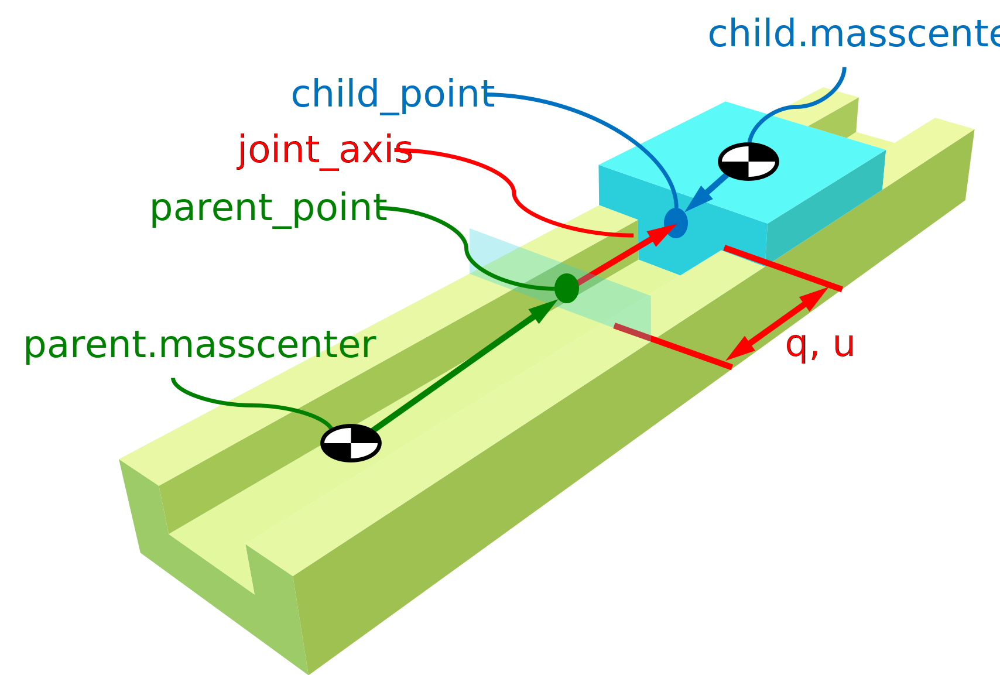

.. _joints_framework:

=====================================
Joints Framework in Physics/Mechanics
=====================================

:mod:`sympy.physics.mechanics` provides a joints framework. This system consists
of two parts. The first are the :obj:`joints<sympy.physics.mechanics.joint>`
themselves, which are used to create connections between
:class:`bodies<sympy.physics.mechanics.body.Body>`. The second part is the
:class:`~.JointsMethod`, which is used to form the equations of motion. Both of
these parts are doing what we can call "book-keeping": keeping track of the
relationships between :class:`bodies<sympy.physics.mechanics.body.Body>`.

Joints in Physics/Mechanics
===========================

The general task of the :mod:`joints<sympy.physics.mechanics.joint>` is creating
kinematic relationships between
:class:`bodies<sympy.physics.mechanics.body.Body>`. Each joint has a setup as
shown in the image below (this is the example of the :class:`~.PrismaticJoint`).

As can be seen in this image, each joint needs several objects in order to
define the relationships. First off it needs two bodies: the parent body (shown
in green) and the child body (shown in blue). Both of these bodies have a mass
center from which the position of the joint is defined. In the parent body the
vector from the mass center to the ``parent_point`` is called the
``parent_joint_pos``. For the child body these are called the ``child_point``
and ``child_joint_pos``. The orientation of the joint in each body is defined by
the ``parent_axis`` and ``child_axis``. These two vectors are aligned as
explained in the :class:`~.Joint` notes and are in the image parallel to the
red vector. As last the joint also needs :func:`~.dynamicsymbols` as generalized
coordinates and speeds. In the case of the :class:`~.PrismaticJoint` shown
above, the generalized coordinate ``q_1`` distance along the joint axis.
And the generalized speed ``u_1`` is its velocity.

With the information listed above, the joint defines the following
relationships. It first defines the kinematic differential equations, which
relate the generalized coordinates to the generalized speeds. Next, it orients
the parent and child body with respect to each other. After which it also
defines their velocity relationships.

The following code shows the creation of a :class:`~.PrismaticJoint` as shown
above with arbitrary linked position vectors: ::

   >>> from sympy.physics.mechanics import *
   >>> mechanics_printing(pretty_print=False)
   >>> q1, u1 = dynamicsymbols('q1, u1')
   >>> parent = Body('parent')
   >>> child = Body('child')
   >>> joint = PrismaticJoint(
   ...     'slider', parent, child, q1, u1,
   ...     parent_joint_pos=parent.frame.x / 2 + parent.frame.y / 10,
   ...     child_joint_pos=-(child.frame.x + child.frame.y) / 10,
   ...     parent_axis=parent.frame.x, child_axis=child.frame.x)
   >>> joint.kdes
   [u1 - q1']
   >>> child.masscenter.pos_from(parent.masscenter)
   (q1 + 1/2)*parent_frame.x + 1/10*parent_frame.y + 1/10*child_frame.x + 1/10*child_frame.y
   >>> child.masscenter.vel(parent.frame)
   u1*parent_frame.x

JointsMethod in Physics/Mechanics
=================================
After defining the entire system you can use the :class:`~.JointsMethod` to
parse the system and form the equations of motion. In this process the
:class:`~.JointsMethod` only does the "book-keeping" of the joints. It uses
another method, like the :class:`~.KanesMethod`, as its backend for forming the
equations of motion.

In the code below we form the equations of motion of the single
:class:`~.PrismaticJoint` above. ::

   >>> method = JointsMethod(parent, joint)
   >>> method.form_eoms()
   Matrix([[-child_mass*u1']])
   >>> type(method.method)  # The method working in the backend
   <class 'sympy.physics.mechanics.kane.KanesMethod'>
