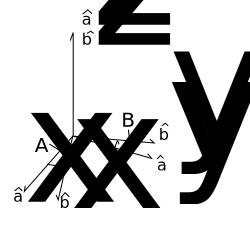

=============================
More about Coordinate Systems
=============================

We will now look at how we can initialize new coordinate systems in 
:mod:`sympy.vector`, positioned and oriented in user-defined
ways with respect to already-existing systems.

Locating new systems
====================

We already know that the ``origin`` property of a 
``CoordSysCartesian`` corresponds to the ``Point`` instance
denoting its origin reference point.

Consider a coordinate system :math:`N`. Suppose we want to define
a new system :math:`M`, whose origin is located at 
:math:`\mathbf{3\hat{i} + 4\hat{j} + 5\hat{k}}` from :math:`N`'s origin.
In other words, the coordinates of :math:`M`'s origin from N's perspective 
happen to be :math:`(3, 4, 5)`. Moreover, this would also mean that 
the coordinates of :math:`N`'s origin with respect to :math:`M` 
would be :math:`(-3, -4, -5)`.

This can be achieved programatically as follows -

  >>> from sympy.vector import CoordSysCartesian
  >>> N = CoordSysCartesian('N')
  >>> M = N.locate_new('M', 3*N.i + 4*N.j + 5*N.k)
  >>> M.position_wrt(N)
  3*N.i + 4*N.j + 5*N.k
  >>> N.origin.express_coordinates(M)
  (-3, -4, -5)

It is worth noting that :math:`M`'s orientation is the same as that of 
:math:`N`. This means that the rotation matrix of :math: `N` with respect 
to :math:`M`, and also vice versa, is equal to the identity matrix of
dimensions 3x3.
The ``locate_new`` method initializes a ``CoordSysCartesian`` that
is only translated in space, not re-oriented, relative to the 'parent'
system.

Orienting new systems
=====================

Similar to 'locating' new systems, :mod:`sympy.vector` also allows for
initialization of new ``CoordSysCartesian`` instances that are oriented
in user-defined ways with respect to existing systems.

Suppose you have a coordinate system :math:`A`.

  >>> from sympy.vector import CoordSysCartesian
  >>> A = CoordSysCartesian('A')

You want to initialize a new coordinate system :math:`B`, that is rotated with 
respect to :math:`A`'s Z-axis by an angle :math:`\theta`.

  >>> from sympy import Symbol
  >>> theta = Symbol('theta')

The orientation is shown in the diagram below:

There are two ways to achieve this.

Using a method of CoordSysCartesian directly
--------------------------------------------

This is the easiest, cleanest, and hence the recommended way of doing
it.

  >>> B = A.orient_new_axis('B', theta, A.k)

This initialzes :math:`B` with the required orientation information with
respect to :math:`A`.

``CoordSysCartesian`` provides the following direct orientation methods
in its API-

1. ``orient_new_axis``

2. ``orient_new_body``

3. ``orient_new_space``

4. ``orient_new_quaternion``

Please look at the ``CoordSysCartesian`` class API given in the docs
of this module, to know their functionality and required arguments 
in detail.

Using Orienter(s) and the orient_new method
-------------------------------------------

You would first have to initialize an ``AxisOrienter`` instance for 
storing the rotation information.

  >>> from sympy.vector import AxisOrienter
  >>> axis_orienter = AxisOrienter(theta, A.k)

And then apply it using the ``orient_new`` method, to obtain :math:`B`.

  >>> B = A.orient_new('B', axis_orienter)

``orient_new`` also lets you orient new systems using multiple
``Orienter`` instances, provided in an iterable. The rotations/orientations
are applied to the new system in the order the ``Orienter`` instances 
appear in the iterable.

  >>> from sympy.vector import BodyOrienter
  >>> from sympy.abc import a, b, c
  >>> body_orienter = BodyOrienter(a, b, c, 'XYZ')
  >>> C = A.orient_new('C', (axis_orienter, body_orienter))

The :mod:`sympy.vector` API provides the following four ``Orienter``
classes for orientation purposes-

1. ``AxisOrienter``

2. ``BodyOrienter``

3. ``SpaceOrienter``

4. ``QuaternionOrienter``

Please refer to the API of the respective classes in the docs of this
module to know more.

In each of the above examples, the origin of the new coordinate system
coincides with the origin of the 'parent' system.

  >>> B.position_wrt(A)
  0

To compute the rotation matrix of any coordinate system with respect 
to another one, use the ``rotation_matrix`` method.

  >>> B = A.orient_new_axis('B', a, A.k)
  >>> B.rotation_matrix(A)
  Matrix([
  [ cos(a), sin(a), 0],
  [-sin(a), cos(a), 0],
  [      0,      0, 1]])
  >>> B.rotation_matrix(B)
  Matrix([
  [1, 0, 0],
  [0, 1, 0],
  [0, 0, 1]])
  

Orienting AND Locating new systems
==================================

What if you want to initialize a new system that is not only oriented
in a pre-defined way, but also translated with respect to the parent?

Each of the ``orient_new_<method of orientation>`` methods, as well
as the ``orient_new`` method, support a ``location`` keyword
argument.

If a ``Vector`` is supplied as the value for this ``kwarg``, the
new system's origin is automatically defined to be located at that
position vector with respect to the parent coordinate system.

Thus, the orientation methods also act as methods to support orientation+
location of the new systems.

  >>> C = A.orient_new_axis('C', a, A.k, location=2*A.j)
  >>> C.position_wrt(A)
  2*A.j
  >>> from sympy.vector import express
  >>> express(A.position_wrt(C), C)
  (-2*sin(a))*C.i + (-2*cos(a))*C.j

More on the ``express`` function in a bit.

Expression of quantities in different coordinate systems
========================================================

Vectors and Dyadics
-------------------

As mentioned earlier, the same vector attains different expressions in
different coordinate systems. In general, the same is true for scalar
expressions and dyadic tensors.

:mod:`sympy.vector` supports the expression of vector/scalar quantities
in different coordinate systems using the ``express`` function.

For purposes of this section, assume the following initializations-

  >>> from sympy.vector import CoordSysCartesian, express
  >>> from sympy.abc import a, b, c
  >>> N = CoordSysCartesian('N')
  >>> M = N.orient_new_axis('M', a, N.k)

``Vector`` instances can be expressed in user defined systems using 
``express``.

  >>> v1 = N.i + N.j + N.k
  >>> express(v1, M)
  (sin(a) + cos(a))*M.i + (-sin(a) + cos(a))*M.j + M.k
  >>> v2 = N.i + M.j
  >>> express(v2, N)
  (-sin(a) + 1)*N.i + (cos(a))*N.j

Apart from ``Vector`` instances, ``express`` also supports
reexpression of scalars (general SymPy ``Expr``) and
``Dyadic`` objects.

``express`` also accepts a second coordinate system 
for re-expressing ``Dyadic`` instances.

  >>> d = 2*(M.i | N.j) + 3* (M.j | N.k)
  >>> express(d, M)
  (2*sin(a))*(M.i|M.i) + (2*cos(a))*(M.i|M.j) + 3*(M.j|M.k)
  >>> express(d, M, N)
  2*(M.i|N.j) + 3*(M.j|N.k)

Coordinate Variables
--------------------

The location of a coordinate system's origin does not affect the 
re-expression of ``BaseVector`` instances. However, it does affect
the way ``BaseScalar`` instances are expressed in different systems.

``BaseScalar`` instances, are coordinate 'symbols' meant to denote the 
variables used in the definition of vector/scalar fields in 
:mod:`sympy.vector`.

For example, consider the scalar field 
:math:`\mathbf{{T}_{N}(x, y, z) = x + y + z}` defined in system :math:`N`.
Thus, at a point with coordinates :math:`(a, b, c)`, the value of the
field would be :math:`a + b + c`. Now consider system :math:`R`, whose
origin is located at :math:`(1, 2, 3)` with respect to :math:`N` (no
change of orientation).
A point with coordinates :math:`(a, b, c)` in :math:`R` has coordinates
:math:`(a + 1, b + 2, c + 3)` in :math:`N`.
Therefore, the expression for :math:`\mathbf{{T}_{N}}` in :math:`R` becomes 
:math:`\mathbf{{T}_{R}}(x, y, z) = x + y + z + 6`.

Coordinate variables, if present in a vector/scalar/dyadic expression,
can also be re-expressed in a given coordinate system, by setting the
``variables`` keyword argument of ``express`` to ``True``.

The above mentioned example, done programatically, would look like 
this -

  >>> R = N.locate_new('R', N.i + 2*N.j + 3*N.k)
  >>> T_N = N.x + N.y + N.z
  >>> express(T_N, R, variables=True)
  R.x + R.y + R.z + 6

Other expression-dependent methods
----------------------------------

The ``to_matrix`` method of ``Vector`` and 
``express_coordinates`` method of ``Point`` also return 
different results depending on the coordinate system being provided.

  >>> P = R.origin.locate_new('P', a*R.i + b*R.j + c*R.k)
  >>> P.express_coordinates(N)
  (a + 1, b + 2, c + 3)
  >>> P.express_coordinates(R)
  (a, b, c)
  >>> v = N.i + N.j + N.k
  >>> v.to_matrix(M)
  Matrix([
  [ sin(a) + cos(a)],
  [-sin(a) + cos(a)],
  [               1]])
  >>> v.to_matrix(N)
  Matrix([
  [1],
  [1],
  [1]])
