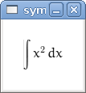

.. _tutorial:

========
Tutorial
========

.. role:: input(strong)

Introduction
============

SymPy is a Python library for symbolic mathematics. It aims to become a
full-featured computer algebra system (CAS) while keeping the code as simple as
possible in order to be comprehensible and easily extensible.  SymPy is written
entirely in Python and does not require any external libraries.

This tutorial gives an overview and introduction to SymPy.
Read this to have an idea what SymPy can do for you (and how) and if you want
to know more, read the :ref:`SymPy User's Guide <guide>`, the
:ref:`SymPy Modules Reference <module-docs>`, or the
`sources <https://github.com/sympy/sympy/>`_ directly.

First Steps with SymPy
======================

The easiest way to download it is to go to
http://code.google.com/p/sympy/ and
download the latest tarball from the Featured Downloads:

.. image:: ../figures/featured-downloads.png

Unpack it:

.. parsed-literal::

    $ :input:`tar xzf sympy-0.5.12.tar.gz`

and try it from a Python interpreter:

.. parsed-literal::

    $ :input:`cd sympy-0.5.12`
    $ :input:`python`
    Python 2.4.4 (#2, Jan  3 2008, 13:36:28)
    [GCC 4.2.3 20071123 (prerelease) (Debian 4.2.2-4)] on linux2
    Type "help", "copyright", "credits" or "license" for more information.
    >>> from sympy import Symbol, cos
    >>> x = Symbol("x")
    >>> (1/cos(x)).series(x, 0, 10)
    1 + x**2/2 + 5*x**4/24 + 61*x**6/720 + 277*x**8/8064 + O(x**10)

You can use SymPy as shown above and this is indeed the recommended way if you
use it in your program. You can also install it using ``./setup.py install`` as
any other Python module, or just install a package in your favourite Linux
distribution, e.g.:

.. topic:: Installing SymPy in Debian

  .. parsed-literal::

    $ :input:`sudo apt-get install python-sympy`
    Reading package lists... Done
    Building dependency tree
    Reading state information... Done
    The following NEW packages will be installed:
      python-sympy
    0 upgraded, 1 newly installed, 0 to remove and 18 not upgraded.
    Need to get 991kB of archives.
    After this operation, 5976kB of additional disk space will be used.
    Get:1 http://ftp.cz.debian.org unstable/main python-sympy 0.5.12-1 [991kB]
    Fetched 991kB in 2s (361kB/s)
    Selecting previously deselected package python-sympy.
    (Reading database ... 232619 files and directories currently installed.)
    Unpacking python-sympy (from .../python-sympy_0.5.12-1_all.deb) ...
    Setting up python-sympy (0.5.12-1) ...

For other means how to install SymPy, consult the wiki page
`Download and Installation <https://github.com/sympy/sympy/wiki/Download-Installation>`_.

isympy Console
--------------

For experimenting with new features, or when figuring out how to do things, you
can use our special wrapper around IPython called ``isympy`` (located in
``bin/isympy`` if you are running from the source directory) which is just a
standard Python shell that has already imported the relevant SymPy modules and
defined the symbols x, y, z and some other things:

.. parsed-literal::

    $ :input:`cd sympy`
    $ :input:`./bin/isympy`
    IPython console for SymPy 0.7.2-git (Python 2.7.1) (ground types: gmpy)

    These commands were executed:
    >>> from __future__ import division
    >>> from sympy import *
    >>> x, y, z, t = symbols('x y z t')
    >>> k, m, n = symbols('k m n', integer=True)
    >>> f, g, h = symbols('f g h', cls=Function)

    Documentation can be found at http://www.sympy.org

    In [1]: :input:`(1/cos(x)).series(x, 0, 10)`
    Out[1]:
         2      4       6        8
        x    5*x    61*x    277*x     / 10\\
    1 + -- + ---- + ----- + ------ + O\\x  /
        2     24     720     8064

.. note::

    Commands entered by you are bold. Thus what we did in 3 lines in a regular
    Python interpreter can be done in 1 line in isympy.

Using SymPy as a calculator
---------------------------

SymPy has three built-in numeric types: Float, Rational and Integer.

The Rational class represents a rational number as a pair of two Integers:
the numerator and the denominator. So Rational(1, 2) represents 1/2,
Rational(5, 2) represents 5/2, and so on.

::

    >>> from sympy import Rational
    >>> a = Rational(1, 2)

    >>> a
    1/2

    >>> a*2
    1

    >>> Rational(2)**50/Rational(10)**50
    1/88817841970012523233890533447265625

Proceed with caution while working with Python int's and floating
point numbers, especially in division, since you may create a
Python number, not a SymPy number. A ratio of two Python ints may
create a float -- the "true division" standard of Python 3
and the default behavior of ``isympy`` which imports division
from __future__:

::

    >>> 1/2 #doctest: +SKIP
    0.5

But in earlier Python versions where division has not been imported, a
truncated int will result:

::

    >>> 1/2 #doctest: +SKIP
    0

In both cases, however, you are not dealing with a SymPy Number because
Python created its own number. Most of the time you will probably be
working with Rational numbers, so make sure to use Rational to get
the SymPy result. One might find it convenient to equate ``R`` and
Rational:

::

    >>> R = Rational
    >>> R(1, 2)
    1/2
    >>> R(1)/2 # R(1) is a SymPy Integer and Integer/int gives a Rational
    1/2

We also have some special constants, like e and pi, that are treated as symbols
(1 + pi won't evaluate to something numeric, rather it will remain as 1 + pi), and
have arbitrary precision:

::

    >>> from sympy import pi, E
    >>> pi**2
    pi**2

    >>> pi.evalf()
    3.14159265358979

    >>> (pi + E).evalf()
    5.85987448204884

as you see, evalf evaluates the expression to a floating-point number

The symbol ``oo`` is used for a class defining mathematical infinity:

::

    >>> from sympy import oo
    >>> oo > 99999
    True
    >>> oo + 1
    oo

Symbols
-------

In contrast to other Computer Algebra Systems, in SymPy you have to declare
symbolic variables explicitly:

::

    >>> from sympy import Symbol
    >>> x = Symbol('x')
    >>> y = Symbol('y')

On the left is the normal Python variable which has been assigned to the
SymPy Symbol class. Predefined symbols (including those for symbols with
Greek names) are available for import from abc:

    >>> from sympy.abc import x, theta

Symbols can also be created with the ``symbols`` or ``var`` functions, the
latter automatically adding the created symbols to the namespace, and both
accepting a range notation:

    >>> from sympy import symbols, var
    >>> a, b, c = symbols('a,b,c')
    >>> d, e, f = symbols('d:f')
    >>> var('g:h')
    (g, h)
    >>> var('g:2')
    (g0, g1)

Instances of the Symbol class "play well together" and are the building blocks
of expresions:

::

    >>> x + y + x - y
    2*x

    >>> (x + y)**2
    (x + y)**2

    >>> ((x + y)**2).expand()
    x**2 + 2*x*y + y**2

They can be substituted with other numbers, symbols or expressions using ``subs(old, new)``:

::

    >>> ((x + y)**2).subs(x, 1)
    (y + 1)**2

    >>> ((x + y)**2).subs(x, y)
    4*y**2

    >>> ((x + y)**2).subs(x, 1 - y)
    1

For the remainder of the tutorial, we assume that we have run:

::

    >>> from sympy import init_printing
    >>> init_printing(use_unicode=False, wrap_line=False, no_global=True)

This will make things look better when printed. See the :ref:`printing-tutorial`
section below. If you have a unicode font installed, you can pass
use_unicode=True for a slightly nicer output.

Algebra
=======

For partial fraction decomposition, use ``apart(expr, x)``:

::

    >>> from sympy import apart
    >>> from sympy.abc import x, y, z

    >>> 1/( (x + 2)*(x + 1) )
           1
    ---------------
    (x + 1)*(x + 2)

    >>> apart(1/( (x + 2)*(x + 1) ), x)
        1       1
    - ----- + -----
      x + 2   x + 1

    >>> (x + 1)/(x - 1)
    x + 1
    -----
    x - 1

    >>> apart((x + 1)/(x - 1), x)
          2
    1 + -----
        x - 1

To combine things back together, use ``together(expr, x)``:

::

    >>> from sympy import together
    >>> together(1/x + 1/y + 1/z)
    x*y + x*z + y*z
    ---------------
         x*y*z

    >>> together(apart((x + 1)/(x - 1), x), x)
    x + 1
    -----
    x - 1

    >>> together(apart(1/( (x + 2)*(x + 1) ), x), x)
           1
    ---------------
    (x + 1)*(x + 2)

.. index:: calculus

Calculus
========

.. index:: limits

Limits
------

Limits are easy to use in SymPy, they follow the syntax ``limit(function,
variable, point)``, so to compute the limit of f(x) as x -> 0, you would issue
``limit(f, x, 0)``:

::

   >>> from sympy import limit, Symbol, sin, oo
   >>> x = Symbol("x")
   >>> limit(sin(x)/x, x, 0)
   1

you can also calculate the limit at infinity:

::

   >>> limit(x, x, oo)
   oo

   >>> limit(1/x, x, oo)
   0

   >>> limit(x**x, x, 0)
   1

for some non-trivial examples on limits, you can read the test file
`test_demidovich.py
<https://github.com/sympy/sympy/blob/master/sympy/series/tests/test_demidovich.py>`_

.. index:: differentiation, diff

Differentiation
---------------

You can differentiate any SymPy expression using ``diff(func, var)``. Examples:

::

    >>> from sympy import diff, Symbol, sin, tan
    >>> x = Symbol('x')
    >>> diff(sin(x), x)
    cos(x)
    >>> diff(sin(2*x), x)
    2*cos(2*x)

    >>> diff(tan(x), x)
       2
    tan (x) + 1

You can check, that it is correct by:

::

    >>> from sympy import limit
    >>> from sympy.abc import delta
    >>> limit((tan(x + delta) - tan(x))/delta, delta, 0)
       2
    tan (x) + 1

Higher derivatives can be calculated using the ``diff(func, var, n)`` method:

::

    >>> diff(sin(2*x), x, 1)
    2*cos(2*x)

    >>> diff(sin(2*x), x, 2)
    -4*sin(2*x)

    >>> diff(sin(2*x), x, 3)
    -8*cos(2*x)

.. index::
    single: series expansion
    single: expansion; series

Series expansion
----------------

Use ``.series(var, point, order)``:

::

    >>> from sympy import Symbol, cos
    >>> x = Symbol('x')
    >>> cos(x).series(x, 0, 10)
         2    4     6      8
        x    x     x      x      / 10\
    1 - -- + -- - --- + ----- + O\x  /
        2    24   720   40320
    >>> (1/cos(x)).series(x, 0, 10)
         2      4       6        8
        x    5*x    61*x    277*x     / 10\
    1 + -- + ---- + ----- + ------ + O\x  /
        2     24     720     8064

Another simple example:

::

    >>> from sympy import Integral, pprint

    >>> y = Symbol("y")
    >>> e = 1/(x + y)
    >>> s = e.series(x, 0, 5)

    >>> print(s)
    1/y - x/y**2 + x**2/y**3 - x**3/y**4 + x**4/y**5 + O(x**5)
    >>> pprint(s)
              2    3    4
    1   x    x    x    x     / 5\
    - - -- + -- - -- + -- + O\x /
    y    2    3    4    5
        y    y    y    y

.. index:: summation

Summation
---------

Compute the summation of f with respect to the given summation variable over the given limits.

summation(f, (i, a, b)) computes the sum of f with respect to i from a to b,
i.e.,

::

                                b
                              ____
                              \   `
    summation(f, (i, a, b)) =  )    f
                              /___,
                              i = a

If it cannot compute the sum, it prints the corresponding summation formula.
Repeated sums can be computed by introducing additional limits:

::

    >>> from sympy import summation, oo, symbols, log
    >>> i, n, m = symbols('i n m', integer=True)

    >>> summation(2*i - 1, (i, 1, n))
     2
    n
    >>> summation(1/2**i, (i, 0, oo))
    2
    >>> summation(1/log(n)**n, (n, 2, oo))
      oo
     ___
     \  `
      \     -n
      /   log (n)
     /__,
    n = 2
    >>> summation(i, (i, 0, n), (n, 0, m))
          3    2
    m    m    m
    -- + -- + -
    6    2    3
    >>> from sympy.abc import x
    >>> from sympy import factorial
    >>> summation(x**n/factorial(n), (n, 0, oo))
     x
    e

.. index:: integration

Integration
-----------

SymPy has support for indefinite and definite integration of transcendental
elementary and special functions via ``integrate()`` facility, which uses
powerful extended Risch-Norman algorithm and some heuristics and pattern
matching:

::

    >>> from sympy import integrate, erf, exp, sin, log, oo, pi, sinh, symbols
    >>> x, y = symbols('x,y')

You can integrate elementary functions:

::

    >>> integrate(6*x**5, x)
     6
    x
    >>> integrate(sin(x), x)
    -cos(x)
    >>> integrate(log(x), x)
    x*log(x) - x
    >>> integrate(2*x + sinh(x), x)
     2
    x  + cosh(x)

Also special functions are handled easily:

::

    >>> integrate(exp(-x**2)*erf(x), x)
      ____    2
    \/ pi *erf (x)
    --------------
          4

It is possible to compute definite integrals:

::

    >>> integrate(x**3, (x, -1, 1))
    0
    >>> integrate(sin(x), (x, 0, pi/2))
    1
    >>> integrate(cos(x), (x, -pi/2, pi/2))
    2

Also, improper integrals are supported as well:

::

    >>> integrate(exp(-x), (x, 0, oo))
    1
    >>> integrate(log(x), (x, 0, 1))
    -1

.. index::
    single: complex numbers
    single: expansion; complex

Complex numbers
---------------

Besides the imaginary unit, I, which is imaginary, symbols can be created with
attributes (e.g. real, positive, complex, etc...) and this will affect how
they behave:

::

    >>> from sympy import Symbol, exp, I
    >>> x = Symbol("x") # a plain x with no attributes
    >>> exp(I*x).expand()
     I*x
    e
    >>> exp(I*x).expand(complex=True)
       -im(x)               -im(x)
    I*e      *sin(re(x)) + e      *cos(re(x))
    >>> x = Symbol("x", real=True)
    >>> exp(I*x).expand(complex=True)
    I*sin(x) + cos(x)

Functions
---------

**trigonometric**

::

    >>> from sympy import asin, asinh, cos, sin, sinh, symbols, I
    >>> x, y = symbols('x,y')

    >>> sin(x + y).expand(trig=True)
    sin(x)*cos(y) + sin(y)*cos(x)

    >>> cos(x + y).expand(trig=True)
    -sin(x)*sin(y) + cos(x)*cos(y)

    >>> sin(I*x)
    I*sinh(x)

    >>> sinh(I*x)
    I*sin(x)

    >>> asinh(I)
    I*pi
    ----
     2

    >>> asinh(I*x)
    I*asin(x)

    >>> sin(x).series(x, 0, 10)
         3     5     7       9
        x     x     x       x       / 10\
    x - -- + --- - ---- + ------ + O\x  /
        6    120   5040   362880

    >>> sinh(x).series(x, 0, 10)
         3     5     7       9
        x     x     x       x       / 10\
    x + -- + --- + ---- + ------ + O\x  /
        6    120   5040   362880

    >>> asin(x).series(x, 0, 10)
         3      5      7       9
        x    3*x    5*x    35*x     / 10\
    x + -- + ---- + ---- + ----- + O\x  /
        6     40    112     1152

    >>> asinh(x).series(x, 0, 10)
         3      5      7       9
        x    3*x    5*x    35*x     / 10\
    x - -- + ---- - ---- + ----- + O\x  /
        6     40    112     1152

**spherical harmonics**

::

    >>> from sympy import Ylm
    >>> from sympy.abc import theta, phi

    >>> Ylm(1, 0, theta, phi)
      ___
    \/ 3 *cos(theta)
    ----------------
            ____
        2*\/ pi

    >>> Ylm(1, 1, theta, phi)
       ___  I*phi
    -\/ 6 *e     *sin(theta)
    ------------------------
                ____
            4*\/ pi

    >>> Ylm(2, 1, theta, phi)
       ____  I*phi
    -\/ 30 *e     *sin(theta)*cos(theta)
    ------------------------------------
                      ____
                  4*\/ pi

**factorials and gamma function**

::

    >>> from sympy import factorial, gamma, Symbol
    >>> x = Symbol("x")
    >>> n = Symbol("n", integer=True)

    >>> factorial(x)
    x!

    >>> factorial(n)
    n!

    >>> gamma(x + 1).series(x, 0, 3) # i.e. factorial(x)
                          /          2     2\
                        2 |EulerGamma    pi |    / 3\
    1 - EulerGamma*x + x *|----------- + ---| + O\x /
                          \     2         12/

**zeta function**

::

    >>> from sympy import zeta
    >>> zeta(4, x)
    zeta(4, x)

    >>> zeta(4, 1)
      4
    pi
    ---
     90

    >>> zeta(4, 2)
           4
         pi
    -1 + ---
          90

    >>> zeta(4, 3)
             4
      17   pi
    - -- + ---
      16    90

**polynomials**

::

    >>> from sympy import assoc_legendre, chebyshevt, legendre, hermite
    >>> chebyshevt(2, x)
       2
    2*x  - 1

    >>> chebyshevt(4, x)
       4      2
    8*x  - 8*x  + 1

    >>> legendre(2, x)
       2
    3*x    1
    ---- - -
     2     2

    >>> legendre(8, x)
          8         6         4        2
    6435*x    3003*x    3465*x    315*x     35
    ------- - ------- + ------- - ------ + ---
      128        32        64       32     128

    >>> assoc_legendre(2, 1, x)
            __________
           /    2
    -3*x*\/  - x  + 1

    >>> assoc_legendre(2, 2, x)
         2
    - 3*x  + 3

    >>> hermite(3, x)
       3
    8*x  - 12*x

.. index:: equations; differential, diff, dsolve

Differential Equations
----------------------

In ``isympy``:

::

    >>> from sympy import Function, Symbol, dsolve
    >>> f = Function('f')
    >>> x = Symbol('x')
    >>> f(x).diff(x, x) + f(x)
            2
           d
    f(x) + ---(f(x))
             2
           dx

    >>> dsolve(f(x).diff(x, x) + f(x), f(x))
    f(x) = C1*sin(x) + C2*cos(x)

.. index:: equations; algebraic, solve

Algebraic equations
-------------------

In ``isympy``:

::

    >>> from sympy import solve, symbols
    >>> x, y = symbols('x,y')
    >>> solve(x**4 - 1, x)
    [-1, 1, -I, I]

    >>> solve([x + 5*y - 2, -3*x + 6*y - 15], [x, y])
    {x: -3, y: 1}

.. index:: linear algebra

Linear Algebra
==============

.. index:: Matrix

Matrices
--------

Matrices are created as instances from the Matrix class:

::

    >>> from sympy import Matrix, Symbol
    >>> Matrix([[1, 0], [0, 1]])
    [1  0]
    [    ]
    [0  1]

They can also contain symbols:

::

    >>> x = Symbol('x')
    >>> y = Symbol('y')
    >>> A = Matrix([[1, x], [y, 1]])
    >>> A
    [1  x]
    [    ]
    [y  1]

    >>> A**2
    [x*y + 1    2*x  ]
    [                ]
    [  2*y    x*y + 1]

For more about Matrices, see the Linear Algebra tutorial.

.. index:: pattern matching, match, Wild, WildFunction

Pattern matching
================

Use the ``.match()`` method, along with the ``Wild`` class, to perform pattern
matching on expressions. The method will return a dictionary with the required
substitutions, as follows:

::

    >>> from sympy import Symbol, Wild
    >>> x = Symbol('x')
    >>> p = Wild('p')
    >>> (5*x**2).match(p*x**2)
    {p: 5}

    >>> q = Wild('q')
    >>> (x**2).match(p*x**q)
    {p: 1, q: 2}

If the match is unsuccessful, it returns ``None``:

::

    >>> print (x + 1).match(p**x)
    None

One can also use the exclude parameter of the ``Wild`` class to ensure that
certain things do not show up in the result:

::

    >>> p = Wild('p', exclude=[1, x])
    >>> print (x + 1).match(x + p) # 1 is excluded
    None
    >>> print (x + 1).match(p + 1) # x is excluded
    None
    >>> print (x + 1).match(x + 2 + p) # -1 is not excluded
    {p_: -1}

.. _printing-tutorial:

Printing
========

There are many ways to print expressions.

**Standard**

This is what ``str(expression)`` returns and it looks like this:

    >>> from sympy import Integral
    >>> from sympy.abc import x
    >>> print x**2
    x**2
    >>> print 1/x
    1/x
    >>> print Integral(x**2, x)
    Integral(x**2, x)

**Pretty printing**

Nice ascii-art printing is produced by the ``pprint`` function:

    >>> from sympy import Integral, pprint
    >>> from sympy.abc import x
    >>> pprint(x**2)
     2
    x
    >>> pprint(1/x)
    1
    -
    x
    >>> pprint(Integral(x**2, x))
      /
     |
     |  2
     | x  dx
     |
    /

If you have a unicode font installed, the ``pprint`` function will use it by
default. You can override this using the ``use_unicode`` option.:

    >>> pprint(Integral(x**2, x), use_unicode=True)
    ⌠
    ⎮  2
    ⎮ x  dx
    ⌡

See also the wiki `Pretty Printing
<https://github.com/sympy/sympy/wiki/Pretty-Printing>`_ for more examples of a nice
unicode printing.

Tip: To make pretty printing the default in the Python interpreter, use:

::

    $ python
    Python 2.5.2 (r252:60911, Jun 25 2008, 17:58:32)
    [GCC 4.3.1] on linux2
    Type "help", "copyright", "credits" or "license" for more information.
    >>> from sympy import init_printing, var, Integral
    >>> init_printing(use_unicode=False, wrap_line=False, no_global=True)
    >>> var("x")
    x
    >>> x**3/3
     3
    x
    --
    3
    >>> Integral(x**2, x) #doctest: +NORMALIZE_WHITESPACE
      /
     |
     |  2
     | x  dx
     |
    /

**Python printing**

::

    >>> from sympy.printing.python import python
    >>> from sympy import Integral
    >>> from sympy.abc import x
    >>> print python(x**2)
    x = Symbol('x')
    e = x**2
    >>> print python(1/x)
    x = Symbol('x')
    e = 1/x
    >>> print python(Integral(x**2, x))
    x = Symbol('x')
    e = Integral(x**2, x)

**LaTeX printing**

::

    >>> from sympy import Integral, latex
    >>> from sympy.abc import x
    >>> latex(x**2)
    x^{2}
    >>> latex(x**2, mode='inline')
    $x^{2}$
    >>> latex(x**2, mode='equation')
    \begin{equation}x^{2}\end{equation}
    >>> latex(x**2, mode='equation*')
    \begin{equation*}x^{2}\end{equation*}
    >>> latex(1/x)
    \frac{1}{x}
    >>> latex(Integral(x**2, x))
    \int x^{2}\, dx

**MathML**

::

    >>> from sympy.printing.mathml import mathml
    >>> from sympy import Integral, latex
    >>> from sympy.abc import x
    >>> print mathml(x**2)
    <apply><power/><ci>x</ci><cn>2</cn></apply>
    >>> print mathml(1/x)
    <apply><power/><ci>x</ci><cn>-1</cn></apply>

**Pyglet**

::

    >>> from sympy import Integral, preview
    >>> from sympy.abc import x
    >>> preview(Integral(x**2, x)) #doctest:+SKIP

If pyglet is installed, a pyglet window will open containing the LaTeX
rendered expression:

Notes
-----

``isympy`` calls ``pprint`` automatically, so that's why you see pretty
printing by default.

Note that there is also a printing module available, ``sympy.printing``.  Other
printing methods available through this module are:

* ``pretty(expr)``, ``pretty_print(expr)``, ``pprint(expr)``: Return or print, respectively, a pretty representation of ``expr``. This is the same as the second level of representation described above.

* ``latex(expr)``, ``print_latex(expr)``: Return or print, respectively, a `LaTeX <http://www.latex-project.org/>`_  representation of ``expr``

* ``mathml(expr)``, ``print_mathml(expr)``: Return or print, respectively, a `MathML <http://www.w3.org/Math/>`_ representation of ``expr``.

* ``print_gtk(expr)``: Print ``expr`` to `Gtkmathview <http://helm.cs.unibo.it/mml-widget/>`_, a GTK widget that displays MathML code. The `Gtkmathview <http://helm.cs.unibo.it/mml-widget/>`_ program is required.

Further documentation
=====================

Now it's time to learn more about SymPy. Go through the
:ref:`SymPy User's Guide <guide>` and
:ref:`SymPy Modules Reference <module-docs>`.

Be sure to also browse our public `wiki.sympy.org <http://wiki.sympy.org/>`_,
that contains a lot of useful examples, tutorials, cookbooks that we and our
users contributed, and feel free to edit it.

.. only:: html or gettext

    Translations
    ------------

    This tutorial is also available in other languages:

.. only:: html

        - `Български <tutorial.bg.html>`_
        - `Česky <tutorial.cs.html>`_
        - `Deutsch <tutorial.de.html>`_
        - `English <tutorial.en.html>`_
        - `Français <tutorial.fr.html>`_
        - `Polski <tutorial.pl.html>`_
        - `Русский <tutorial.ru.html>`_
        - `Српски <tutorial.sr.html>`_
        - `中文 <tutorial.zh.html>`_
