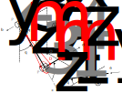

======================================
Introduction to Biomechanical Modeling
======================================

:obj:`~sympy.physics._biomechanics` provides features to enhance models created
with :obj:`~sympy.physics.mechanics` with force producing elements that model
muscles and other biomechanical elements. In this tutorial, we will introduce
the features of this package by adding muscles to a simple model of a human arm
that moves a lever.

Model Description
=================

   TODO: add caption

The lever :math:`A` can rotate about :math:`\hat{n}_z` through angle
:math:`q_1`. The shoulder is located at :math:`P_2` and the upper arm :math:`C`
can extend about :math:`\hat{n}_y` through angle :math:`q_2` and rotate about
:math:`\hat{b}_z` through angle :math:`q_3`. The elbow is located at point
:math:`P_3`.  The lower arm can extend about :math:`\hat{c}_y` through angle
:math:`q_4`. The hand is located at point :math:`P_4`. The hand will be
constrained to the lever by :math:`\mathbf{r}^{P_4/O} = \mathbf{r}^{P_1/O}`.
The lever, upper arm, and lower arm will be modeled as thin cylinders for
inertial simplicity.

To begin, we will introduce two muscles that represent the bicep and the
tricep. A circular arc of radius :math:`r` is defined with its center at
:math:`P_3` and normal to :math:`\hat{c}_y`. Two muscle attachment points
:math:`C_m` and :math:`D_m` are fixed on the upper arm and lower arm,
respectively. The bicep muscle will act along a linear path from :math:`C_m` to
:math:`D_m`. The tricep will wrap around the circular arc and also attach at
the same points as the bicep.
