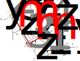

.. _biomechanical-model-example:

===========================
Biomechanical Model Example
===========================

:obj:`sympy.physics.biomechanics` provides features to enhance models created
with :obj:`sympy.physics.mechanics` with force producing elements that model
muscles and tendons. In this tutorial, we will introduce the features of this
package by adding muscles to a simple model of a human arm that moves a lever.

Model Description
=================

.. _fig-biomechanics-steerer:

   Schematic showing the lever :math:`A` and the upper :math:`C` and lower
   :math:`D` arm.

The lever :math:`A` can rotate about :math:`\hat{n}_z` through angle
:math:`q_1`. Its mass center lies on the rotation axis. The shoulder is located
at :math:`P_2` and the upper arm :math:`C` can extend about :math:`\hat{n}_y`
through angle :math:`q_2` and rotate about :math:`\hat{b}_z` through angle
:math:`q_3`. The elbow is located at point :math:`P_3`.  The lower arm can flex
about :math:`\hat{c}_y` through angle :math:`q_4`. The hand is located at point
:math:`P_4`. The hand will be constrained to the lever by enforcing
:math:`\mathbf{r}^{P_4/O} = \mathbf{r}^{P_1/O}`. The lever, upper arm, and
lower arm will be modeled as thin cylinders for inertial simplicity.

We will introduce two musculotendon models that represent the biceps and the
triceps. Two muscle attachment points :math:`C_m` and :math:`D_m` are fixed on
the upper arm and lower arm, respectively. The biceps muscle will act along a
linear path from :math:`C_m` to :math:`D_m`, causing flexion at the elbow when
contracted. A circular arc of radius :math:`r` is defined with its center at
:math:`P_3` and normal to :math:`\hat{c}_y`. The triceps will wrap around the
circular arc and also attach at the same points as the biceps, causing elbow
extension when contracted.

.. plot::
   :format: doctest
   :include-source: True
   :context: reset
   :nofigs:

   >>> import sympy as sm
   >>> import sympy.physics.mechanics as me
   >>> import sympy.physics.biomechanics as bm

Define Variables
================

Introduce the four coordinates :math:`\mathbf{q} = [q_1, q_2, q_3, q_4]^T` for
the lever angle, shoulder extension, shoulder rotation, and elbow flexion. We
will also need generalized speeds :math:`\mathbf{u} = [u_1,u_2,u_3,u_4]^T`
which we define as :math:`\mathbf{u} = \dot{\mathbf{q}}`.

.. plot::
   :format: doctest
   :include-source: True
   :context: close-figs
   :nofigs:

   >>> q1, q2, q3, q4 = me.dynamicsymbols('q1, q2, q3, q4', real=True)
   >>> u1, u2, u3, u4 = me.dynamicsymbols('u1, u2, u3, u4', real=True)

The necessary constant parameters for the mechanical system are:

- :math:`d_x, l_A`: locates :math:`P_1` from :math:`O` along the
  :math:`\hat{n}_x` and :math:`\hat{a}_y` directions, respectively
- :math:`d_y, d_z`: locates :math:`P_2` from :math:`O` along the :math:`N` unit
  vector directions
- :math:`l_C,l_D` : length of upper and lower arm
- :math:`m_A,m_C,m_D` : mass of lever, upper arm, and lower arm
- :math:`g` : acceleration due to gravity
- :math:`k` : lever linear rotational spring coefficient
- :math:`c` : lever linear rotational damper coefficient

.. plot::
   :format: doctest
   :include-source: True
   :context: close-figs
   :nofigs:

   >>> dx, dy, dz = sm.symbols('dx, dy, dz', real=True, nonnegative=True)
   >>> lA, lC, lD = sm.symbols('lA, lC, lD', real=True, positive=True)
   >>> mA, mC, mD = sm.symbols('mA, mC, mD', real=True, positive=True)
   >>> g, k, c, r = sm.symbols('g, k, c, r', real=True, positive=True)

Define Kinematics
=================

Define all the reference frames and points shown in
:ref:`fig-biomechanics-steerer`. :math:`C_o` and :math:`D_o` are the mass
centers of the upper and lower arm, respectively.

.. plot::
   :format: doctest
   :include-source: True
   :context: close-figs
   :nofigs:

   >>> N, A, B, C, D = sm.symbols('N, A, B, C, D', cls=me.ReferenceFrame)
   >>> O, P1, P2, P3, P4 = sm.symbols('O, P1, P2, P3, P4 ', cls=me.Point)
   >>> Ao, Co, Cm, Dm, Do = sm.symbols('Ao, Co, Cm, Dm, Do', cls=me.Point)

The orientations and angular velocities of the reference frames are:

.. plot::
   :format: doctest
   :include-source: True
   :context: close-figs
   :nofigs:

   >>> A.orient_axis(N, q1, N.z)
   >>> B.orient_axis(N, q2, N.y)
   >>> C.orient_axis(B, q3, B.z)
   >>> D.orient_axis(C, q4, C.y)
   >>> A.set_ang_vel(N, u1*N.z)
   >>> B.set_ang_vel(N, u2*N.y)
   >>> C.set_ang_vel(B, u3*B.z)
   >>> D.set_ang_vel(C, u4*C.y)

All of the points' locations and velocities are:

.. plot::
   :format: doctest
   :include-source: True
   :context: close-figs
   :nofigs:

   >>> Ao.set_pos(O, dx*N.x)
   >>> P1.set_pos(Ao, lA*A.y)
   >>> P2.set_pos(O, dy*N.y + dz*N.z)
   >>> Co.set_pos(P2, lC/2*C.z)
   >>> Cm.set_pos(P2, 1*lC/3*C.z)
   >>> P3.set_pos(P2, lC*C.z)
   >>> Dm.set_pos(P3, 1*lD/3*D.z)
   >>> Do.set_pos(P3, lD/2*D.z)
   >>> P4.set_pos(P3, lD*D.z)

   >>> O.set_vel(N, 0)
   >>> Ao.set_vel(N, 0)
   >>> P1.v2pt_theory(Ao, N, A)
   - lA*u1(t)*A.x
   >>> P2.set_vel(N, 0)
   >>> Co.v2pt_theory(P2, N, C)
   lC*u2(t)*cos(q3(t))/2*C.x - lC*u2(t)*sin(q3(t))/2*C.y
   >>> Cm.v2pt_theory(P2, N, C)
   lC*u2(t)*cos(q3(t))/3*C.x - lC*u2(t)*sin(q3(t))/3*C.y
   >>> P3.v2pt_theory(P2, N, C)
   lC*u2(t)*cos(q3(t))*C.x - lC*u2(t)*sin(q3(t))*C.y
   >>> Dm.v2pt_theory(P3, N, D)
   lC*u2(t)*cos(q3(t))*C.x - lC*u2(t)*sin(q3(t))*C.y + lD*(u2(t)*cos(q3(t)) + u4(t))/3*D.x - lD*(u2(t)*sin(q3(t))*cos(q4(t)) - u3(t)*sin(q4(t)))/3*D.y
   >>> Do.v2pt_theory(P3, N, D)
   lC*u2(t)*cos(q3(t))*C.x - lC*u2(t)*sin(q3(t))*C.y + lD*(u2(t)*cos(q3(t)) + u4(t))/2*D.x - lD*(u2(t)*sin(q3(t))*cos(q4(t)) - u3(t)*sin(q4(t)))/2*D.y
   >>> P4.v2pt_theory(P3, N, D)
   lC*u2(t)*cos(q3(t))*C.x - lC*u2(t)*sin(q3(t))*C.y + lD*(u2(t)*cos(q3(t)) + u4(t))*D.x - lD*(u2(t)*sin(q3(t))*cos(q4(t)) - u3(t)*sin(q4(t)))*D.y

There are three holonomic constraint equations needed to keep the hand
:math:`P_4` on the lever :math:`P_1`:

.. plot::
   :format: doctest
   :include-source: True
   :context: close-figs
   :nofigs:

   >>> holonomic = (P4.pos_from(O) - P1.pos_from(O)).to_matrix(N)

Define Inertia
==============

The inertia dyadics and then rigid bodies can be formed assuming the lever,
upper arm, and lower arm are thin cylinders:

.. plot::
   :format: doctest
   :include-source: True
   :context: close-figs
   :nofigs:

   >>> IA = me.Inertia(me.inertia(A, mA/12*lA**2, mA/2*lA**2, mA/12*lA**2), Ao)
   >>> IC = me.Inertia(me.inertia(C, mC/12*lC**2, mC/12*lC**2, mC/2*lC**2), Co)
   >>> ID = me.Inertia(me.inertia(D, mD/12*lD**2, mD/12*lD**2, mD/2*lD**2), Do)

   >>> lever = me.RigidBody('lever', masscenter=Ao, frame=A, mass=mA, inertia=IA)
   >>> u_arm = me.RigidBody('upper arm', masscenter=Co, frame=C, mass=mC, inertia=IC)
   >>> l_arm = me.RigidBody('lower arm', masscenter=Do, frame=D, mass=mD, inertia=ID)

Define Forces
=============

We will simulate this system in Earth's gravitational field:

.. plot::
   :format: doctest
   :include-source: True
   :context: close-figs
   :nofigs:

   >>> gravC = me.Force(u_arm, mC*g*N.z)
   >>> gravD = me.Force(l_arm, mD*g*N.z)

The lever has inertia but we will also add a linear torsional spring and damper
to provide some more resistance for the arm to press against and pull on:

.. plot::
   :format: doctest
   :include-source: True
   :context: close-figs
   :nofigs:

   >>> lever_resistance = me.Torque(A, (-k*q1 - c*u1)*N.z)

Biceps
------

We will model the biceps muscle as an actuator that contracts between the two
muscle attachment points :math:`C_m` and :math:`D_m`. This muscle can contract
given an excitation specified input and we will assume that the associated
tendon is rigid. The musculotendon actuator model will be made up of two
components: a pathway on which to act and activation dynamics that define how
an excitation input will propagate to activating the muscle. The biceps muscle
will act along a :obj:`~sympy.physics.mechanics.pathway.LinearPathway` and will
use a specific muscle dynamics implementation derived from [DeGroote2016]_.

Start by creating the linear pathway:

.. plot::
   :format: doctest
   :include-source: True
   :context: close-figs
   :nofigs:

   >>> biceps_pathway = me.LinearPathway(Cm, Dm)

You can create an activation model that is fully symbolic or create it with the
specific tuned numerical parameters from [DeGroote2016]_ like so (recommended):

.. plot::
   :format: doctest
   :include-source: True
   :context: close-figs
   :nofigs:

   >>> biceps_activation = bm.FirstOrderActivationDeGroote2016.with_defaults('biceps')

The full musculotendon actuator model is then named and constructed with a
matching class:

.. plot::
   :format: doctest
   :include-source: True
   :context: close-figs
   :nofigs:

   >>> biceps = bm.MusculotendonDeGroote2016.with_defaults('biceps', biceps_pathway, biceps_activation)

Triceps
-------

The triceps actuator model will need a custom pathway to manage the wrapped
nature of the muscle and tendon around the circular arc of radius :math:`r`.
This pathway is made up of two linear segments that do not change length and a
circular arc that changes length as the elbow extends and flexes. The forces
acting on the upper and lower arm can be modeled as forces acting on points
:math:`C_m` and :math:`D_m` always parallel to the linear segments and a
resultant force at :math:`P_3` from the equal and opposite forces acting on the
points at the ends of the circular arc.

To develop this pathway we need to subclass
:obj:`~sympy.physics.mechanics.pathway.PathwayBase` and create methods that
compute the pathway length, pathway extension velocity, and the loads acting on
the involved bodies. We will develop a class which assumes that there is a pin
joint between two rigid bodies, that the two muscle attachment points are fixed
on each body, respectively, and that the pin joint point and two attachment
points lie in the same plane which is normal to the pin joint axis.  We will
also assume that the pin joint coordinate is measured as :math:`q_4` is in
:ref:`fig-biomechanics-steerer` and that :math:`0 \le q_4 \le \pi`'. The
circular arc has a radius :math:`r`. With these assumptions we can then use the
``__init__()`` method to collect the necessary information for use in the
remaining methods. In ``__init__()`` we will also calculate some quantities
that will be needed in multiple overloaded methods. The length of the pathway
is the sum of the lengths of the two linear segments and the circular arc that
changes with variation of the pin joint coordinate. The extension velocity is
simply the change with respect to time in the arc length. The loads are made up
of three forces: two that push an pull on the origin and insertion points along
the linear portions of the pathway and the resultant effect on the elbow from
the forces pushing and pulling on the ends of the circular arc.

.. plot::
   :format: doctest
   :include-source: True
   :context: close-figs
   :nofigs:

   >>> class ExtensorPathway(me.PathwayBase):
   ...
   ...     def __init__(self, origin, insertion, axis_point, axis, parent_axis,
   ...                  child_axis, radius, coordinate):
   ...         """A custom pathway that wraps a circular arc around a pin joint.
   ...
   ...         This is intended to be used for extensor muscles. For example, a
   ...         triceps wrapping around the elbow joint to extend the upper arm at
   ...         the elbow.
   ...
   ...         Parameters
   ...         ==========
   ...         origin : Point
   ...             Muscle origin point fixed on the parent body (A).
   ...         insertion : Point
   ...             Muscle insertion point fixed on the child body (B).
   ...         axis_point : Point
   ...             Pin joint location fixed in both the parent and child.
   ...         axis : Vector
   ...             Pin joint rotation axis.
   ...         parent_axis : Vector
   ...             Axis fixed in the parent frame (A) that is directed from the pin
   ...             joint point to the muscle origin point.
   ...         child_axis : Vector
   ...             Axis fixed in the child frame (B) that is directed from the pin
   ...             joint point to the muscle insertion point.
   ...         radius : sympyfiable
   ...             Radius of the arc that the muscle wraps around.
   ...         coordinate : sympfiable function of time
   ...             Joint angle, zero when parent and child frames align. Positive
   ...             rotation about the pin joint axis, B with respect to A.
   ...
   ...         Notes
   ...         =====
   ...
   ...         Only valid for coordinate >= 0.
   ...
   ...         """
   ...         super().__init__(origin, insertion)
   ...
   ...         self.origin = origin
   ...         self.insertion = insertion
   ...         self.axis_point = axis_point
   ...         self.axis = axis.normalize()
   ...         self.parent_axis = parent_axis.normalize()
   ...         self.child_axis = child_axis.normalize()
   ...         self.radius = radius
   ...         self.coordinate = coordinate
   ...
   ...         self.origin_distance = axis_point.pos_from(origin).magnitude()
   ...         self.insertion_distance = axis_point.pos_from(insertion).magnitude()
   ...         self.origin_angle = sm.asin(self.radius/self.origin_distance)
   ...         self.insertion_angle = sm.asin(self.radius/self.insertion_distance)
   ...
   ...     @property
   ...     def length(self):
   ...         """Length of the pathway.
   ...
   ...         Length of two fixed length line segments and a changing arc length
   ...         of a circle.
   ...
   ...         """
   ...
   ...         angle = self.origin_angle + self.coordinate + self.insertion_angle
   ...         arc_length = self.radius*angle
   ...
   ...         origin_segment_length = self.origin_distance*sm.cos(self.origin_angle)
   ...         insertion_segment_length = self.insertion_distance*sm.cos(self.insertion_angle)
   ...
   ...         return origin_segment_length + arc_length + insertion_segment_length
   ...
   ...     @property
   ...     def extension_velocity(self):
   ...         """Extension velocity of the pathway.
   ...
   ...         Arc length of circle is the only thing that changes when the elbow
   ...         flexes and extends.
   ...
   ...         """
   ...         return self.radius*self.coordinate.diff(me.dynamicsymbols._t)
   ...
   ...     def to_loads(self, force_magnitude):
   ...         """Loads in the correct format to be supplied to `KanesMethod`.
   ...
   ...         Forces applied to origin, insertion, and P from the muscle wrapped
   ...         over circular arc of radius r.
   ...
   ...         """
   ...
   ...         parent_tangency_point = me.Point('Aw')  # fixed in parent
   ...         child_tangency_point = me.Point('Bw')  # fixed in child
   ...
   ...         parent_tangency_point.set_pos(
   ...             self.axis_point,
   ...             -self.radius*sm.cos(self.origin_angle)*self.parent_axis.cross(self.axis)
   ...             + self.radius*sm.sin(self.origin_angle)*self.parent_axis,
   ...         )
   ...         child_tangency_point.set_pos(
   ...             self.axis_point,
   ...             self.radius*sm.cos(self.insertion_angle)*self.child_axis.cross(self.axis)
   ...             + self.radius*sm.sin(self.insertion_angle)*self.child_axis),
   ...
   ...         parent_force_direction_vector = self.origin.pos_from(parent_tangency_point)
   ...         child_force_direction_vector = self.insertion.pos_from(child_tangency_point)
   ...         force_on_parent = force_magnitude*parent_force_direction_vector.normalize()
   ...         force_on_child = force_magnitude*child_force_direction_vector.normalize()
   ...         loads = [
   ...             me.Force(self.origin, force_on_parent),
   ...             me.Force(self.axis_point, -(force_on_parent + force_on_child)),
   ...             me.Force(self.insertion, force_on_child),
   ...         ]
   ...         return loads
   ...

Now that we have a custom pathway defined we can create a musculotendon
actuator model in the same fashion as the biceps:

.. plot::
   :format: doctest
   :include-source: True
   :context: close-figs
   :nofigs:

   >>> triceps_pathway = ExtensorPathway(Cm, Dm, P3, B.y, -C.z, D.z, r, q4)
   >>> triceps_activation = bm.FirstOrderActivationDeGroote2016.with_defaults('triceps')
   >>> triceps = bm.MusculotendonDeGroote2016.with_defaults('triceps', triceps_pathway, triceps_activation)

Lastly, all of the loads can be assembled into one list:

.. plot::
   :format: doctest
   :include-source: True
   :context: close-figs
   :nofigs:

   >>> loads = biceps.to_loads() + triceps.to_loads() + [lever_resistance, gravC, gravD]

Equations of Motion
===================

With all of the loads now defined the equations of motion of the system can be
generated. We have three holonomic constraints, so the system only has one
degree of freedom.

.. plot::
   :format: doctest
   :include-source: True
   :context: close-figs
   :nofigs:

   >>> kane = me.KanesMethod(
   ...     N,
   ...     (q1,),
   ...     (u1,),
   ...     kd_eqs=(
   ...         u1 - q1.diff(),
   ...         u2 - q2.diff(),
   ...         u3 - q3.diff(),
   ...         u4 - q4.diff(),
   ...     ),
   ...     q_dependent=(q2, q3, q4),
   ...     configuration_constraints=holonomic,
   ...     velocity_constraints=holonomic.diff(me.dynamicsymbols._t),
   ...     u_dependent=(u2, u3, u4),
   ... )
   ...
   >>> Fr, Frs = kane.kanes_equations((lever, u_arm, l_arm), loads)

The terms not linear in :math:`\dot{\mathbf{u}}` contain the muscle forces
which are a function of the activation state variables in addition to the
coordinates and generalized speeds.

.. plot::
   :format: doctest
   :include-source: True
   :context: close-figs
   :nofigs:

   >>> me.find_dynamicsymbols(kane.forcing)
   {a_biceps(t), a_triceps(t), q1(t), q2(t), q3(t), q4(t), u1(t), u2(t), u3(t), u4(t)}

They also contain new constant parameters associated with the muscle models:

.. plot::
   :format: doctest
   :include-source: True
   :context: close-figs
   :nofigs:

   >>> kane.forcing.free_symbols
   {F_M_max_biceps, F_M_max_triceps, c, g, k, lA, lC, lD, l_M_opt_biceps, l_M_opt_triceps, l_T_slack_biceps, l_T_slack_triceps, mC, mD, r, t}

Muscle Activation Differential Equations
========================================

The activation state of each muscle are new state variables associated with two
new first order differential equations. These differential equations are
accessed from the muscle actuator models:

.. plot::
   :format: doctest
   :include-source: True
   :context: close-figs
   :nofigs:

   >>> biceps.rhs()
   Matrix([[((1/2 - tanh(10.0*a_biceps(t) - 10.0*e_biceps(t))/2)/(0.0225*a_biceps(t) + 0.0075) + 16.6666666666667*(3*a_biceps(t)/2 + 1/2)*(tanh(10.0*a_biceps(t) - 10.0*e_biceps(t))/2 + 1/2))*(-a_biceps(t) + e_biceps(t))]])

.. plot::
   :format: doctest
   :include-source: True
   :context: close-figs
   :nofigs:

   >>> triceps.rhs()
   Matrix([[((1/2 - tanh(10.0*a_triceps(t) - 10.0*e_triceps(t))/2)/(0.0225*a_triceps(t) + 0.0075) + 16.6666666666667*(3*a_triceps(t)/2 + 1/2)*(tanh(10.0*a_triceps(t) - 10.0*e_triceps(t))/2 + 1/2))*(-a_triceps(t) + e_triceps(t))]])

Store the muscle activation differential equations together in a matrix:

.. plot::
   :format: doctest
   :include-source: True
   :context: close-figs
   :nofigs:

   >>> dadt = biceps.rhs().col_join(triceps.rhs())

Evaluate the System Differential Equations
==========================================

The complete set of differential equations for this system take the form:

.. math::

   \begin{bmatrix}
     \mathbf{I} & \mathbf{0} & \mathbf{0} \\
     \mathbf{0} & \mathbf{M}_d &  \mathbf{0} \\
     \mathbf{0} & \mathbf{0}   & \mathbf{I}
   \end{bmatrix}
   \begin{bmatrix}
     \dot{\mathbf{q}} \\
     \dot{\mathbf{u}} \\
     \dot{\mathbf{a}}
   \end{bmatrix}
   =
   \begin{bmatrix}
     \mathbf{u} \\
     \mathbf{g}_d(\mathbf{q}, \mathbf{u}, \mathbf{a})  \\
     \mathbf{g}_a(\mathbf{a}, \mathbf{e})
   \end{bmatrix}

In this case, only the dynamical differential equations require solving the
linear system to put into explicit form.

To evaluate the system's equations we first need to gather up all of the state,
input, and constant variables for use with
:obj:`~sympy.utilities.lambdify.lambdify`. The state vector is made up of the
coordinates, generalized speeds, and the two muscles' activation state:
:math:`\mathbf{x}=\begin{bmatrix}\mathbf{q}\\\mathbf{u}\\\mathbf{a}\end{bmatrix}`.

.. plot::
   :format: doctest
   :include-source: True
   :context: close-figs
   :nofigs:

   >>> q, u = kane.q, kane.u
   >>> a = biceps.x.col_join(triceps.x)
   >>> x = q.col_join(u).col_join(a)
   >>> x
   Matrix([
   [       q1(t)],
   [       q2(t)],
   [       q3(t)],
   [       q4(t)],
   [       u1(t)],
   [       u2(t)],
   [       u3(t)],
   [       u4(t)],
   [ a_biceps(t)],
   [a_triceps(t)]])

The only specified inputs are the two muscles' excitation:

.. plot::
   :format: doctest
   :include-source: True
   :context: close-figs
   :nofigs:

   >>> e = biceps.r.col_join(triceps.r)
   >>> e
   Matrix([
   [ e_biceps(t)],
   [e_triceps(t)]])

The constants are made up of the geometry, mass, local gravitational constant,
the lever's stiffness and damping coefficients, and various parameters of the
muscles.

.. plot::
   :format: doctest
   :include-source: True
   :context: close-figs
   :nofigs:

   >>> p = sm.Matrix([
   ...     dx,
   ...     dy,
   ...     dz,
   ...     lA,
   ...     lC,
   ...     lD,
   ...     mA,
   ...     mC,
   ...     mD,
   ...     g,
   ...     k,
   ...     c,
   ...     r,
   ...     biceps.F_M_max,
   ...     biceps.l_M_opt,
   ...     biceps.l_T_slack,
   ...     triceps.F_M_max,
   ...     triceps.l_M_opt,
   ...     triceps.l_T_slack,
   ... ])
   ...
   >>> p
   Matrix([
   [               dx],
   [               dy],
   [               dz],
   [               lA],
   [               lC],
   [               lD],
   [               mA],
   [               mC],
   [               mD],
   [                g],
   [                k],
   [                c],
   [                r],
   [   F_M_max_biceps],
   [   l_M_opt_biceps],
   [ l_T_slack_biceps],
   [  F_M_max_triceps],
   [  l_M_opt_triceps],
   [l_T_slack_triceps]])

Now we have all the symbolic components to generate numerical functions to
evaluate :math:`\mathbf{M}_d,\mathbf{g}_d` and :math:`\mathbf{g}_a`. With these
we can calculate the time derivative of the state. We will also need a
numerical function for the holonomic constraints to ensure the configuration is
in a valid state.

.. plot::
   :format: doctest
   :include-source: True
   :context: close-figs
   :nofigs:

   >>> eval_diffeq = sm.lambdify((q, u, a, e, p),
   ...                           (kane.mass_matrix, kane.forcing, dadt), cse=True)
   >>> eval_holonomic = sm.lambdify((q, p), holonomic, cse=True)

We need some reasonable numerical values for all the constants:

.. plot::
   :format: doctest
   :include-source: True
   :context: close-figs
   :nofigs:

   >>> import numpy as np

   >>> p_vals = np.array([
   ...     0.31,  # dx [m]
   ...     0.15,  # dy [m]
   ...     -0.31,  # dz [m]
   ...     0.2,   # lA [m]
   ...     0.3,  # lC [m]
   ...     0.3,  # lD [m]
   ...     1.0,  # mA [kg]
   ...     2.3,  # mC [kg]
   ...     1.7,  # mD [kg]
   ...     9.81,  # g [m/s/s]
   ...     5.0,  # k [Nm/rad]
   ...     0.5,  # c [Nms/rad]
   ...     0.03,  # r [m]
   ...     500.0,  # biceps F_M_max [?]
   ...     0.6*0.3,  # biceps l_M_opt [?]
   ...     0.55*0.3,  # biceps l_T_slack [?]
   ...     500.0,  # triceps F_M_max [?]
   ...     0.6*0.3,  # triceps l_M_opt [?]
   ...     0.65*0.3,  # triceps l_T_slack [?]
   ... ])
   ...

Due to the three holonomic constraints, three of the coordinates are a function
of the remaining one. We can choose the lever angle :math:`q_1` to be the
independent coordinate and solve for the rest, given guesses of their values.

.. plot::
   :format: doctest
   :include-source: True
   :context: close-figs
   :nofigs:

   >>> from scipy.optimize import fsolve

   >>> q_vals = np.array([
   ...     np.deg2rad(5.0),  # q1 [rad]
   ...     np.deg2rad(-10.0),  # q2 [rad]
   ...     np.deg2rad(0.0),  # q3 [rad]
   ...     np.deg2rad(75.0),  # q4 [rad]
   ... ])
   ...

   >>> def eval_holo_fsolve(x):
   ...     q1 = q_vals[0]  # specified
   ...     q2, q3, q4 = x
   ...     return eval_holonomic((q1, q2, q3, q4), p_vals).squeeze()
   ...

   >>> q_vals[1:] = fsolve(eval_holo_fsolve, q_vals[1:])

   >>> np.rad2deg(q_vals)
   [ 5.         -0.60986636  9.44918589 88.68812842]

We'll assume the system is in an initial stationary state:

.. plot::
   :format: doctest
   :include-source: True
   :context: close-figs
   :nofigs:

   >>> u_vals = np.array([
   ...     0.0,  # u1, [rad/s]
   ...     0.0,  # u2, [rad/s]
   ...     0.0,  # u3, [rad/s]
   ...     0.0,  # u4, [rad/s]
   ... ])
   ...

   >>> a_vals = np.array([
   ...     0.0,  # a_bicep, nondimensional
   ...     0.0,  # a_tricep, nondimensional
   ... ])

The muscle excitations will also initially be deactivated:

.. plot::
   :format: doctest
   :include-source: True
   :context: close-figs
   :nofigs:

   >>> e_vals = np.array([
   ...     0.0,
   ...     0.0,
   ... ])

The system equations can be now be numerically evaluated:

.. plot::
   :format: doctest
   :include-source: True
   :context: close-figs
   :nofigs:

   >>> eval_diffeq(q_vals, u_vals, a_vals, e_vals, p_vals)
   ([[ 0.00333333 -0.15174161 -0.00109772 -0.00152436]
    [ 0.19923894  0.31       -0.04923615  0.00996712]
    [ 0.01743115  0.          0.29585191  0.0011276 ]
    [ 0.         -0.29256885 -0.0005241  -0.29983226]], [[-0.9121071]
    [ 0.       ]
    [-0.       ]
    [ 0.       ]], [[0.]
    [0.]])

Simulate the Muscle-actuated Motion
===================================

Now that the system equations can be evaluated given the state and constant
values we can simulate the arm and lever's motion with excitation of the two
muscles. SciPy's ``solve_ivp()`` can integrate the differential equations if we
provide a function that evaluates them in explicit form, i.e.
:math:`\dot{\mathbf{x}}=`. We will include a function to excite the muscles but
set it to zero for the first simulation.

.. plot::
   :format: doctest
   :include-source: True
   :context: close-figs
   :nofigs:

   >>> def eval_r(t):
   ...     """Returns the muscles' excitation as a function of time."""
   ...     e = np.array([0.0, 0.0])
   ...     return e
   ...
   >>> def eval_rhs(t, x, r, p):
   ...     """Returns the time derivative of the state.
   ...
   ...     Parameters
   ...     ==========
   ...     t : float
   ...         Time in seconds.
   ...     x : array_like, shape(10,)
   ...         State vector.
   ...     r : function
   ...         Function f(t) that evaluates e.
   ...     p : array_like, shape(?, )
   ...         Parameter vector.
   ...
   ...     Returns
   ...     =======
   ...     dxdt : ndarray, shape(10,)
   ...       Time derivative of the state.
   ...
   ...     """
   ...
   ...     q = x[0:4]
   ...     u = x[4:8]
   ...     a = x[8:10]
   ...
   ...     e = r(t)
   ...
   ...     qd = u
   ...     m, f, ad = eval_diffeq(q, u, a, e, p)
   ...     ud = np.linalg.solve(m, f).squeeze()
   ...
   ...     return np.hstack((qd, ud, ad.squeeze()))
   ...

The system can now be simulated over 3 seconds provided the initial state
:math:`\mathbf{x}_0` and our function defined above using SciPy's
``solve_ivp()``.

.. plot::
   :format: doctest
   :include-source: True
   :context: close-figs
   :nofigs:

   >>> from scipy.integrate import solve_ivp

   >>> t0, tf = 0.0, 3.0
   >>> ts = np.linspace(t0, tf, num=301)
   >>> x0 = np.hstack((q_vals, u_vals, a_vals))
   >>> sol = solve_ivp(lambda t, x: eval_rhs(t, x, eval_r, p_vals),
   ...                 (t0, tf), x0, t_eval=ts)

The motion can be visualized by plotting the state trajectories over time:

.. plot::
   :format: doctest
   :include-source: True
   :context: close-figs
   :nofigs:

   >>> import matplotlib.pyplot as plt

   >>> def plot_traj(t, x, syms):
   ...     """Simple plot of state trajectories.
   ...
   ...     Parameters
   ...     ==========
   ...     t : array_like, shape(n,)
   ...         Time values.
   ...     x : array_like, shape(n, m)
   ...         State values at each time value.
   ...     syms : sequence of Symbol, len(m)
   ...         SymPy symbols associated with state.
   ...
   ...     """
   ...
   ...     fig, axes = plt.subplots(5, 2, sharex=True)
   ...
   ...     for ax, traj, sym in zip(axes.T.flatten(), x.T, syms):
   ...         if not sym.name.startswith('a'):
   ...             traj = np.rad2deg(traj)
   ...         ax.plot(t, traj)
   ...         ax.set_ylabel(sm.latex(sym, mode='inline'))
   ...
   ...     for ax in axes[-1, :]:
   ...         ax.set_xlabel('Time [s]')
   ...
   ...     fig.tight_layout()
   ...
   ...     return axes
   ...

.. plot::
   :format: doctest
   :include-source: True
   :context: close-figs
   :caption: Simulation of the arm with an initial lever angle of 5 degrees
             settling to its equilibrium position with no muscle activation.

   >>> plot_traj(ts, sol.y.T, x)
   [[<Axes: ylabel='$q_{1}{\\left(t \\right)}$'>
     <Axes: ylabel='$u_{2}{\\left(t \\right)}$'>]
    [<Axes: ylabel='$q_{2}{\\left(t \\right)}$'>
     <Axes: ylabel='$u_{3}{\\left(t \\right)}$'>]
    [<Axes: ylabel='$q_{3}{\\left(t \\right)}$'>
     <Axes: ylabel='$u_{4}{\\left(t \\right)}$'>]
    [<Axes: ylabel='$q_{4}{\\left(t \\right)}$'>
     <Axes: ylabel='$a_{biceps}{\\left(t \\right)}$'>]
    [<Axes: xlabel='Time [s]', ylabel='$u_{1}{\\left(t \\right)}$'>
     <Axes: xlabel='Time [s]', ylabel='$a_{triceps}{\\left(t \\right)}$'>]]

The simulation shows that the arm settles into equilibrium balanced by the
gravitational forces, the lever resistance, and the passive aspects of the
musculotendon models. Now we activate the biceps for 1 second with 80%
excitation to see the effect on the motion:

.. plot::
   :format: doctest
   :include-source: True
   :context: close-figs
   :nofigs:

   >>> def eval_r(t):
   ...     if t < 0.5 or t > 1.5:
   ...         e = np.array([0.0, 0.0])
   ...     else:
   ...         e = np.array([0.8, 0.0])
   ...     return e
   ...

.. plot::
   :format: doctest
   :include-source: True
   :context: close-figs
   :nofigs:

   >>> sol = solve_ivp(lambda t, x: eval_rhs(t, x, eval_r, p_vals), (t0, tf), x0, t_eval=ts)

.. plot::
   :format: doctest
   :include-source: True
   :context: close-figs
   :caption: Simulation of the arm with an initial lever angle of 5 degrees
             under the influence of the biceps contracting for 1 second.

   >>> plot_traj(ts, sol.y.T, x)
   [[<Axes: ylabel='$q_{1}{\\left(t \\right)}$'>
     <Axes: ylabel='$u_{2}{\\left(t \\right)}$'>]
    [<Axes: ylabel='$q_{2}{\\left(t \\right)}$'>
     <Axes: ylabel='$u_{3}{\\left(t \\right)}$'>]
    [<Axes: ylabel='$q_{3}{\\left(t \\right)}$'>
     <Axes: ylabel='$u_{4}{\\left(t \\right)}$'>]
    [<Axes: ylabel='$q_{4}{\\left(t \\right)}$'>
     <Axes: ylabel='$a_{biceps}{\\left(t \\right)}$'>]
    [<Axes: xlabel='Time [s]', ylabel='$u_{1}{\\left(t \\right)}$'>
     <Axes: xlabel='Time [s]', ylabel='$a_{triceps}{\\left(t \\right)}$'>]]

We first see that the arm tries to settle to equilibrium as before but then the
activated biceps pull the lever back towards the shoulder causing the arm to
oppose the passive motion. Once the muscle is deactivated, the arm settles as
before.

Conclusion
==========

Here we have shown how to create a mathematical model that represents a
musculoskeletal system by constructing a simple and custom muscle-tendon
actuation pathway. The model's motion can be controlled by exciting the muscles
and the simulation shows expected behavior.

References
==========

.. [DeGroote2016] De Groote, F., Kinney, A. L., Rao, A. V., & Fregly, B. J.,
   Evaluation of direct collocation optimal control problem formulations for
   solving the muscle redundancy problem, Annals of biomedical engineering,
   44(10), (2016) pp. 2922-2936
