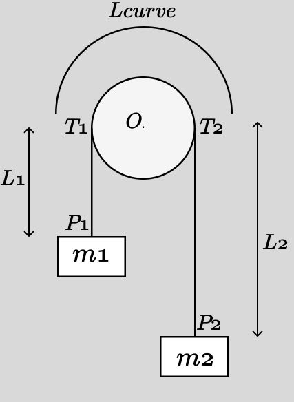

.. _atwoods_machine_example:

======================
Atwood Machine Example
======================

.. _fig-atwood-machine:

The Atwood machine consists of two particles of masses $m_1$ and $m_2$
connected by a massless, inextensible rope that passes over a fixed pulley of
radius $r$. As one mass descends by a displacement $q$, the other ascends
by the same amount, so that the total rope length remains constant.

:obj:`sympy.physics.mechanics` provides wrapping geometry classes and a wrapping pathway
that are useful to model forces along a surface.

We can model the pulley as a ``WrappingCylinder`` and the rope
as a ``WrappingPathway`` that wraps over this cylinder. This example
illustrates how to set up the kinematics, compute the total rope length, verify
inextensibility of the rope, and derive the equations of motion using Kane's method.

Define Variables
================

First, import the necessary symbols, frames, points, and classes. We introduce
a single generalized coordinate $q(t)$, which measures the downward
displacement of mass $m_1$. Its time derivative $u(t) = \dot q(t)$ is the
generalized speed.

    >>> import sympy as sp
    >>> from sympy import Q, refine
    >>> from sympy.physics.mechanics import (
    ...      ReferenceFrame,
    ...      Point,
    ...      Particle,
    ...      KanesMethod,
    ...      dynamicsymbols,
    ...      WrappingCylinder,
    ...      WrappingPathway,
    ...      Force,
    ...  )
    >>>
    >>> t = sp.symbols("t")
    >>>
    >>> # Constant parameters: masses, gravity, pulley radius, initial height, tension
    >>>
    >>> m1, m2, g, r, h, T = sp.symbols("m1 m2 g r h T", positive=True, real=True)
    >>>
    >>> # Generalized coordinate and speed: m1 moves downward by q(t)
    >>>
    >>> q = dynamicsymbols("q", real=True)   # q(t)
    >>> u = dynamicsymbols("u", real=True)   # u(t) = dq/dt

Inertial Frame and Pulley Center
================================

We define an inertial frame $N$ and fix the pulley's center $O$ at the
origin. The pulley axis is aligned with the $\hat{\mathbf{N}}_x$ direction.

    >>> # Define inertial reference frame and pulley center
    >>>
    >>> N = ReferenceFrame("N")
    >>> O = Point("O")
    >>> O.set_vel(N, 0)  # Pulley center is fixed at the origin

Positions and Velocities of the Two Masses
==========================================

Let $P_1$ be the contact point (mass point) of $m_1$ and $P_2$ that of
$m_2$. Initially, when $q=0$, both masses are at vertical distance $h+r$
below the center of the pulley. As $m_1$ descends by $q$, its position is

$$
P_1: (x=0,\; y=+r,\; z=-(h+q))\,,
$$

and $m_2$ rises accordingly to

$$
P_2: (x=0,\; y=-r,\; z=-(h-q))\,.
$$

We set their velocities by differentiating their position vectors in frame
$N$.

    >>> # Mass m1 at P1: (x=0, y=+r, z=-(h+q))
    >>>
    >>> P1 = Point("P1")
    >>> P1.set_pos(O, r * N.y + (-(h + q)) * N.z)
    >>> P1.vel(N)
    - Derivative(q(t), t)*N.z
    >>> M1 = Particle("M1", P1, m1)
    >>>
    >>> # Mass m2 at P2: (x=0, y=-r, z=-(h-q))
    >>>
    >>> P2 = Point("P2")
    >>> P2.set_pos(O, -r * N.y + (-(h - q)) * N.z)
    >>> P2.vel(N)
    Derivative(q(t), t)*N.z
    >>> M2 = Particle("M2", P2, m2)

Create WrappingCylinder for the Pulley
======================================

We model the pulley as an ideal cylinder of radius $r$, centered at $O$,
with its rotational axis along $\hat{\mathbf{N}}_x$. This is done via ``WrappingCylinder(r, O, N.x)``.

    >>> pulley = WrappingCylinder(r, O, N.x)

Determine Tangent Points $T_1$ and $T_2$
==========================================

Because each mass hangs directly below the “eastmost” or “westmost” point on
the pulley (i.e., $y=\pm r$ and $z=0$ on the cylinder), the tangent points
are fixed:

$$
T_1: (x=0,\, y=+r,\, z=0),
\quad
T_2: (x=0,\, y=-r,\, z=0).
$$

We place points $T_1$ and $T_2$ there and set their velocities to zero.

    >>> # Tangent point for P1 (eastmost)
    >>>
    >>> T1 = Point("T1")
    >>> T1.set_pos(O, r * N.y + 0 * N.z)
    >>> T1.set_vel(N, 0)
    >>>
    >>> # Tangent point for P2 (westmost)
    >>>
    >>> T2 = Point("T2")
    >>> T2.set_pos(O, -r * N.y + 0 * N.z)
    >>> T2.set_vel(N, 0)

WrappingPathway Over the Cylinder
=================================

With the two tangent points $T_1$ and $T_2$ and the ``WrappingCylinder`` pulley
object, we construct a ``WrappingPathway`` $wpath$.
Internally, this object computes the geodesic (shortest-path) on the
cylinder's surface connecting $T_1$ and $T_2$, which here is a
half-circumference of length $\pi r$, independent of $q$.

    >>> wpath = WrappingPathway(T1, T2, pulley)

Compute Segment Lengths and Verify Inextensible Rope
====================================================

Note that this section is only for demonstrating the capabilities of ``WrappingPathway``
and is not required to obtain the correct acceleration result. We verify the
inextensibility of the rope in the following way.
The rope consists of three segments:

1. **Segment 1** from $P_1$ down to $T_1$.  Its length is

   $$
   L_1 = \|\,P_1 - T_1\| \;=\; h + q,
   $$

   because $P_1$ sits at $(y=+r,\,z=-(h+q))$ and $T_1$ at
   $(y=+r,\, z=0)$. We simplify this using a positivity assumption on $h+q$.

2. **Curved segment** along the pulley (cylinder surface) from $T_1$ to
   $T_2$. We compute this using the ``length`` property of ``WrappingPathway``.
   By construction, this geodesic is a half-circumference:

    .. math::

            L_\text{curve} = \pi r

3. **Segment 2** from $T_2$ up to $P_2$.  Its length is

   $$
   L_2 = \|\,P_2 - T_2\| \;=\; h - q,
   $$

   again simplified by assuming $h - q$ is positive.

Hence, the total rope length

.. math::
   \begin{aligned}
   L_{\text{total}} &= L_{1} + L_{\text{curve}} + L_{2} \\
                    &= (h + q) + (\pi\,r) + (h - q) \\
                    &= 2\,h + \pi\,r
   \end{aligned}

is independent of $q$. We verify :math:`\frac{d L_\text{total}}{dq} = 0`.

    >>> # Segment length from P1 to T1
    >>>
    >>> L1 = sp.sqrt((P1.pos_from(T1).dot(P1.pos_from(T1))))
    >>> L1 = refine(L1, Q.positive(h + q))  # enforces h+q > 0
    >>> L1
    h + q(t)
    >>>
    >>> # Segment length from P2 to T2
    >>>
    >>> L2 = sp.sqrt((P2.pos_from(T2).dot(P2.pos_from(T2))))
    >>> L2 = refine(L2, Q.positive(h - q))  # enforces h-q > 0
    >>> L2
    h - q(t)
    >>>
    >>> # Curved segment on the pulley
    >>>
    >>> L_curve = wpath.length
    >>> L_curve
    pi*r
    >>>
    >>> # Total length and its derivative
    >>>
    >>> L_total = sp.simplify(L1 + L_curve + L2)
    >>> L_total
    2*h + pi*r
    >>> dL_dq = sp.simplify(sp.diff(L_total, q))
    >>> dL_dq
    0

Define Gravity Forces on Each Mass
==================================

Each particle is subjected to its weight in the negative $\hat{\mathbf{N}}_z$ direction:

    >>> grav1 = Force(P1, -m1 * g * N.z)
    >>> grav2 = Force(P2, -m2 * g * N.z)

Collect All Loads for Kane's Method
===================================

The only generalized coordinates in the system are $q$ and its derivative
$u$.  The rope transmits a tension $T$ to each mass via the wrapping
pathway.  By calling ``wpath.to_loads(T)``, we automatically get
three ``Force`` objects:

* One pulling mass $m_1$ at point $P_1$ in the tangent-direction
* One pulling mass $m_2$ at point $P_2$
* One equal-and-opposite reaction at the pulley center $O$

We combine these with the gravity forces.

    >>> loads = wpath.to_loads(T) + [grav1, grav2]

Kinematic Differential Equation
===============================

We declare the usual kinematic relationship $\;u = \dot q$:

    >>> kin_diff = [u - q.diff()]

Formulate and Solve via Kane's Method
=====================================

With inertial frame $N$, one coordinate $q$ and one speed $u$, and
kinematic relation $\;u - \dot q = 0$, we form a ``KanesMethod`` object.
The two particle bodies $M1$ and $M2$ and the ``loads`` list specify all
forces in the system.

    >>> kane = KanesMethod(N, (q,), (u,), kd_eqs=kin_diff)
    >>> bodies = [M1, M2]
    >>> Fr, Frs = kane.kanes_equations(bodies, loads)

    Solve for $\ddot q$ (i.e. $\dot u$) in terms of $q$, $u$, and $T$.
    Since $T$ is an unknown reaction, the symbolic result will contain $T$.
    We then simplify to obtain the standard second-order equation of motion:

    >>> [u, u_dot] = kane.rhs()
    >>> qdd = sp.simplify(u_dot)
    >>> sp.pprint(qdd, use_unicode=True)
    g⋅(m₁ - m₂)
    ───────────
      m₁ + m₂

    Thus we obtain the familiar result of acceleration in an Atwood's Machine.

Numeric Check
=============

Finally, we substitute $m_1=1$, $m_2=2$, $g=9.81$, $h=5.0$, $r=0.5$
and confirm numerically that $\ddot q$ matches
$\,\frac{m_1 - m_2}{m_1 + m_2} g$.

    >>> numeric_vals = {m1: 1.0, m2: 2.0, g: 9.81, h: 5.0, r: 0.5}
    >>> qdd_num = float(qdd.subs(numeric_vals))
    >>> print(f"{qdd_num:.6f} m/s²")
    -3.270000 m/s²

Conclusion
==========

This tutorial has demonstrated how to model an Atwood machine in Sympy's
mechanics framework by using a ``WrappingCylinder`` to represent the pulley and a
``WrappingPathway`` to capture the wrapped rope.  The inextensible rope constraint
was verified automatically by showing that the total length
$\,L_\text{total} = 2\,h + \pi r$ is independent of the generalized
coordinate $q$.  Kane's method then yields the customary second-order
equation of motion, and recovers the classic acceleration formula
$\ddot q = \tfrac{m_1 - m_2}{m_1 + m_2} \,g$.

References
==========

.. [1] https://en.wikipedia.org/wiki/Atwood_machine
.. [2] https://www.aplusphysics.com/courses/honors/dynamics/Atwood.html
