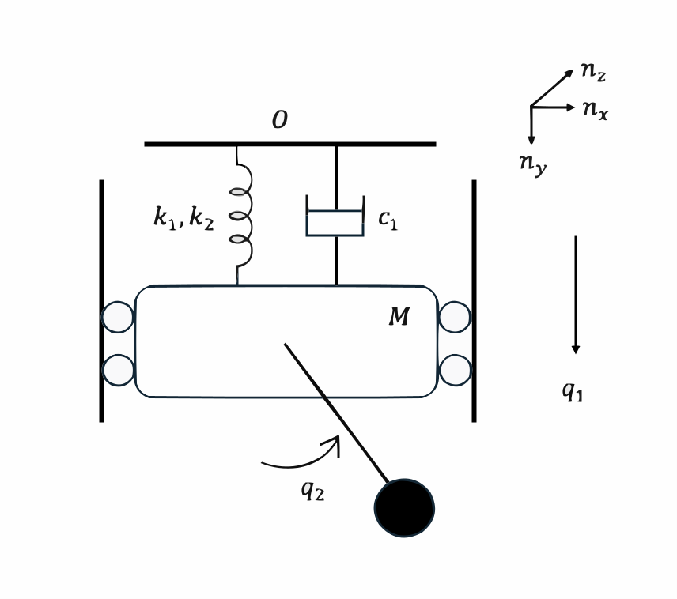

.. _duffing-example:

==================================
Duffing Oscillator with a Pendulum
==================================

In this example we demonstrate the use of functionality provided in
:obj:`sympy.physics.mechanics` for deriving the quations of motion (EOM) for a system
consisting of a Duffing oscillator with a pendulum.

.. _fig-duffing-oscillator-pendulum:

The system will be modeled using Lagrange equations. `M` is mass of the Duffing oscillator,
`m` is mass of the pendulum, `l` is length of the pendulum. `k_1` and `k_2` are linear and
non-linear parts of spring stiffness, and `c_1` is a viscous damping coefficient of the Duffing oscillator.

   >>> import sympy as sm
   >>> import sympy.physics.mechanics as me

Define Variables
================

   >>> M, m, l, k1, k2, c1, g, h, w, d, r = sm.symbols('M, m, l, k1, k2, c1, g, h, w, d, r')
   >>> q1, q2, u2, u2 = me.dynamicsymbols('q1 q2 u1 u2')

- :math:`h`: Height of the Duffing oscillator
- :math:`w`: Width of the Duffing oscillator
- :math:`d`: Depth of the Duffing oscillator
- :math:`r`: Radius of the massive bob of the pendulum
- :math:`q_1`: Generalized coordinate representing the position of the Duffing oscillator
- :math:`q_2`: Generalized coordinate representing the angle of the pendulum
- :math:`\dot{q}_1`: First time derivative of `q1`, representing the velocity of the Duffing oscillator
- :math:`\dot{q}_2`: First time derivative of `q2`, representing the angular velocity of the pendulum
- :math:`u_1`: Generalized speed associated with the Duffing oscillator
- :math:`u_2`: Generalized speed associated with the pendulum
- :math:`\dot{u}_1`: First time derivative of `u1`, representing the acceleration of the Duffing oscillator
- :math:`\dot{u}_2`: First time derivative of `u2`, representing the angular acceleration of the pendulum

Define Kinematics
=================

Define all the reference frames and points.

   >>> N = me.ReferenceFrame('N')
   >>> B = N.orientnew('B', 'axis', (q2, N.z))

The angular velocity of the pendulum in the reference frame is:

   >>> B.set_ang_vel(N, q2.diff() * N.z)
   >>> B.ang_vel_in(N)
   Derivative(q2(t), t)*N.z

Locations and velocities of the Duffing Oscillator block and the pendulum are:

   >>> O = me.Point('O')
   >>> Block = O.locatenew('Block', q1 * N.y)
   >>> Pendulum = Block.locatenew('Pendulum', l * B.y)

O is a fixed point in the inertial reference frame.

   >>> O.set_vel(N, 0)
   >>> Block.set_vel(N, q1d * N.y)
   >>> Pendulum.v2pt_theory(Block, N, B)
   Derivative(q1(t), t)*N.y - l*Derivative(q2(t), t)*B.x

   >>> me.init_vprinting()

Define inertia and rigid bodies.
Here, we assume a simple pendulum which consists of a bob of mass m hanging from a massless string of length l
and fixed at a pivot point (Duffing Oscillator Block).

   >>> I_block = me.inertia(N, M*(h**2 + d**2)/12, M*(w**2 + h**2)/12, M*(w**2 + d**2)/12)
   >>> I_pendulum = me.inertia(B, 0, 0, 2*m*r**2/5)

   >>> par_block = me.RigidBody('block', Block, N, M, (I_block, Block))
   >>> par_pendulum = me.RigidBody('pendulum', Pendulum, B, m, (I_pendulum, Pendulum))

Define Forces
=============

We calculate the forces acting on the system.

   >>> path = me.LinearPathway(O, Block)
   >>> spring = me.DuffingSpring(k1, k2, path, 0)
   >>> damper = me.LinearDamper(c1, path)

   >>> loads = spring.to_loads() + damper.to_loads()

   >>> bodies = [par_block, par_pendulum]

   >>> for body in bodies:
   ...     loads.append(me.Force(body, -body.mass * g * N.y))

   >>> loads
         /      _____           3/2\                  /        _____           3/2\
         |     /   2       /  2\   |                  |       /   2       /  2\   |
         \k1*\/  q1   + k2*\q1 /   /*q1               \- k1*\/  q1   - k2*\q1 /   /*q1
    [(O, ------------------------------ n_y), (Block, -------------------------------- n_y), (O, c1*q1'(t) n_y), (Block, -c1*q1'(t) n_y), (Block, -M*g n_y), (Pendulum, -g*m n_y)]
                       _____                                         _____
                      /   2                                         /   2
                    \/  q1                                        \/  q1

Lagrange's Method
=================

With the problem setup, the Lagrangian can be calculated, and the equations of motion formed.

   >>> L = me.Lagrangian(N, par_block, par_pendulum)
   >>> me.Lagrangian(N, par_block, par_pendulum)
            2      2       2     / 2       2                                     2\
    M*q1'(t)    m*r *q2'(t)    m*\l *q2'(t)  - 2*l*sin(q2)*q1'(t)*q2'(t) + q1'(t) /
    --------- + ------------ + ----------------------------------------------------
        2            5                                  2

   >>> LM = me.LagrangesMethod(L, [q1, q2], bodies=bodies, forcelist=loads, frame=N)
   >>> LM.form_lagranges_equations()
    [                                                                                                 /        _____           3/2\   ]
    [                                      /                                         2            \   |       /   2       /  2\   |   ]
    [                                    m*\-2*l*sin(q2)*q2''(t) - 2*l*cos(q2)*q2'(t)  + 2*q1''(t)/   \- k1*\/  q1   - k2*\q1 /   /*q1]
    [M*g + M*q1''(t) + c1*q1'(t) + g*m + ---------------------------------------------------------- - --------------------------------]
    [                                                                2                                               _____            ]
    [                                                                                                               /   2             ]
    [                                                                                                             \/  q1              ]
    [                                                                                                                                 ]
    [                                                  2             /   2                                                          \ ]
    [                                             2*m*r *q2''(t)   m*\2*l *q2''(t) - 2*l*sin(q2)*q1''(t) - 2*l*cos(q2)*q1'(t)*q2'(t)/ ]
    [-g*l*m*sin(q2) + l*m*cos(q2)*q1'(t)*q2'(t) + -------------- + ------------------------------------------------------------------ ]
    [                                                   5                                          2                                  ]

References
==========

.. [P.Brzeskia2012] P. Brzeskia, P. Perlikowskia, S. Yanchukb, T. Kapitaniaka,
   The dynamics of the pendulum suspended on the forced Duffing oscillator,
   Journal of Sound and Vibration, 2012, https://doi.org/10.48550/arXiv.1202.5937
