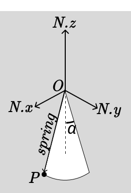

.. _elastic_pendulum_cone_model:

=====================================
Elastic Pendulum on a Conical Surface
=====================================

.. _fig-elastic-pendulum-cone:

This example explores the dynamics of a particle of mass $m$ constrained to move on the inner surface of a frictionless cone with a fixed half-angle $\alpha$. The particle is attached to the apex of the cone by an ideal elastic spring with stiffness $k$ and natural rest length $L\_0$. The system is subject to a uniform gravitational field $g$.

The particle's motion is described by its geodesic distance $s(t)$ from the apex along the cone's surface and its azimuthal angle $\phi(t)$. This model is a classic problem in mechanics that demonstrates the interplay between gravitational forces, elastic restoring forces, and the inertial effects (like centrifugal force) that arise from motion on a curved surface.

:obj:`sympy.physics.mechanics` provides a robust framework for deriving the equations of motion for such systems using Lagrangian dynamics. This example demonstrates how to set up the system's geometry, define its kinetic and potential energies, and automatically derive the final equations of motion.

Define Symbols and Import Modules
=================================

First, we import the necessary symbols, frames, points, and classes from SymPy and its mechanics module.

>>> from sympy import symbols, sin, cos, simplify, Rational
>>> from sympy.physics.mechanics import (
...     dynamicsymbols, ReferenceFrame, Point,
...     LagrangesMethod, Lagrangian, Particle
... )

Generalized Coordinates and Physical Parameters
===============================================

We define the time variable `t` and establish our generalized coordinates, `s(t)` and `phi(t)`.

    >>> # Time variable
    >>> t = symbols('t')

    >>> # Generalized coordinates and their time derivatives
    >>> s, phi = dynamicsymbols('s phi')
    >>> ds, dphi = dynamicsymbols('s phi', 1)

    >>> # Physical parameters
    >>> m, g, k, L0, alpha = symbols('m g k L0 alpha', positive=True)

The physical parameters represent:

  - $m$: mass of the particle
  - $g$: acceleration due to gravity
  - $k$: elastic stiffness constant of the spring
  - $L\_0$: natural (rest) length of the spring
  - $\alpha$: constant half-angle of the cone, measured from the vertical axis

Inertial Frame and Point Setup
==============================

We establish a fixed inertial reference frame $N$ and place the cone's apex, point $O$, at its origin.

    >>> # Inertial frame and fixed apex
    >>> N = ReferenceFrame('N')
    >>> O = Point('O')
    >>> O.set_vel(N, 0)

Position and Velocity of the Particle
=====================================

The position of the particle $P$ is described using the conical coordinates $(s, \phi)$. We express its position vector from the apex $O$ in the Cartesian basis of the inertial frame $N$. The z-axis is aligned with the cone's axis of symmetry and points upwards.

$$\mathbf{r}_P = s\sin\alpha\cos\phi\,\hat{\mathbf{N}}_x + s\sin\alpha\sin\phi\,\hat{\mathbf{N}}_y - s\cos\alpha\,\hat{\mathbf{N}}_z$$

The velocity of point $P$ is the time derivative of its position vector in frame $N$.

    >>> # Define the particle P
    >>> P = Point('P')

    >>> # Set the position of P relative to the apex O
    >>> P.set_pos(O, s*sin(alpha)*cos(phi)*N.x +
    ...              s*sin(alpha)*sin(phi)*N.y -
    ...              s*cos(alpha)*N.z)

    >>> # Calculate the velocity of P in the inertial frame
    >>> P.set_vel(N, P.pos_from(O).dt(N))

Kinetic Energy Calculation
==========================

We model the system as a single particle `P\_part` with mass $m$ located at point $P$. The kinetic energy is $T = \frac{1}{2}mv^2$.

    >>> # Create a particle object
    >>> P_part = Particle('P_part', P, m)

    >>> # Calculate and simplify the kinetic energy
    >>> T = P_part.kinetic_energy(N).simplify()
    >>> print(T)
    m*(s(t)**2*sin(alpha)**2*Derivative(phi(t), t)**2 + Derivative(s(t), t)**2)/2

The derived kinetic energy has the expected form for motion on a cone:

.. math::

    T = \frac{1}{2}m\left(\dot{s}^2 + s^2\sin^2\alpha \cdot \dot{\phi}^2\right)

- The $\dot{s}^2$ term represents the kinetic energy from motion along the cone's slant (radial motion).
- The $s^2\sin^2\alpha \cdot \dot{\phi}^2$ term represents the kinetic energy from the azimuthal motion (rotation). The factor $s\sin\alpha$ is the radius of the horizontal circle on which the particle moves.

Potential Energy and Lagrangian Formulation
===========================================

The total potential energy of the system is the sum of the gravitational potential energy ($V_g$) and the elastic potential energy stored in the spring ($V_e$).

.. math::

    V_g = mgz = -mgs\cos\alpha

.. math::

    V_e = \frac{1}{2}k(\text{stretch})^2 = \frac{1}{2}k(s - L_0)^2

>>> # Gravitational potential energy
>>> Vg = m*g*P.pos_from(O).dot(N.z)

>>> # Elastic potential energy
>>> Ve = Rational(1, 2)*k*(s - L0)**2

>>> # Assign the total potential energy to the particle
>>> P_part.potential_energy = Vg + Ve

>>> # Form the Lagrangian L = T - V
>>> Lag = Lagrangian(N, P_part)
>>> print(simplify(Lag))
g*m*s(t)*cos(alpha) - k*(L0 - s(t))**2/2 + m*(s(t)**2*sin(alpha)**2*Derivative(phi(t), t)**2 + Derivative(s(t), t)**2)/2

The complete Lagrangian for the system is:

.. math::

    \mathcal{L} = T - V = \frac{1}{2}m\left(\dot{s}^2 + s^2\sin^2\alpha \cdot \dot{\phi}^2\right) + mgs\cos\alpha - \frac{1}{2}k(s - L_0)^2

Equations of Motion Derivation
==============================

We use ``LagrangesMethod`` to automatically apply the Euler-Lagrange equations for each generalized coordinate, $s$ and $\phi$.

$$\frac{d}{dt}\left(\frac{\partial \mathcal{L}}{\partial \dot{q}_i}\right) - \frac{\partial \mathcal{L}}{\partial q_i} = 0$$

    >>> # Form Lagrange's equations of motion
    >>> LM = LagrangesMethod(Lag, [s, phi])
    >>> eqns = LM.form_lagranges_equations()

    >>> # Display the resulting ordinary differential equations
    >>> # Equation for s:
    >>> print(simplify(eqns[0]))
    -L0*k - g*m*cos(alpha) + k*s(t) - m*s(t)*sin(alpha)**2*Derivative(phi(t), t)**2 + m*Derivative(s(t), (t, 2))
    >>> # Equation for phi:
    >>> print(simplify(eqns[1]))
    m*(s(t)*Derivative(phi(t), (t, 2)) + 2*Derivative(phi(t), t)*Derivative(s(t), t))*s(t)*sin(alpha)**2

The resulting equations of motion, after rearranging for clarity, are:

**Equation 1 (for `s`):**

.. math::

    m\ddot{s} = ms^2\sin^2\alpha\dot{\phi}^2 + mg\cos\alpha - k(s - L_0)

**Equation 2 (for `φ`):**

.. math::

    \frac{d}{dt}\left(ms^2\sin^2\alpha\dot{\phi}\right) = 0

In matrix form, the system can be written as:

.. math::

    \begin{bmatrix}
    m & 0 \\[6pt]
    0 & m s^2 \sin^2\alpha
    \end{bmatrix}
    \begin{bmatrix}
    \ddot{s} \\[6pt]
    \ddot{\phi}
    \end{bmatrix}
    +
    \begin{bmatrix}
    -\,m s \sin^2\alpha\,\dot{\phi}^{2} \\[6pt]
    2\,m s \sin^2\alpha\,\dot{s}\,\dot{\phi}
    \end{bmatrix}
    =
    \begin{bmatrix}
    m g \cos\alpha - k\,(s - L_{0}) \\[6pt]
    0
    \end{bmatrix}

Physical Interpretation of the Equations
========================================

The two equations describe the coupled dynamics of the system:

1.  **Equation 1 (for $s$):** The acceleration along the cone's slant ($\ddot{s}$) is a balance of three forces:

      - The outward **centrifugal force** ($ms\sin^2\alpha\dot{\phi}^2$) due to rotation.
      - The downward component of **gravity** ($mg\cos\alpha$).
      - The inward **elastic restoring force** ($-k(s - L\_0)$) from the spring.

2.  **Equation 2 (for $\phi$):** This equation shows that the time derivative of the quantity $p\_\phi = ms^2\sin^2\alpha\dot{\phi}$ is zero. This quantity is the particle's **angular momentum** about the vertical axis. Because gravity and the spring force are central (acting along the `s` direction), there is no torque in the `φ` direction, and thus angular momentum is conserved.

Conclusion
==========

This example demonstrates how to model a system with combined gravitational and elastic potential energies on a curved surface. By defining the geometry and the energy components, SymPy's ``LagrangesMethod`` provides a powerful and systematic way to derive the full, coupled equations of motion. The resulting equations clearly show the balance of inertial, gravitational, and elastic forces that govern the particle's complex trajectory on the cone.
