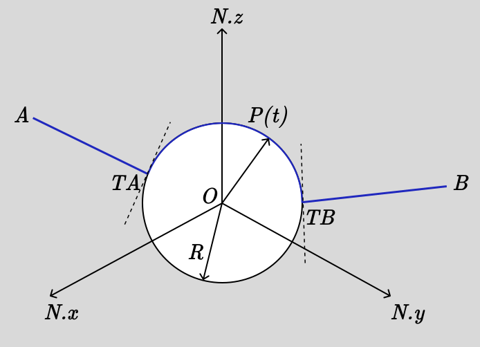

.. _muscle_model_example:

=================================================
Muscle Wrapping over a Spherical Bone in 3D Space
=================================================

.. _fig-muscle-model:

The wrapping sphere muscle model consists of a muscle that runs from an origin point $A$ to an insertion point $B$, wrapping smoothly over a fixed spherical bone of radius $R$ centered at the origin. The muscle contacts the sphere at a moving point $P(t)$ that varies with time based on the muscle's activation and the mechanical constraints of the system.

The complete muscle path is composed of three segments:

1. **Straight line segment** from origin $A$ to tangent point $T_A$
2. **Geodesic segment** on the sphere surface from $T_A$ to $T_B$
3. **Straight line segment** from tangent point $T_B$ to insertion $B$

Here, $T_A$ and $T_B$ are the tangent points on the sphere where the straight lines from $A$ and $B$ touch the spherical surface. This model is particularly useful in biomechanics for analyzing how muscles wrap around bones and joints during movement.

:obj:`sympy.physics.mechanics` provides wrapping geometry classes including ``WrappingSphere`` that are specifically designed to handle the complex geodesic calculations required for this type of analysis. This example demonstrates how to set up the complete kinematic and dynamic model, compute the total muscle path length, and derive the equations of motion using Lagrangian mechanics.

Define Symbols and Import Modules
==================================

First, we import the necessary symbols, frames, points, and classes from SymPy and its mechanics module. We'll use spherical coordinates $\theta(t)$ and $\phi(t)$ to describe the contact point on the sphere surface.

    >>> from sympy import (
    ...      symbols, sin, cos, sqrt,
    ...      simplify,Rational
    ... )
    >>> from sympy.physics.mechanics import (
    ...      dynamicsymbols, ReferenceFrame,
    ...      Point, dot, LagrangesMethod,
    ...      Lagrangian, WrappingSphere,
    ...      Particle
    ... )

Generalized Coordinates and Physical Parameters
===============================================

We define the time variable and establish our generalized coordinates. The spherical coordinates $\theta(t)$ and $\phi(t)$ completely describe the position of the contact point $P$ on the sphere surface, where $\theta$ is the polar angle (measured from the positive z-axis) and $\phi$ is the azimuthal angle (measured from the positive x-axis in the xy-plane).

    >>> # Time variable
    >>> t = symbols('t')

    >>> # Generalized coordinates and their time derivatives
    >>> theta, phi = dynamicsymbols('theta phi')
    >>> dtheta, dphi = dynamicsymbols('theta phi', 1)

    >>> # Physical parameters
    >>> R, m, k, L0 = symbols('R m k L0', positive=True)
    >>> Ax, Ay, Az, Bx, By, Bz = symbols('Ax Ay Az Bx By Bz')

The physical parameters represent:
- $R$: radius of the spherical bone
- $m$: effective mass associated with the contact point (representing muscle inertia)
- $k$: elastic stiffness constant of the muscle
- $L_0$: natural (rest) length of the muscle
- $(A_x, A_y, A_z)$ and $(B_x, B_y, B_z)$: fixed spatial coordinates of the muscle's origin and insertion points

Inertial Frame and WrappingSphere Setup
=======================================

We establish an inertial reference frame $N$ and place the sphere's center $O$ at the origin with zero velocity. The ``WrappingSphere`` object will automatically handle the geodesic computations required for calculating the shortest path along the spherical surface.

    >>> # Inertial frame and fixed origin
    >>> N = ReferenceFrame('N')
    >>> O = Point('O')
    >>> O.set_vel(N, 0)

    >>> # Define wrapping sphere centered at origin
    >>> sphere = WrappingSphere(R, O)

The sphere is assumed to be fixed in space (representing a bone), so its center has zero velocity in the inertial frame.

Position and Velocity of Contact Point
======================================

The contact point $P$ on the sphere surface is parameterized using spherical coordinates. In the standard spherical coordinate system, the position vector is:

$$\mathbf{r}_P = R\sin\theta\cos\phi\,\hat{\mathbf{N}}_x + R\sin\theta\sin\phi\,\hat{\mathbf{N}}_y + R\cos\theta\,\hat{\mathbf{N}}_z$$

The velocity of point $P$ is obtained by differentiating its position vector with respect to time in the inertial frame $N$.

    >>> # Contact point P in spherical coordinates
    >>> P = Point('P')
    >>> x = R*sin(theta)*cos(phi)
    >>> y = R*sin(theta)*sin(phi)
    >>> z = R*cos(theta)

    >>> P.set_pos(O, x*N.x + y*N.y + z*N.z)
    >>> P.set_vel(N, P.pos_from(O).diff(t, N))

The resulting velocity will be a function of $\dot{\theta}$ and $\dot{\phi}$, representing how the contact point moves along the sphere surface.

Kinetic Energy Calculation
==========================

We model the contact point $P$ as a particle with mass $m$ to account for the inertial effects of the muscle tissue. The kinetic energy of this particle is computed using the standard formula $T = \frac{1}{2}mv^2$.

    >>> # Model P as a particle with mass m
    >>> P_part = Particle('P_part', P, m)

    >>> # Kinetic energy T = (1/2)mv²
    >>> T = simplify(P_part.kinetic_energy(N))
    >>> print(T)
    R**2*m*(sin(theta(t))**2*Derivative(phi(t), t)**2 + Derivative(theta(t), t)**2)/2

The kinetic energy expression reveals the characteristic form for motion on a sphere. The computed result shows:

.. math::

   T = \frac{1}{2}mR^2\left(\dot{\theta}^2 + \sin^2\theta \cdot \dot{\phi}^2\right)

This is the familiar form for motion constrainted to a sphere:

- The $\dot{\theta}^2$ term represents kinetic energy from changes in the polar angle (north-south motion on the sphere)
- The $\sin^2\theta \cdot \dot{\phi}^2$ term represents kinetic energy from changes in the azimuthal angle (east-west motion)
- The $R^2$ factor scales all kinetic energy with the square of the sphere radius

Fixed Points and Tangent Point Determination
============================================

The muscle's origin point $A$ and insertion point $B$ are fixed in space. To find where the muscle would naturally contact the sphere (the tangent points), we project rays from the sphere center $O$ toward points $A$ and $B$ onto the sphere surface.

    >>> # Fixed muscle origin and insertion points
    >>> A = Point('A'); B = Point('B')
    >>> A.set_pos(O, Ax*N.x + Ay*N.y + Az*N.z)
    >>> B.set_pos(O, Bx*N.x + By*N.y + Bz*N.z)

    >>> # Unit direction vectors from sphere center
    >>> uA = A.pos_from(O).normalize()
    >>> uB = B.pos_from(O).normalize()

    >>> # Tangent points on sphere surface
    >>> TA = Point('TA'); TB = Point('TB')
    >>> TA.set_pos(O, R*uA)
    >>> TB.set_pos(O, R*uB)

The tangent points $T_A$ and $T_B$ represent the "natural" contact points where the muscle would touch the sphere if it followed the shortest possible path from $A$ to $B$ while wrapping around the spherical obstacle.

Total Muscle Path Length Computation
====================================

The total muscle path consists of three segments whose lengths must be computed and summed:

1. **Straight segment** from $A$ to the current contact point $P$
2. **Geodesic segment** on the sphere from $T_A$ to $T_B$ (shortest path on sphere surface)
3. **Straight segment** from $P$ to insertion point $B$

The ``WrappingSphere`` class provides the ``geodesic_length`` method to compute the arc length of the shortest path between two points on the sphere surface.

    >>> # Geodesic segment length on sphere surface
    >>> L_wrap = simplify(sphere.geodesic_length(TA, TB))

    >>> # Straight-line segment vectors and lengths
    >>> TA_vec = P.pos_from(A)
    >>> TB_vec = P.pos_from(B)

    >>> # Total muscle path length
    >>> L_tot = simplify(
    ...     sqrt(dot(TA_vec, TA_vec)) +
    ...     L_wrap +
    ...     sqrt(dot(TB_vec, TB_vec))
    ... )
    >>> print(L_tot)
    R*acos((Ax*Bx + Ay*By + Az*Bz)/(sqrt(Ax**2 + Ay**2 + Az**2)*sqrt(Bx**2 + By**2 + Bz**2))) + sqrt((Ax - R*sin(theta(t))*cos(phi(t)))**2 + (Ay - R*sin(phi(t))*sin(theta(t)))**2 + (Az - R*cos(theta(t)))**2) + sqrt((Bx - R*sin(theta(t))*cos(phi(t)))**2 + (By - R*sin(phi(t))*sin(theta(t)))**2 + (Bz - R*cos(theta(t)))**2)

The total muscle path length expression can be broken down into three distinct components:

.. math::

   L_{total} = \sqrt{(A_x - R\sin\theta\cos\phi)^2 + (A_y - R\sin\theta\sin\phi)^2 + (A_z - R\cos\theta)^2} + R\arccos\left(\frac{A_x B_x + A_y B_y + A_z B_z}{\sqrt{A_x^2 + A_y^2 + A_z^2}\sqrt{B_x^2 + B_y^2 + B_z^2}}\right) + \sqrt{(B_x - R\sin\theta\cos\phi)^2 + (B_y - R\sin\theta\sin\phi)^2 + (B_z - R\cos\theta)^2}

This expression reveals several important features:

- **First term**: Euclidean distance from origin point $A$ to the current contact point $P(\theta, \phi)$
- **Second term**: Great circle distance on the sphere between the natural tangent points $T_A$ and $T_B$, which is constant and independent of $\theta$ and $\phi$
- **Third term**: Euclidean distance from the current contact point $P(\theta, \phi)$ to the insertion point $B$

The geodesic length component $R\arccos(\cdot)$ represents the shortest path between the natural tangent points on the sphere surface, computed using the dot product formula for the angle between position vectors from the origin to points $A$ and $B$.

Potential Energy and Lagrangian Formulation
===========================================

The muscle is modeled as an elastic element with spring constant $k$ and natural length $L_0$. The elastic potential energy follows as: $V = \frac{1}{2}k(L_{total} - L_0)^2$, where the energy increases quadratically with the deviation from the natural length.

    >>> # Elastic potential energy of the muscle
    >>> P_part.potential_energy = (
    ...     Rational(1, 2)*k*(L_tot - L0)**2
    ... )

    >>> # Lagrangian L = T - V (kinetic minus potential energy)
    >>> Lag = Lagrangian(N, P_part)
    >>> print(Lag)
    -k*(-L0 + R*acos((Ax*Bx + Ay*By + Az*Bz)/(sqrt(Ax**2 + Ay**2 + Az**2)*sqrt(Bx**2 + By**2 + Bz**2))) + sqrt((Ax - R*sin(theta(t))*cos(phi(t)))**2 + (Ay - R*sin(phi(t))*sin(theta(t)))**2 + (Az - R*cos(theta(t)))**2) + sqrt((Bx - R*sin(theta(t))*cos(phi(t)))**2 + (By - R*sin(phi(t))*sin(theta(t)))**2 + (Bz - R*cos(theta(t)))**2))**2/2 + m*(R**2*sin(theta(t))**2*Derivative(theta(t), t)**2 + (-R*sin(phi(t))*sin(theta(t))*Derivative(phi(t), t) + R*cos(phi(t))*cos(theta(t))*Derivative(theta(t), t))**2 + (R*sin(phi(t))*cos(theta(t))*Derivative(theta(t), t) + R*sin(theta(t))*cos(phi(t))*Derivative(phi(t), t))**2)/2

The Lagrangian expression shows the complete energy formulation for the muscle wrapping system:

.. math::

   \mathcal{L} = T - V = \frac{1}{2}mR^2\left(\dot{\theta}^2 + \sin^2\theta \cdot \dot{\phi}^2\right) - \frac{1}{2}k(L_{total}(\theta, \phi) - L_0)^2

Key observations from the computed Lagrangian:

- **Kinetic energy component**: The first part contains the spherical motion terms $\dot{\theta}^2$ and $\sin^2\theta \cdot \dot{\phi}^2$, scaled by $mR^2/2$
- **Potential energy component**: The negative quadratic term $-k(L_{total} - L_0)^2/2$ represents the elastic energy storage
- **Geometric coupling**: The $L_{total}(\theta, \phi)$ dependence creates nonlinear coupling between the coordinates through the distance calculations
- **Configuration-dependent forces**: The muscle naturally seeks positions that minimize the total path length while balancing kinetic and elastic energies

Equations of Motion Derivation
==============================

Using Lagrange's method, we derive the equations of motion for the system. The ``LagrangesMethod`` class automatically applies the Euler-Lagrange equations:

$$\frac{d}{dt}\left(\frac{\partial \mathcal{L}}{\partial \dot{q}_i}\right) - \frac{\partial \mathcal{L}}{\partial q_i} = 0$$

for each generalized coordinate $q_i$ (in our case, $\theta$ and $\phi$).

    >>> # Form Lagrange's equations for θ and φ
    >>> LM = LagrangesMethod(Lag, [theta, phi])
    >>> eqns = LM.form_lagranges_equations()

    >>> # Display the resulting ordinary differential equations
    >>> for i, eq in enumerate(eqns, 1):
    ...     print(f"Equation {i}:")
    ...     print(simplify(eq))
    Equation 1:
    R*(R*m*(-sin(2*theta(t))*Derivative(phi(t), t)**2/2 + Derivative(theta(t), (t, 2)))*sqrt((Ax - R*sin(theta(t))*cos(phi(t)))**2 + (Ay - R*sin(phi(t))*sin(theta(t)))**2 + (Az - R*cos(theta(t)))**2)*sqrt((Bx - R*sin(theta(t))*cos(phi(t)))**2 + (By - R*sin(phi(t))*sin(theta(t)))**2 + (Bz - R*cos(theta(t)))**2) - k*((Ax*cos(phi(t))*cos(theta(t)) + Ay*sin(phi(t))*cos(theta(t)) - Az*sin(theta(t)))*sqrt((Bx - R*sin(theta(t))*cos(phi(t)))**2 + (By - R*sin(phi(t))*sin(theta(t)))**2 + (Bz - R*cos(theta(t)))**2) + (Bx*cos(phi(t))*cos(theta(t)) + By*sin(phi(t))*cos(theta(t)) - Bz*sin(theta(t)))*sqrt((Ax - R*sin(theta(t))*cos(phi(t)))**2 + (Ay - R*sin(phi(t))*sin(theta(t)))**2 + (Az - R*cos(theta(t)))**2))*(-L0 + R*acos((Ax*Bx + Ay*By + Az*Bz)/(sqrt(Ax**2 + Ay**2 + Az**2)*sqrt(Bx**2 + By**2 + Bz**2))) + sqrt((Ax - R*sin(theta(t))*cos(phi(t)))**2 + (Ay - R*sin(phi(t))*sin(theta(t)))**2 + (Az - R*cos(theta(t)))**2) + sqrt((Bx - R*sin(theta(t))*cos(phi(t)))**2 + (By - R*sin(phi(t))*sin(theta(t)))**2 + (Bz - R*cos(theta(t)))**2)))/(sqrt((Ax - R*sin(theta(t))*cos(phi(t)))**2 + (Ay - R*sin(phi(t))*sin(theta(t)))**2 + (Az - R*cos(theta(t)))**2)*sqrt((Bx - R*sin(theta(t))*cos(phi(t)))**2 + (By - R*sin(phi(t))*sin(theta(t)))**2 + (Bz - R*cos(theta(t)))**2))
    Equation 2:
    R*(R*m*(sin(2*theta(t))*Derivative(phi(t), t)*Derivative(theta(t), t) - cos(2*theta(t))*Derivative(phi(t), (t, 2))/2 + Derivative(phi(t), (t, 2))/2)*sqrt((Ax - R*sin(theta(t))*cos(phi(t)))**2 + (Ay - R*sin(phi(t))*sin(theta(t)))**2 + (Az - R*cos(theta(t)))**2)*sqrt((Bx - R*sin(theta(t))*cos(phi(t)))**2 + (By - R*sin(phi(t))*sin(theta(t)))**2 + (Bz - R*cos(theta(t)))**2) + k*((Ax*sin(phi(t)) - Ay*cos(phi(t)))*sqrt((Bx - R*sin(theta(t))*cos(phi(t)))**2 + (By - R*sin(phi(t))*sin(theta(t)))**2 + (Bz - R*cos(theta(t)))**2) + (Bx*sin(phi(t)) - By*cos(phi(t)))*sqrt((Ax - R*sin(theta(t))*cos(phi(t)))**2 + (Ay - R*sin(phi(t))*sin(theta(t)))**2 + (Az - R*cos(theta(t)))**2))*(-L0 + R*acos((Ax*Bx + Ay*By + Az*Bz)/(sqrt(Ax**2 + Ay**2 + Az**2)*sqrt(Bx**2 + By**2 + Bz**2))) + sqrt((Ax - R*sin(theta(t))*cos(phi(t)))**2 + (Ay - R*sin(phi(t))*sin(theta(t)))**2 + (Az - R*cos(theta(t)))**2) + sqrt((Bx - R*sin(theta(t))*cos(phi(t)))**2 + (By - R*sin(phi(t))*sin(theta(t)))**2 + (Bz - R*cos(theta(t)))**2))*sin(theta(t)))/(sqrt((Ax - R*sin(theta(t))*cos(phi(t)))**2 + (Ay - R*sin(phi(t))*sin(theta(t)))**2 + (Az - R*cos(theta(t)))**2)*sqrt((Bx - R*sin(theta(t))*cos(phi(t)))**2 + (By - R*sin(phi(t))*sin(theta(t)))**2 + (Bz - R*cos(theta(t)))**2))

The resulting equations of motion are:

**Equation 1 (for $\theta$):**

.. math::

   mR^2\ddot{\theta} - \frac{1}{2}mR^2\sin(2\theta)\dot{\phi}^2 + k\frac{\partial L_{total}}{\partial \theta}(L_{total} - L_0) = 0

**Equation 2 (for $\phi$):**

.. math::

   mR^2\sin^2\theta\ddot{\phi} + mR^2\sin(2\theta)\dot{\theta}\dot{\phi} + k\frac{\partial L_{total}}{\partial \phi}(L_{total} - L_0) = 0

In matrix form, the system can be written as:

.. math::

   \begin{bmatrix}
   mR^2 & 0 \\
   0 & mR^2\sin^2\theta
   \end{bmatrix}
   \begin{bmatrix}
   \ddot{\theta} \\
   \ddot{\phi}
   \end{bmatrix} +
   \begin{bmatrix}
   -\frac{1}{2}mR^2\sin(2\theta)\dot{\phi}^2 \\
   mR^2\sin(2\theta)\dot{\theta}\dot{\phi}
   \end{bmatrix} +
   \begin{bmatrix}
   k\frac{\partial L_{total}}{\partial \theta}(L_{total} - L_0) \\
   k\frac{\partial L_{total}}{\partial \phi}(L_{total} - L_0)
   \end{bmatrix} =
   \begin{bmatrix}
   0 \\
   0
   \end{bmatrix}

Physical Interpretation of the Equations
========================================

The derived equations reveal several important physical phenomena:

1. **Inertial terms**: The $mR^2$ coefficients represent the effective moment of inertia for motion on the sphere
2. **Centrifugal effects**: The $-\frac{1}{2}mR^2\sin(2\theta)\dot{\phi}^2$ term represents centrifugal forces due to azimuthal motion
3. **Coriolis coupling**: The $mR^2\sin(2\theta)\dot{\theta}\dot{\phi}$ term couples the two coordinates through velocity cross-products
4. **Geometric constraints**: The $\sin^2\theta$ factor in the $\phi$ equation reflects the decreasing effective radius near the poles
5. **Elastic restoring forces**: The $k\frac{\partial L_{total}}{\partial q_i}(L_{total} - L_0)$ terms drive the system toward configurations that minimize muscle length

Conclusion
==========

This tutorial has demonstrated how to construct a comprehensive dynamic model of muscle wrapping around a spherical bone using SymPy's mechanics framework. The ``WrappingSphere`` class automatically handles the complex geodesic calculations, while the Lagrangian formulation provides a systematic approach to deriving the equations of motion.

We've built a compact Lagrangian model of a muscle wrapping around a fixed sphere. By combining the simple kinetic energy on a sphere,
the constant geodesic arc between tangent points,and an elastic spring law, we automatically capture inertial, geometric, and elastic effects in a unified framework. This approach scales naturally to more complex geometries or multiple muscles, just swap in the appropriate wrapping class and recompute the Lagrangian.
