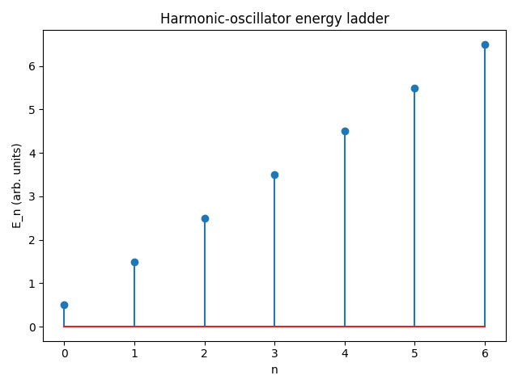

.. _creation_annihilation_tutorial:

======================================
Creation and Annihilation Operators
======================================

This tutorial demonstrates the algebra of creation and annihilation operators using
the :mod:`sympy.physics.quantum` tools.

.. code-block:: python

   from sympy.physics.quantum import Dagger, Operator, Commutator

   a = Operator('a')
   adag = Dagger(a)

.. code-block:: python

   from sympy.physics.quantum import Ket
   n = Ket('n')
   print(a * n)
   print(adag * n)

.. code-block:: python

   from sympy.physics.quantum.boson import BosonOp
   from sympy.physics.quantum import Dagger, Commutator

   a = BosonOp('a')
   adag = Dagger(a)
   print(Commutator(a, adag).doit())

Visualization
=============

