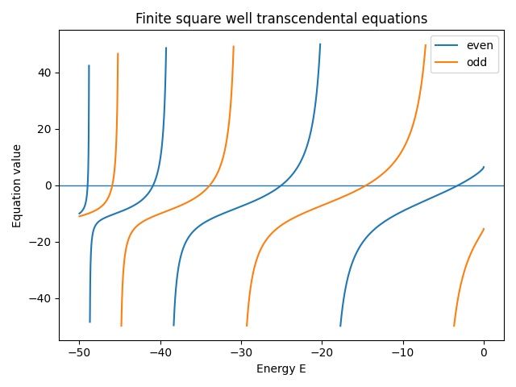

.. _finite_potential_well_tutorial:

=============================================
Finite Square Potential Well (Bound States)
=============================================

.. math::

   k(E) = \frac{\sqrt{2 m (E + V_0)}}{\hbar}, \qquad
   \alpha(E) = \frac{\sqrt{-2 m E}}{\hbar}

Even: :math:`k \tan(k a) = \alpha`

Odd: :math:`-k \cot(k a) = \alpha`

Visualization
=============

