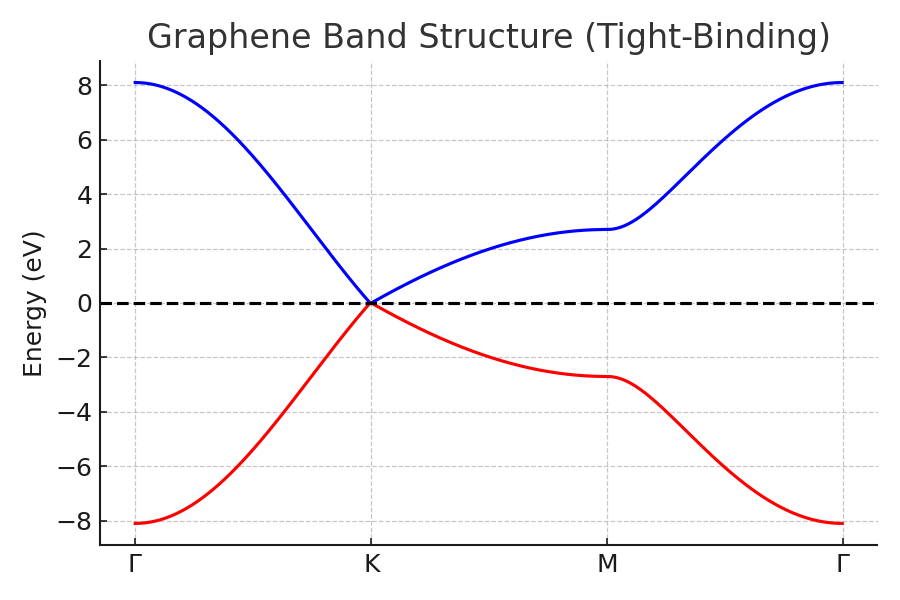
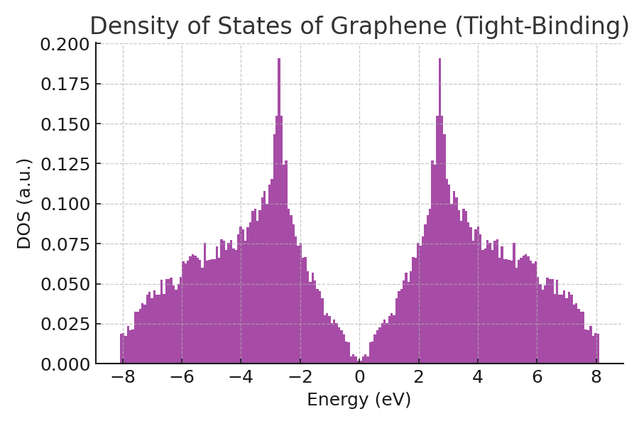

.. _graphene_tightbinding:

==========================================
Graphene Band Structure with Tight Binding
==========================================

This tutorial demonstrates how to use Python (NumPy + Matplotlib + SymPy) to 
calculate and plot the **band structure** and **density of states (DOS)** of 
graphene using the nearest-neighbor **tight-binding model**.

Theory
------

In graphene, the electronic structure can be approximated by considering only 
nearest-neighbor hopping between carbon atoms on a honeycomb lattice.

The Hamiltonian is:

.. math::

   H(\mathbf{k}) = -t \begin{pmatrix}
   0 & f(\mathbf{k}) \\
   f^*(\mathbf{k}) & 0
   \end{pmatrix}

where:

.. math::

   f(\mathbf{k}) = e^{i k \cdot \delta_1} + e^{i k \cdot \delta_2} + e^{i k \cdot \delta_3}

with nearest-neighbor vectors:

.. math::

   \delta_1 = (0, a), \quad
   \delta_2 = (\tfrac{\sqrt{3}a}{2}, -\tfrac{a}{2}), \quad
   \delta_3 = ( -\tfrac{\sqrt{3}a}{2}, -\tfrac{a}{2})

and hopping parameter :math:`t \approx 2.7 eV`.

The eigenvalues give two bands:

.. math::

   E(\mathbf{k}) = \pm t |f(\mathbf{k})|

Band Structure
--------------

The following figure shows the band structure along the high-symmetry path 
:math:`\Gamma \to K \to M \to \Gamma`.

.. plot::
   :include-source:

   import numpy as np
   import matplotlib.pyplot as plt

   # Constants
   a = 1.0          # Lattice constant
   t = 2.7          # Hopping energy (eV)

   # Nearest neighbor vectors
   d1 = np.array([0, a])
   d2 = np.array([np.sqrt(3)*a/2, -a/2])
   d3 = np.array([-np.sqrt(3)*a/2, -a/2])
   deltas = [d1, d2, d3]

   def f_k(kx, ky):
       return sum(np.exp(1j*(kx*dx + ky*dy)) for dx,dy in deltas)

   def energy(kx, ky):
       f = f_k(kx, ky)
       return np.array([+t*np.abs(f), -t*np.abs(f)])

   # High symmetry points
   G = np.array([0,0])
   K = np.array([2*np.pi/(3*np.sqrt(3)*a), 2*np.pi/(3*a)])
   M = np.array([np.pi/(np.sqrt(3)*a), np.pi/(3*a)])

   path = [G,K,M,G]
   labels = [r"$\Gamma$", "K", "M", r"$\Gamma$"]

   # Interpolate k-path
   Nk = 200
   kpts = []
   for i in range(len(path)-1):
       start, end = path[i], path[i+1]
       seg = np.linspace(start, end, Nk)
       kpts.append(seg)
   kpts = np.vstack(kpts)

   bands = [energy(kx,ky) for kx,ky in kpts]
   bands = np.array(bands)

   # Plot Band Structure
   plt.figure(figsize=(6,4))
   plt.plot(bands[:,0], color="blue")
   plt.plot(bands[:,1], color="red")
   plt.axhline(0, color="black", linestyle="--")
   plt.xticks([0, Nk, 2*Nk, 3*Nk], labels)
   plt.ylabel("Energy (eV)")
   plt.title("Graphene Band Structure (Tight-Binding)")
   plt.grid(True)
   plt.show()

Density of States
-----------------

The DOS is estimated by random sampling in the Brillouin zone.

.. plot::
   :include-source:

   N = 50000
   kx = np.random.uniform(-np.pi/a, np.pi/a, N)
   ky = np.random.uniform(-np.pi/a, np.pi/a, N)
   E = np.concatenate([energy(kx[i], ky[i]) for i in range(N)])

   plt.figure(figsize=(6,4))
   plt.hist(E, bins=200, density=True, color="purple", alpha=0.7)
   plt.xlabel("Energy (eV)")
   plt.ylabel("DOS (a.u.)")
   plt.title("Density of States of Graphene (Tight-Binding)")
   plt.show()