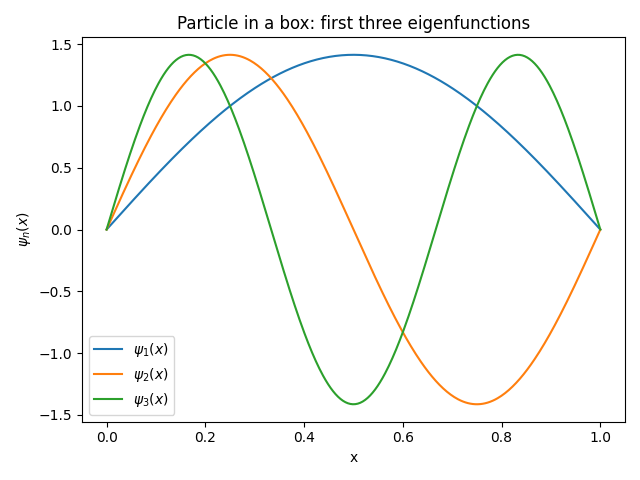

.. _particle_in_box_tutorial:

=====================================
Particle in a Box (Infinite Well)
=====================================

.. math::

   -\frac{\hbar^2}{2m} \frac{d^2 \psi(x)}{dx^2} = E \psi(x)

with :math:`\psi(0) = \psi(L) = 0`.

.. code-block:: python

   from sympy import symbols, Function, diff, Eq, dsolve
   from sympy.abc import x

   m, hbar, L, E = symbols("m hbar L E", positive=True)
   psi = Function("psi")

   sch_eq = Eq(-hbar**2/(2*m) * diff(psi(x), x, 2), E*psi(x))
   sol = dsolve(sch_eq)
   print(sol)

Plotting Wavefunctions
======================

