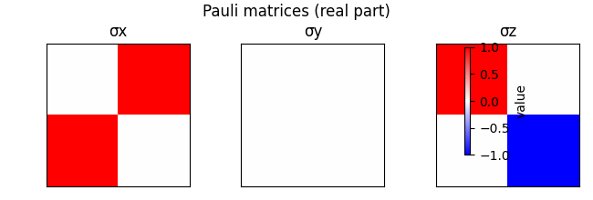

.. _pauli_commutators_tutorial:

===============================
Pauli Matrices and Commutators
===============================

This tutorial demonstrates how to define Pauli matrices and compute their commutators.

.. code-block:: python

   from sympy import Matrix, I

   sigma_x = Matrix([[0, 1], [1, 0]])
   sigma_y = Matrix([[0, -I], [I, 0]])
   sigma_z = Matrix([[1, 0], [0, -1]])

   comm_xy = sigma_x * sigma_y - sigma_y * sigma_x
   comm_yz = sigma_y * sigma_z - sigma_z * sigma_y
   comm_zx = sigma_z * sigma_x - sigma_x * sigma_z

   print("[σx, σy] =", comm_xy.simplify())
   print("[σy, σz] =", comm_yz.simplify())
   print("[σz, σx] =", comm_zx.simplify())

Visualization
=============

